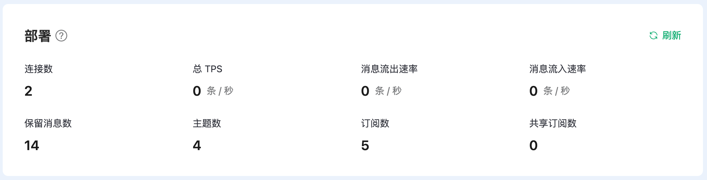
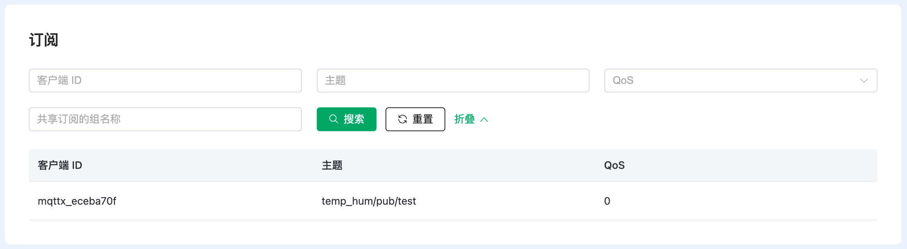

# 监控

在部署的**监控**页面，您可以查看部署的监控数据，包括连接和消息的指标，以及有关客户端和订阅的详细信息。它能让您方便得观察部署运行情况并管理部署中的客户端连接。

## 部署指标

在**部署**区域，您可以观测到当前部署的实时指标。

| 指标         | 描述                                                         |
| ------------ | ------------------------------------------------------------ |
| 连接数       | 当前连接到部署的客户端总数，包含保留会话的离线客户端。       |
| 总 TPS       | 当前部署每秒处理的消息总数，包括每秒接收和发送的消息总速率。 |
| 消息流出速率 | 部署当前每秒钟流出的消息数。                                 |
| 消息流入速率 | 部署当前每秒钟流入的消息数。                                 |
| 保留消息数   | 部署中的保留消息总数。  有关保留消息的介绍，参见 [MQTT 保留消息是什么？如何使用？](https://www.emqx.com/zh/blog/mqtt5-features-retain-message)。 |
| 主题数       | 当前所有客户端订阅的主题总数。                               |
| 订阅数       | 当前每个客户端中订阅主题的总数。                             |
| 共享订阅数   | 部署中共享订阅的总数。 有关共享订阅的介绍，参见 [共享订阅 - MQTT 5.0 新特性](https://www.emqx.com/zh/blog/introduction-to-mqtt5-protocol-shared-subscription)。 |

::: tip
订阅数是按客户端计算的。如果两个不同的客户端订阅了同一主题，则订阅数计为2。
:::

## 客户端

**客户端**区域列出了每个客户端的身份信息和连接状态。除了 **Keepalive**，您可以根据所有这些不同的字段来搜索某个特定的客户端。点击**更多条件**将出现可以输入其他字段的文本框。您还可以点击列表项末尾的**踢除**按钮将客户端踢除下线。

## 订阅

**订阅**区域列出了每个客户端订阅的主题信息，包括客户端 ID，主题和QoS。您可以通过所有这些字段进行搜索。当使用**主题**进行搜索时，可以使用通配符，例如想要搜索 `a/b`，可以通过输入 `a/b`、`a/+` 或 `a/#` 进行搜索。

点击**更多条件**将出现文本框，您可以通过输入共享订阅组名称来进行搜索。点击**搜索**，您可以看到属于同一共享订阅组的客户端以及共享订阅的主题。

