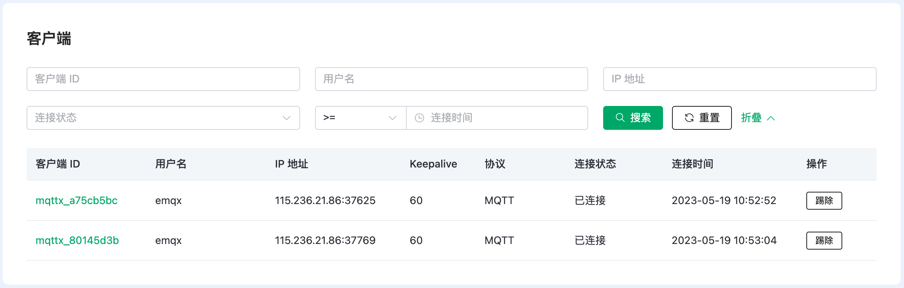

# 监控

在监控页面中，可以看到部署的连接指标、客户端详情以及订阅的信息

## 部署指标
包含以下几个监控指标
* 部署当前的总的连接数量
* 部署当前总 TPS
	- 部署总 TPS 包含了每秒钟接收和发送的消息的总速率
* 消息流出速率
* 消息流入速率
* [保留消息](https://www.emqx.com/zh/blog/mqtt5-features-retain-message)数量
* 主题数
	- 主题数为当前所有客户端订阅的主题总数
* 订阅数
	- 订阅数为当前每个客户端中订阅主题的总数
* [共享订阅](https://www.emqx.com/zh/blog/introduction-to-mqtt5-protocol-shared-subscription)数量

::: tip
订阅数是按客户端计算的，而主题是唯一的订阅，同一主题可能被不同的客户端订阅。
:::

## 客户端

客户端列表包含以下数据
* 客户端 ID
* 用户名
* IP 地址
* Keepalive
* 协议
* 连接状态
* 连接时间

以上数据除 Keepalive 以外都支持搜索，还可以点击列表项末尾的 `剔除` 按钮将客户端剔除下线

## 订阅

订阅列表包含以下数据
* 客户端 ID
* 主题
* QoS

搜索支持
* 客户端 ID
* topic 查询：例如：要搜索 `a/b`，可以通过 `a/b`，`a/+` 和 `a/#` 搜索到
* QoS
* 共享订阅组名称
