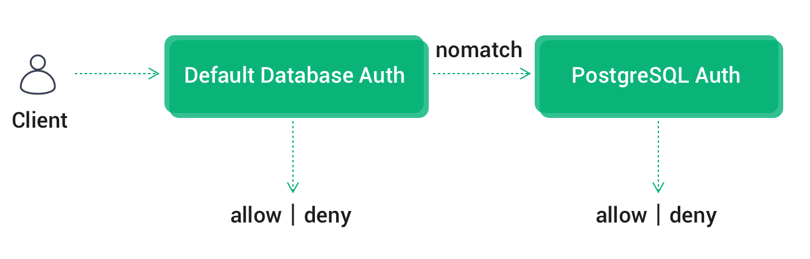
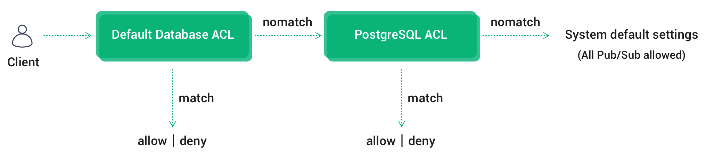
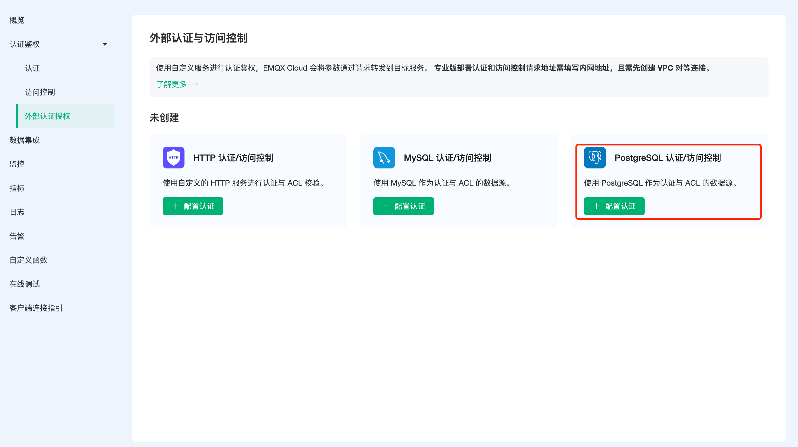
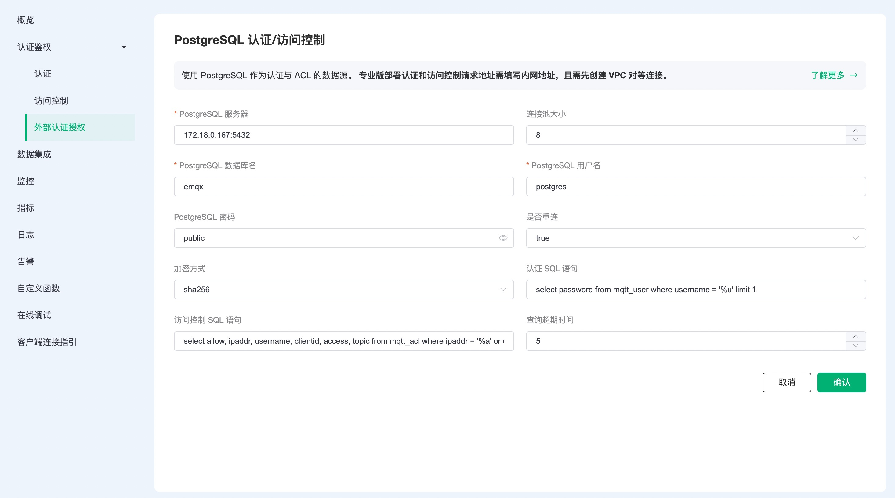

# PostgreSQL 认证/访问控制

EMQX Cloud 除了支持默认的认证鉴权方式，还可以使⽤外部 PostgreSQL 数据库作为数据源，存储⼤量数据，同时⽅便与外部设备管理系统集成。

## 认证链

若同时启用默认认证模块，EMQX Cloud 将按照[默认认证](./auth_dedicated.md) -> PostgreSQL 认证的顺序进行链式认证：

* 一旦认证成功，终止认证链并允许客户端接入
* 一旦认证失败，终止认证链并禁止客户端接入



## ACL 鉴权链

若同时启用默认 ACL 模块，EMQX Cloud 将按照[默认认证数据库 ACL](./acl_dedicated.md) ->  PostgreSQL ACL ->  系统默认设置(允许所有订阅/发布) 的顺序进行链式鉴权：

- 一旦通过鉴权，终止链并允许客户端通过验证
- 一旦鉴权失败，终止链并禁止客户端通过验证
- 直到最后一个 ACL 模块仍未通过鉴权，根据系统默认设置来验证，即 **允许所有订阅/发布**

> 同时只启用一个 ACL 插件可以提高客户端 ACL 检查性能。



## PostgreSQL 配置

1. PostgreSQL 安装

   ```bash
    docker run -d --name postgresql -p 5432:5432 -e POSTGRES_PASSWORD=public postgres:13
   ```

2. 数据库创建

   ```bash
    docker exec -it postgresql psql -U postgres
    CREATE database emqx;
    \c emqx
   ```

3. 认证表创建

   使用以下 SQL 语句将创建 `mqtt_user` 表，该表将用于存放用户认证数据。

   ```sql
   CREATE TABLE mqtt_user (
     id SERIAL PRIMARY KEY,
     username CHARACTER VARYING(100),
     password CHARACTER VARYING(100),
     salt CHARACTER VARYING(40),
     UNIQUE (username)
    );
   ```

   字段说明:

   * username：连接客户端的用户名，此处的值如果设置为 $all 表示该规则适用于所有的用户
   * password：连接客户端的密码参数
   * salt：密码加盐字符串

    > 可以在 SQL 中使用 AS 语法为字段重命名指定 password，或者将 salt 值设为固定值。

4. 访问控制表创建

    使用以下 SQL 语句将创建 `mqtt_acl` 表，该表将用于存放 topic 订阅、发布权限的认证数据。

   ```sql
    CREATE TABLE mqtt_acl (
      id SERIAL PRIMARY KEY,
      allow INTEGER,
      ipaddr CHARACTER VARYING(60),
      username CHARACTER VARYING(100),
      clientid CHARACTER VARYING(100),
      access  INTEGER,
      topic CHARACTER VARYING(100)
    );
   ```

    字段说明：

   * allow：禁止（0），允许（1）
   * ipaddr：设置 IP 地址
   * username：连接客户端的用户名，此处的值如果设置为 $all 表示该规则适用于所有的用户
   * clientid：连接客户端的 clientid
   * access：允许的操作：订阅（1），发布（2），订阅发布都可以（3）
   * topic：控制的主题，可以使用通配符，并且可以在主题中加入占位符来匹配客户端信息，例如 t/%c 在匹配时主题将会替换为当前客户端的 clientid

## 认证/访问控制配置

1. 在 EMQX Cloud 部署左侧菜单栏点击 `认证鉴权` - `外部认证授权`，选择 PostgreSQL 认证/访问控制。

    

2. 点击`配置认证`，进入 PostgreSQL 认证/访问控制页面，填写信息，新建认证。

    ::: tip
      * 如果当前部署为基础版，服务器地址填写公网地址。
      * 如果当前部署为专业版，需创建 [VPC 对等连接](./vpc_peering.md)，服务器地址填写内网地址。
      * 如果当前部署为 BYOC 版，需在您的公有云控制台中创建 VPC 对等连接，具体请参考 [创建 BYOC 部署 - VPC 对等连接配置](../create/byoc.md#vpc-对等连接配置) 章节。服务器地址填写内网地址。
      * 若提示 Init resource failure! 请检查服务器地址是否无误、安全组是否开启。
    :::

    

### 权限认证原理

进行身份认证时，EMQX Cloud 将使用当前客户端信息填充并执行用户配置的用户名、密码认证 SQL，查询出该客户端在数据库中的认证数据。

```sql
select password from mqtt_user where username = '%u' limit 1;
```

可以在认证 SQL 中使用以下占位符，执行时 EMQX Cloud 将自动填充为客户端信息：:

* %u：用户名
* %c：clientid
* %P：明文密码

可以根据业务需要调整认证 SQL，如添加多个查询条件、使用数据库预处理函数，以实现更多业务相关的功能。但是任何情况下认证 SQL 需要满足以下条件：

1. 查询结果中必须包含 password 字段，EMQX Cloud 使用该字段与客户端密码比对，若选择了非明文的其他加密方式，mqtt_user 表中的 password 字段需要插入对应加密算法加密后的字符串
2. 如果启用了加盐配置，查询结果中必须包含 salt 字段，EMQX Cloud 使用该字段作为 salt（盐）值
3. 查询结果只能有一条，多条结果时只取第一条作为有效数据

默认配置示例数据如下：

```sql
INSERT INTO mqtt_user (id, username, password, salt) VALUES (1, 'emqx', 'efa1f375d76194fa51a3556a97e641e61685f914d446979da50a551a4333ffd7', NULL);
```

启用 PostgreSQL 认证后，你可以通过用户名： emqx，密码：public 连接。

### 访问控制原理

进行 topic 订阅、发布访问控制鉴权时，EMQX Cloud 将使用当前客户端信息填充并执行用户配置的访问控制认证 SQL，从 PostgreSQL 中查找跟客户端相关的数据，然后进行鉴权，默认的查询 SQL 如下：

```sql
select allow, ipaddr, username, clientid, access, topic from mqtt_acl where ipaddr = '%a' or username = '%u' or username = '$all' or clientid = '%c';
```

可以在认证 SQL 中使用以下占位符，执行时 EMQX Cloud 将自动填充为客户端信息：:

* %u：用户名
* %c：clientid
* %a：客户端 IP 地址
* %P：明文密码

默认配置以下示例数据：

```sql
-- 所有用户不可以订阅系统主题
INSERT INTO mqtt_acl (allow, ipaddr, username, clientid, access, topic) VALUES (0, NULL, '$all', NULL, 1, '$SYS/#');

-- 允许 10.59.1.100 上的客户端订阅系统主题
INSERT INTO mqtt_acl (allow, ipaddr, username, clientid, access, topic) VALUES (1, '10.59.1.100', NULL, NULL, 1, '$SYS/#');

-- 禁止客户端订阅 /smarthome/+/temperature 主题
 INSERT INTO mqtt_acl (allow, ipaddr, username, clientid, access, topic) VALUES (0, NULL, '$all', NULL, 1, '/smarthome/+/temperature');

-- 允许客户端订阅包含自身 Client ID 的 /smarthome/${clientid}/temperature 主题
INSERT INTO mqtt_acl (allow, ipaddr, username, clientid, access, topic) VALUES (1, NULL, '$all', NULL, 1, '/smarthome/%c/temperature');
```

### 加密规则

EMQX Cloud 多数外部认证均可以启用哈希方法，数据源中仅保存密码密文，保证数据安全。启用哈希方法时，用户可以为每个客户端都指定一个 salt（盐）并配置加盐规则，数据库中存储的密码是按照加盐规则与哈希方法处理后的密文。

> 可参考：[加盐规则与哈希方法](https://www.emqx.io/docs/zh/v4.3/advanced/auth.html#%E5%AF%86%E7%A0%81%E5%8A%A0%E7%9B%90%E8%A7%84%E5%88%99%E4%B8%8E%E5%93%88%E5%B8%8C%E6%96%B9%E6%B3%95)。

```bash
## 不加盐，明文
plain

## 不加盐，仅做哈希处理
sha256

 ## salt 前缀：使用 sha256 加密 salt + 密码 拼接的字符串
salt,sha256

## salt 后缀：使用 sha256 加密 密码 + salt 拼接的字符串
sha256,salt

## pbkdf2 with macfun iterations dklen
## macfun: md4, md5, ripemd160, sha, sha224, sha256, sha384, sha512
pbkdf2, sha256, 1000, 20
```
