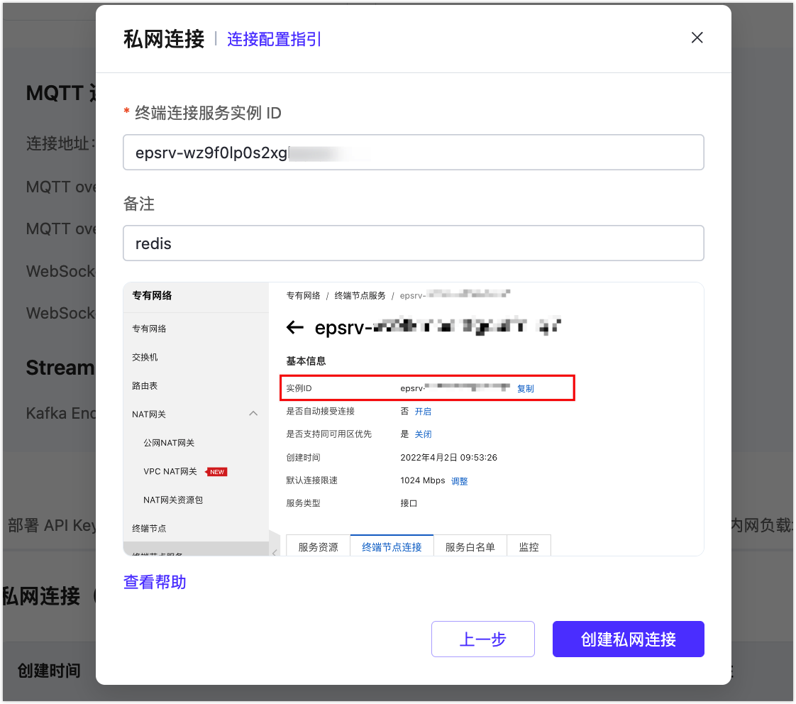
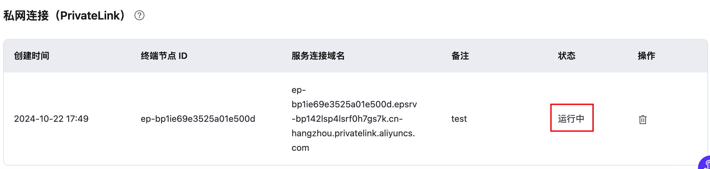

# 私网连接 PrivateLink 设置

::: warning 注意

该功能仅适用于专有版和旗舰版。

:::

私网连接（PrivateLink）能够实现 EMQX 专有版或旗舰版部署所在的专有网络 VPC 与公有云上的服务建立安全稳定的私有连接，简化网络架构，实现私网访问服务，避免通过公网访问服务带来的潜在安全风险。

在私网连接中，EMQX 部署 VPC 作为服务使用方，请求用户在云服务商资源所在的 VPC，即服务提供方。

## 阿里云平台私网连接 PrivateLink

您可以查看[教程视频](https://player.bilibili.com/player.html?aid=810742292&bvid=BV1C34y1v7mt&cid=576712083&page=1)进一步了解。

### 准备工作

在配置私网连接之前，您需要在阿里云平台完成以下前提条件：

1. 注册阿里云账号并开通私网连接服务。

2. 创建 VPC 并创建资源实例。

3. 创建并配置了传统型负载均衡（CLB）。

> 注意：此处创建的 CLB 的地域可用区需和 EMQX 专有版部署 CLB 可用区一致，该信息可以在 EMQX Platform 控制台获取。

创建的私网 CLB 实例只有在私网连接支持的可用区内，才可被添加为私网连接（PrivateLink）的服务资源。阿里云支持私网连接的 [地域和可用区](https://help.aliyun.com/document_detail/198081.html)，以深圳为例，可用区为 D、E。由于本示例中 EMQX 专有版部署的 CLB 的可用区为深圳可用区 D，在创建私网 CLB 实例时我们选择同一区域-深圳可用区 D。

 在创建好 CLB 之后，配置您资源的监听端口，检查其健康状态是否正常。

4. 创建终端节点服务。
   

  在您的阿里云账号上的专有网络 VPC 左侧菜单栏找到终端节点服务，点击创建。

 > 注意：目前仅支持服务提供方付费，即为用户在自己服务的阿里云平台支付私网连接所产生的全部费用。请检查是否有选择服务提供方付费的选项菜单，如缺失请向阿里云平台 [提交工单](https://help.aliyun.com/document_detail/198081.html) 开通「服务提供方付费功能」。完成申请之后，即可在开通服务的时候选择服务提供方付费。如果没有开通此功能，无法完成后续的配置验证。

您可以参考 [阿里云帮助](https://help.aliyun.com/document_detail/174059.html) 完成以上的配置。

### 创建私网连接 PrivateLink

1. 登录 [EMQX Platform 控制台](<https://cloud.emqx.com/console>)，进入需要创建 PrivateLink 的部署的概览页面。

1. 点击左侧菜单中的**网络管理**，在**私网连接 (PrivateLink)** 区域点击 **+私网连接** 按钮。

2. 确认提示信息后，点击**了解并进入下一步**。

   

3. 在 EMQX Platform 控制台获取到部署所在的阿里云账号 UID，将其添加到您阿里云平台-终端节点服务的白名单。

   

   添加完成后，点击**完成配置进入下一步**。

4. 在您的阿里云平台上找到终端节点服务，复制实例 ID，将其填写到 EMQX 专有版终端节点服务实例 ID，填写描述（可选），点击**创建私网连接**。

   

5. 填写完成后，在您的阿里云平台找到终端节点服务-终端节点连接，点击**允许**。

   

6. 等待一段时间，在部署详情查看私网连接状态，`运行中`表示已经创建成功。

   

### 删除私网连接

删除私网连接，您需要确保私网连接状态为`运行中`。

> - 若需在您的阿里云平台删除私网连接服务，请先在 EMQX Platform 控制台 删除私网连接节点，否则会导致部署私网连接状态为`failed`。
> - 删除私网连接前，请确保部署不存在任何关联的资源，否则将导致不可预估的风险。

1. 进入部署的**网络管理**页面。

2. 点击私网连接**操作**列中的删除按钮，点击**确认**后完成删除。

