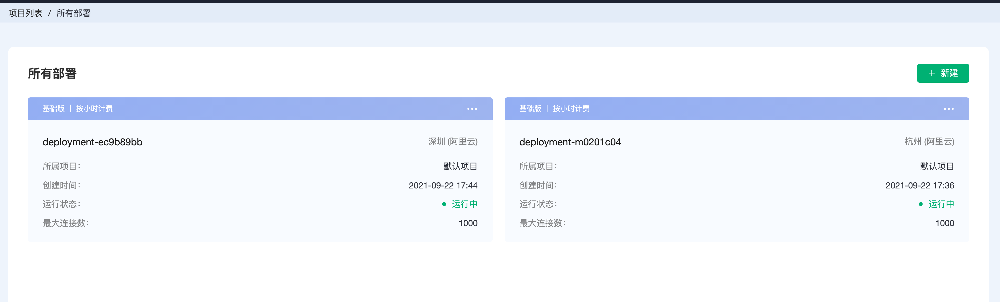

# 项目管理

项目管理功能用于将部署归为不同的项目之下，方便根据项目对部署进行管理

## 默认项目

未关联项目的部署，将会归到默认部署下

## 创建项目

点击**新建项目**，在弹框中输入项目名称和描述，可以创建一个新项目

## 在项目下创建部署

选中左侧项目，可以在选中项目下创建部署

## 移动项目

点击部署右上角的菜单，选择移动项目

在项目列表选择目标项目

点击确认后，便可以将部署移动到新的项目下

## 更新项目

鼠标悬浮在项目之上，可以看到更新按钮

点击可以对项目名称和描述进行修改更新

## 删除项目

> 删除项目之前请确保项目下没有部署

鼠标悬浮在项目之上，点击删除按钮可以删除项目

## 查看所有部署

点击右上角**所有部署**，可以查看所有的部署

