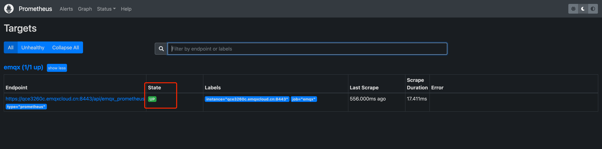
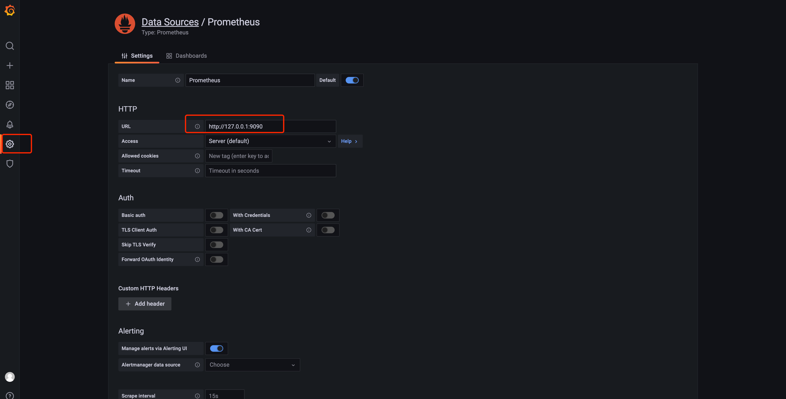
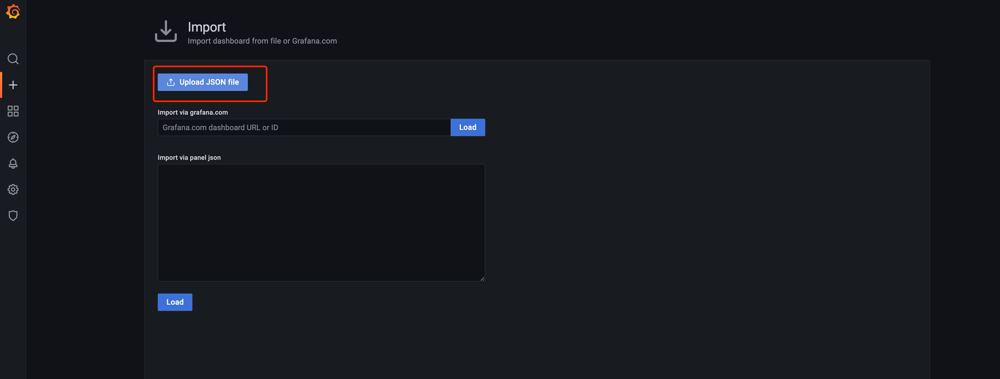

# Prometheus 监控告警

EMQX Cloud 提供了 Prometheus API ，您可以轻松调用 API 来监控 EMQX Cloud 的关键指标。
在本文中我们将介绍如何配置 Prometheus 服务，从 EMQX Cloud API 读取关键指标，以及如何使用 Grafana 查看指标。

::: warning
该功能仅适用于专有版和 BYOC 部署。
:::

## API 配置

在 EMQX Cloud 部署控制台找到概览 - REST API，获取到 API 地址，点击新建应用，获取 APP ID、APP Secret。


### 请求示例

```bash
curl -u app_id:app_secret -X GET {api}/emqx_prometheus?type=prometheus
```

### 响应示例

```prometheus
# TYPE emqx_vm_run_queue gauge
emqx_vm_run_queue 2
# TYPE emqx_vm_process_messages_in_queues gauge
emqx_vm_process_messages_in_queues 0
# TYPE emqx_vm_cpu_use gauge
emqx_vm_cpu_use 1
# TYPE emqx_vm_cpu_idle gauge
emqx_vm_cpu_idle 198
# TYPE emqx_vm_used_memory gauge
emqx_vm_used_memory 2100293632
# TYPE emqx_vm_total_memory gauge
emqx_vm_total_memory 8065474560
# TYPE emqx_messages_qos1_received counter
emqx_messages_qos1_received 0
# TYPE emqx_messages_dropped_expired counter
emqx_messages_dropped_expired 0
# TYPE emqx_messages_dropped counter
emqx_messages_dropped 0
# TYPE emqx_messages_qos1_sent counter
emqx_messages_qos1_sent 0
# TYPE emqx_messages_qos0_received counter
emqx_messages_qos0_received 0
# TYPE emqx_messages_received counter
emqx_messages_received 0
# TYPE emqx_messages_acked counter
emqx_messages_acked 0
# TYPE emqx_messages_publish counter
emqx_messages_publish 0
# TYPE emqx_messages_delivered counter
emqx_messages_delivered 0
# TYPE emqx_messages_sent counter
emqx_messages_sent 0
# TYPE emqx_messages_qos0_sent counter
emqx_messages_qos0_sent 0
# TYPE emqx_messages_qos2_received counter
emqx_messages_qos2_received 0
# TYPE emqx_messages_retained counter
emqx_messages_retained 660
# TYPE emqx_messages_qos2_sent counter
emqx_messages_qos2_sent 0
# TYPE emqx_messages_forward counter
emqx_messages_forward 0
# TYPE emqx_messages_delayed counter
emqx_messages_delayed 0
# TYPE emqx_messages_dropped_no_subscribers counter
emqx_messages_dropped_no_subscribers 0
# TYPE emqx_delivery_dropped counter
emqx_delivery_dropped 0
# TYPE emqx_delivery_dropped_too_large counter
emqx_delivery_dropped_too_large 0
# TYPE emqx_delivery_dropped_queue_full counter
emqx_delivery_dropped_queue_full 0
# TYPE emqx_delivery_dropped_qos0_msg counter
emqx_delivery_dropped_qos0_msg 0
# TYPE emqx_delivery_dropped_no_local counter
emqx_delivery_dropped_no_local 0
# TYPE emqx_delivery_dropped_expired counter
emqx_delivery_dropped_expired 0
# TYPE emqx_client_auth_anonymous counter
emqx_client_auth_anonymous 0
# TYPE emqx_client_unsubscribe counter
emqx_client_unsubscribe 0
# TYPE emqx_client_subscribe counter
emqx_client_subscribe 0
# TYPE emqx_client_disconnected counter
emqx_client_disconnected 0
# TYPE emqx_client_connected counter
emqx_client_connected 0
# TYPE emqx_client_check_acl counter
emqx_client_check_acl 0
# TYPE emqx_client_authenticate counter
emqx_client_authenticate 0
# TYPE emqx_cluster_nodes_stopped gauge
emqx_cluster_nodes_stopped 0
# TYPE emqx_cluster_nodes_running gauge
emqx_cluster_nodes_running 2
# TYPE emqx_suboptions_max gauge
emqx_suboptions_max 0
# TYPE emqx_subscriptions_shared_max gauge
emqx_subscriptions_shared_max 0
# TYPE emqx_subscribers_max gauge
emqx_subscribers_max 0
# TYPE emqx_retained_count gauge
emqx_retained_count 10
# TYPE emqx_sessions_max gauge
emqx_sessions_max 0
# TYPE emqx_routes_max gauge
emqx_routes_max 0
# TYPE emqx_topics_max gauge
emqx_topics_max 0
# TYPE emqx_connections_max gauge
emqx_connections_max 0
# TYPE emqx_subscribers_count gauge
emqx_subscribers_count 0
# TYPE emqx_retained_max gauge
emqx_retained_max 10
# TYPE emqx_subscriptions_count gauge
emqx_subscriptions_count 0
# TYPE emqx_subscriptions_shared_count gauge
emqx_subscriptions_shared_count 0
# TYPE emqx_suboptions_count gauge
emqx_suboptions_count 0
# TYPE emqx_routes_count gauge
emqx_routes_count 0
# TYPE emqx_topics_count gauge
emqx_topics_count 0
# TYPE emqx_sessions_count gauge
emqx_sessions_count 0
# TYPE emqx_connections_count gauge
emqx_connections_count 0
# TYPE emqx_subscriptions_max gauge
emqx_subscriptions_max 0
# TYPE emqx_session_discarded counter
emqx_session_discarded 0
# TYPE emqx_session_created counter
emqx_session_created 0
# TYPE emqx_session_terminated counter
emqx_session_terminated 0
# TYPE emqx_session_takeovered counter
emqx_session_takeovered 0
# TYPE emqx_session_resumed counter
emqx_session_resumed 0
# TYPE emqx_packets_pubrec_missed counter
emqx_packets_pubrec_missed 0
# TYPE emqx_packets_pubrel_received counter
emqx_packets_pubrel_received 0
# TYPE emqx_packets_auth_received counter
emqx_packets_auth_received 0
# TYPE emqx_packets_pingresp_sent counter
emqx_packets_pingresp_sent 0
# TYPE emqx_packets_publish_auth_error counter
emqx_packets_publish_auth_error 0
# TYPE emqx_packets_disconnect_received counter
emqx_packets_disconnect_received 0
# TYPE emqx_packets_sent counter
emqx_packets_sent 0
# TYPE emqx_packets_puback_received counter
emqx_packets_puback_received 0
# TYPE emqx_bytes_sent counter
emqx_bytes_sent 0
# TYPE emqx_packets_pubcomp_missed counter
emqx_packets_pubcomp_missed 0
# TYPE emqx_packets_pubrel_missed counter
emqx_packets_pubrel_missed 0
# TYPE emqx_packets_pubrec_inuse counter
emqx_packets_pubrec_inuse 0
# TYPE emqx_packets_pubcomp_sent counter
emqx_packets_pubcomp_sent 0
# TYPE emqx_packets_auth_sent counter
emqx_packets_auth_sent 0
# TYPE emqx_packets_pubcomp_inuse counter
emqx_packets_pubcomp_inuse 0
# TYPE emqx_bytes_received counter
emqx_bytes_received 0
# TYPE emqx_packets_publish_inuse counter
emqx_packets_publish_inuse 0
# TYPE emqx_packets_pubrec_received counter
emqx_packets_pubrec_received 0
# TYPE emqx_packets_pingreq_received counter
emqx_packets_pingreq_received 0
# TYPE emqx_packets_suback_sent counter
emqx_packets_suback_sent 0
# TYPE emqx_packets_publish_error counter
emqx_packets_publish_error 0
# TYPE emqx_packets_disconnect_sent counter
emqx_packets_disconnect_sent 0
# TYPE emqx_packets_publish_received counter
emqx_packets_publish_received 0
# TYPE emqx_packets_received counter
emqx_packets_received 0
# TYPE emqx_packets_puback_missed counter
emqx_packets_puback_missed 0
# TYPE emqx_packets_puback_sent counter
emqx_packets_puback_sent 0
# TYPE emqx_packets_publish_dropped counter
emqx_packets_publish_dropped 0
# TYPE emqx_packets_pubrec_sent counter
emqx_packets_pubrec_sent 0
# TYPE emqx_packets_pubrel_sent counter
emqx_packets_pubrel_sent 0
# TYPE emqx_packets_connack_auth_error counter
emqx_packets_connack_auth_error 0
# TYPE emqx_packets_subscribe_error counter
emqx_packets_subscribe_error 0
# TYPE emqx_packets_publish_sent counter
emqx_packets_publish_sent 0
# TYPE emqx_packets_connect counter
emqx_packets_connect 0
# TYPE emqx_packets_puback_inuse counter
emqx_packets_puback_inuse 0
# TYPE emqx_packets_connack_sent counter
emqx_packets_connack_sent 0
# TYPE emqx_packets_unsuback_sent counter
emqx_packets_unsuback_sent 0
# TYPE emqx_packets_pubcomp_received counter
emqx_packets_pubcomp_received 0
# TYPE emqx_packets_subscribe_auth_error counter
emqx_packets_subscribe_auth_error 0
# TYPE emqx_packets_unsubscribe_error counter
emqx_packets_unsubscribe_error 0
# TYPE emqx_packets_unsubscribe_received counter
emqx_packets_unsubscribe_received 0
# TYPE emqx_packets_connack_error counter
emqx_packets_connack_error 0
# TYPE emqx_packets_subscribe_received counter
emqx_packets_subscribe_received 0
```

## Prometheus 配置

1. 安装 Prometheus

    ```bash
    wget -c https://github.com/prometheus/prometheus/releases/download/v2.35.0-rc0/prometheus-2.35.0-rc0.linux-amd64.tar.gz
    tar xvfz prometheus-*.tar.gz
    ```

2. 修改配置文件

    找到您的 Prometheus 服务指定的监控目录，按如下示例修改配置文件 prometheus.yml 的 scrape_configs section。

    ```bash
    scrape_configs:
      - job_name: 'emqx'
        scheme: 'https'
        static_configs:
          - targets: [ 'xxxx:8443' ]
        metrics_path: "/api/emqx_prometheus"
        params:
          type: [ "prometheus" ]
        basic_auth:
          username: 'APP ID'
          password: 'APP Secret'
    ```

3. 启动并检查服务状态

    启动 Prometheus

   ```bash
    ./prometheus --config.file=prometheus.yml
   ```

    通过本地 IP + 对应端⼝，如：x.x.x.x:9090 访问您的 Prometheus 服务，检查 Status - Targets 以确认新的 scrape_config 文件已被读取。如果状态显示异常，您可能需要检查配置文件，重新启动 Prometheus 服务。

    

## Grafana 配置

1. 安装并启动 Grafana

   ```bash
    wget https://dl.grafana.com/enterprise/release/grafana-enterprise-8.4.6.linux-amd64.tar.gz
    tar -zxvf grafana-enterprise-8.4.6.linux-amd64.tar.gz
    ./bin/grafana-server
    ```

2. 配置 Grafana

    通过本地 IP + 对应端⼝，如：x.x.x.x:3000 访问 Grafana 的 dashbroad，初始 ID 和密码都是 admin，初次登录请修改密码，登录进⼊后需添加 Data sources - Prometheus。

    

3. 导⼊ Grafana 数据模板

    EMQX Cloud 提供了 Grafana 的 Dashboard 的模板文件。这些模板包含了所有 EMQX Cloud 监控数据的展示。用户可直接导入到 Grafana 中，进行显示 EMQX 的监控状态的图标。

    模板文件位于：[emqx_prometheus/grafana_template/EMQ.json](https://github.com/emqx/emqx-prometheus/blob/master/grafana_template/EMQ.json)，可通过 Upload JSON file 的方式上传本地的 EMQ.json ⽂件，或者通过 Import via panel json 手动编写。

    

## 指标详解

完成整套系统搭建并运行一段时间后，EMQX Cloud Prometheus 收集到的数据将展示在 Grafana 上，包括客户端数、订阅数、主题数、消息数、报文数等业务信息历史统计，可以查看每种指标对应的展示图表，某个时间点的详细信息.


Prometheus 跟踪您的 EMQX Cloud 部署的以下指标数据。

| 指标名                               | 指标类型 | 指标说明                            |
| ------------------------------------ | -------- | ----------------------------------- |
| emqx_vm_used_memory                  | gauge    | VM已占用内存                        |
| emqx_vm_total_memory                 | gauge    | VM总开辟内存                        |
| emqx_vm_run_queue                    | gauge    | RunQueue大小                        |
| emqx_vm_process_messages_in_queues   | gauge    | 消息阻塞总数                        |
| emqx_vm_cpu_use                      | gauge    | CPU占用数                           |
| emqx_vm_cpu_idle                     | gauge    | CPU空闲数                           |
| emqx_topics_max                      | gauge    | 历史最大主题数                      |
| emqx_topics_count                    | gauge    | 当前主题数                          |
| emqx_subscriptions_shared_max        | gauge    | 历史最大共享订阅数                  |
| emqx_subscriptions_shared_count      | gauge    | 当前共享订阅数                      |
| emqx_subscriptions_max               | gauge    | 历史最大订阅关系数                  |
| emqx_subscriptions_count             | gauge    | 当前订阅关系数                      |
| emqx_subscribers_max                 | gauge    | 历史最大订阅者总数                  |
| emqx_subscribers_count               | gauge    | 当前订阅者数                        |
| emqx_suboptions_max                  | gauge    | 历史最大订阅配置项数                |
| emqx_suboptions_count                | gauge    | 历史最大订阅配置项数                |
| emqx_sessions_max                    | gauge    | 历史最大会话数                      |
| emqx_sessions_count                  | gauge    | 当前会话数                          |
| emqx_session_terminated              | counter  | 会话终止                            |
| emqx_session_takeovered              | counter  | 会话被接管                          |
| emqx_session_resumed                 | counter  | 会话重新激活                        |
| emqx_session_discarded               | counter  | 会话丢弃                            |
| emqx_session_created                 | counter  | 会话创建                            |
| emqx_routes_max                      | gauge    | 历史最大路由数                      |
| emqx_routes_count                    | gauge    | 当前路由数                          |
| emqx_retained_max                    | gauge    | 历史最大保留消息数                  |
| emqx_retained_count                  | gauge    | 当前保留消息数                      |
| emqx_packets_unsubscribe_received    | counter  | 已接收UNSUB报文数                   |
| emqx_packets_unsubscribe_error       | counter  | 已拒绝UNSUB报文数                   |
| emqx_packets_unsuback_sent           | counter  | 已发送UNSUBACK报文数                |
| emqx_packets_subscribe_received      | counter  | 已接收SUB报文数                     |
| emqx_packets_subscribe_error         | counter  | 已拒绝SUB报文数                     |
| emqx_packets_subscribe_auth_error    | counter  | 已拒绝SUB报文数(ACL检查失败)        |
| emqx_packets_suback_sent             | counter  | 已发送SUBACK报文数                  |
| emqx_packets_sent                    | counter  | 已发送报文数                        |
| emqx_packets_received                | counter  | 已接收报文数                        |
| emqx_packets_pubrel_sent             | counter  | 已发送PUBREL报文数                  |
| emqx_packets_pubrel_received         | counter  | 已接收PUBREL报文数                  |
| emqx_packets_pubrel_missed           | counter  | 已拒绝PUBREL报文数(PacketId未找到)  |
| emqx_packets_pubrec_sent             | counter  | 已发送PUBREC报文数                  |
| emqx_packets_pubrec_received         | counter  | 已接收PUBREC报文数                  |
| emqx_packets_pubrec_missed           | counter  | 已拒绝PUBREC报文数(PacketId未找到)  |
| emqx_packets_pubrec_inuse            | counter  | 已拒绝PUBREC报文数(PacketId被占用)  |
| emqx_packets_publish_sent            | counter  | 已发送PUB报文数                     |
| emqx_packets_publish_received        | counter  | 已接收PUB报文数                     |
| emqx_packets_publish_inuse           | counter  | 已拒绝PUB报文数(PacketId被占用)     |
| emqx_packets_publish_error           | counter  | 错误的PUB报文数                     |
| emqx_packets_publish_dropped         | counter  | 已丢弃PUB报文数                     |
| emqx_packets_publish_auth_error      | counter  | 已拒绝PUB报文数 (ACL检查失败)       |
| emqx_packets_pubcomp_sent            | counter  | 已发送PUBCOMP报文数                 |
| emqx_packets_pubcomp_received        | counter  | 已接收PUBCOMP报文数                 |
| emqx_packets_pubcomp_missed          | counter  | 已拒绝PUBCOMP报文数(PacketId未找到) |
| emqx_packets_pubcomp_inuse           | counter  | 已拒绝PUBCOMP报文数(PacketId被占用) |
| emqx_packets_puback_sent             | counter  | 已发送PUBACK报文数                  |
| emqx_packets_puback_received         | counter  | 已接收PUBACK报文数                  |
| emqx_packets_puback_missed           | counter  | 已拒绝PUBACK报文数(PacketId未找到)  |
| emqx_packets_puback_inuse            | counter  | 已拒绝PUBACK报文数(PacketId被占用)  |
| emqx_packets_pingresp_sent           | counter  | 已发送PONG报文数                    |
| emqx_packets_pingreq_received        | counter  | 已接收PING报文数                    |
| emqx_packets_disconnect_sent         | counter  | 已发送断开连接报文数                |
| emqx_packets_disconnect_received     | counter  | 已接收断开连接报文数                |
| emqx_packets_connect                 | counter  | 已接收连接报文数                    |
| emqx_packets_connack_sent            | counter  | 已发送连接确认报文数                |
| emqx_packets_connack_error           | counter  | 已发送连接失败报文数                |
| emqx_packets_connack_auth_error      | counter  | 已发送连接认证失败报文数            |
| emqx_packets_auth_sent               | counter  | 已发送认证报文数                    |
| emqx_packets_auth_received           | counter  | 已接收认证报文数                    |
| emqx_messages_sent                   | counter  | 消息发出总数                        |
| emqx_messages_retained               | counter  | 存入为保留消息总数                  |
| emqx_messages_received               | counter  | 消息接收总数                        |
| emqx_messages_qos2_sent              | counter  | QoS2消息发出总数                    |
| emqx_messages_qos2_received          | counter  | QoS2消息接收总数                    |
| emqx_messages_qos1_sent              | counter  | QoS1消息发出总数                    |
| emqx_messages_qos1_received          | counter  | QoS1消息接收总数                    |
| emqx_messages_qos0_sent              | counter  | QoS0消息发出总数                    |
| emqx_messages_qos0_received          | counter  | QoS0消息接收总数                    |
| emqx_messages_publish                | counter  | 消息发起发布                        |
| emqx_messages_forward                | counter  | 消息跨节点转发总数                  |
| emqx_messages_dropped_no_subscribers | counter  | 无订阅者消息丢弃总数                |
| emqx_messages_dropped_expired        | counter  | 过期消息丢弃总数                    |
| emqx_messages_dropped                | counter  | 消息丢弃                            |
| emqx_messages_delivered              | counter  | 消息已投递                          |
| emqx_messages_delayed                | counter  | 存入为延迟消息总数                  |
| emqx_messages_acked                  | counter  | 消息已收到回执                      |
| emqx_delivery_dropped_too_large      | counter  | 消息投递太大丢弃数                  |
| emqx_delivery_dropped_queue_full     | counter  | 消息投递队列满丢弃数                |
| emqx_delivery_dropped_qos0_msg       | counter  | 消息投递 QoS0 丢弃数                |
| emqx_delivery_dropped_no_local       | counter  | 消息投递no_local丢弃数              |
| emqx_delivery_dropped_expired        | counter  | 消息投递超期丢弃数                  |
| emqx_delivery_dropped                | counter  | 消息投递丢弃数                      |
| emqx_connections_max                 | gauge    | 历史最大连接数                      |
| emqx_connections_count               | gauge    | 当前连接数                          |
| emqx_cluster_nodes_stopped           | gauge    | 集群停止节点数                      |
| emqx_cluster_nodes_running           | gauge    | 集群运行节点数                      |
| emqx_client_unsubscribe              | counter  | 客户端取消订阅                      |
| emqx_client_subscribe                | counter  | 客户端发起订阅                      |
| emqx_client_disconnected             | counter  | 客户端已下线                        |
| emqx_client_connected                | counter  | 客户端已上线                        |
| emqx_client_check_acl                | counter  | 客户端发起ACL请求                   |
| emqx_client_authenticate             | counter  | 客户端发起认证                      |
| emqx_client_auth_anonymous           | counter  | 作为匿名客户端登录                  |
| emqx_bytes_sent                      | counter  | 已发送总字节数                      |
| emqx_bytes_received                  | counter  | 已接收总字节数                      |
