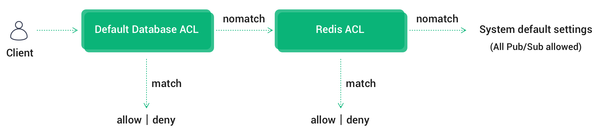
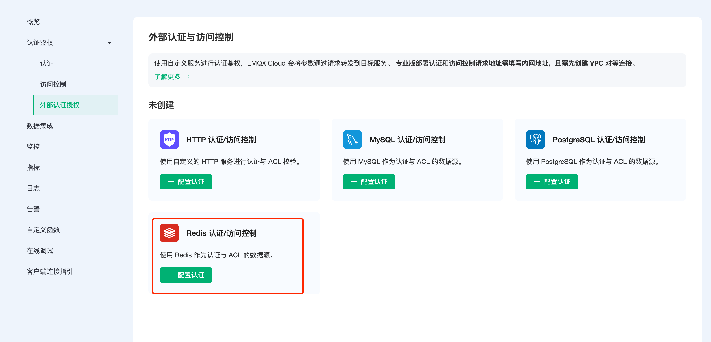
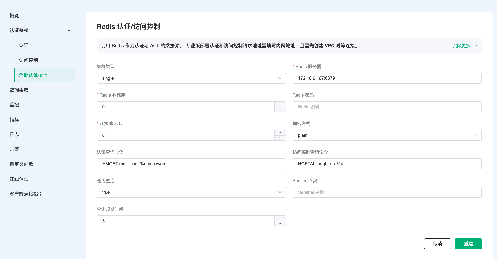

# Redis 认证/访问控制

EMQX Cloud 除了支持默认的认证鉴权方式，还可以使⽤外部 Redis 数据库作为数据源，存储⼤量数据，同时⽅便与外部设备管理系统集成。

## 认证链

若同时启用默认认证模块，EMQX Cloud 将按照[默认认证](https://docs.emqx.com/zh/cloud/latest/deployments/auth.html#%E8%AE%A4%E8%AF%81) -> Redis 认证的顺序进行链式认证：

* 一旦认证成功，终止认证链并允许客户端接入
* 一旦认证失败，终止认证链并禁止客户端接入


## ACL 鉴权链

若同时启用默认 ACL 模块，EMQX Cloud 将按照[默认认证数据库 ACL](https://docs.emqx.com/zh/cloud/latest/deployments/acl.html) ->  Redis ACL ->  系统默认设置(允许所有订阅/发布) 的顺序进行链式鉴权：

- 一旦通过鉴权，终止链并允许客户端通过验证
- 一旦鉴权失败，终止链并禁止客户端通过验证
- 直到最后一个 ACL 模块仍未通过鉴权，根据系统默认设置来验证，即 **允许所有订阅/发布**

> 同时只启用一个 ACL 插件可以提高客户端 ACL 检查性能。



## Redis 配置

在你的云服务器中，创建一个 Redis 服务。为了方便演示，这里使用 Docker 快速搭建。

1. 获取 Redis 镜像

    ```bash
    docker pull redis:latest
    ```

2. 运行 Redis 容器

    ```bash
    docker run -itd --name redis -p 6379:6379 redis:latest
    ```

## 认证/访问控制配置

1. 在 EMQX Cloud 部署左侧菜单栏点击 `认证鉴权` - `外部认证授权`，选择 Redis 认证/访问控制。

    

2. 点击`配置认证`，进入 Redis 认证/访问控制页面，填写信息，新建认证。

    ::: tip
      * 如果当前部署为基础版，服务器地址请填写公网地址
      * 如果当前部署为专业版，需创建 [VPC 对等连接](https://docs.emqx.com/zh/cloud/latest/deployments/vpc_peering.html)，服务器地址请填写内网地址
      * 若提示 Init resource failure! 需检查服务器地址是否无误、安全组是否开启
    :::

    

3. 由于 EMQX Cloud ACL 默认是`黑名单模式`，如需开启 Redis ACL 白名单，需要提交[工单](https://docs.emqx.com/zh/cloud/latest/feature/tickets.html#%E5%B7%A5%E5%8D%95%E8%81%94%E7%B3%BB)后台开启。

### 权限认证原理

进行身份认证时，EMQX Cloud 将使用当前客户端信息填充并执行用户配置的认证查询命令，查询出该客户端在 Redis 中的认证数据。

```sql
HMGET mqtt_user:%u password
```

可以在认证 SQL 中使用以下占位符，执行时 EMQX Cloud 将自动填充为客户端信息：:

* %u：用户名
* %c：clientid

你可以根据业务需要调整认证查询命令，使用任意 [Redis 支持的命令](http://redisdoc.com/index.html)，但是任何情况下认证查询命令需要满足以下条件：

1. 查询结果中第一个数据必须为 password，EMQX Cloud 使用该字段与客户端密码比对

2. 如果启用了加盐配置，查询结果中第二个数据必须是 salt 字段，EMQX Cloud 使用该字段作为 salt（盐）值

#### 权限认证默认数据结构

Redis 认证默认配置下使用哈希表存储认证数据，使用 mqtt_user: 作为 Redis 键前缀，数据结构如下：

```sql
redis> hgetall mqtt_user:emqx
password public
```

默认配置示例数据如下：

```sql
HMSET mqtt_user:emqx password public
```

启用 Redis 认证后，你可以通过用户名： emqx，密码：public 连接。

### 访问控制原理

进行 topic 订阅、发布访问控制鉴权时，EMQX Cloud 将使用当前客户端信息填充并执行用户配置的访问控制认证 SQL，从 Redis 中查找跟客户端相关的数据，然后进行鉴权，默认的查询 SQL 如下：

```sql
HGETALL mqtt_acl:%u
```

你可以在 ACL 查询命令中使用以下占位符，执行时 EMQX 将自动填充为客户端信息：

* %u：用户名
* %c：clientid

你可以根据业务需要调整 ACL 查询命令，但是任何情况下 ACL 查询命令需要满足以下条件：

1. 哈希中使用 topic 作为键，access 作为值

#### 访问控制默认数据结构

ACL 规则数据格式和结构示例如下：

* username：连接客户端的用户名
* clientid：连接客户端的 clientid
* topic：订阅/发布的主题
* access：允许的操作：订阅（1），发布（2），订阅发布都可以（3）

```sql
## 格式
HSET mqtt_acl:[username clientid][topic] [access]

## 结构
redis> hgetall mqtt_acl:emqx
testtopic/1 1
```

默认配置示例数据如下：

```sql
HSET mqtt_acl:emqx # 1

HSET mqtt_acl:test topic/2 2
```

### 加密规则

EMQX Cloud 多数外部认证均可以启用哈希方法，数据源中仅保存密码密文，保证数据安全。启用哈希方法时，用户可以为每个客户端都指定一个 salt（盐）并配置加盐规则，数据库中存储的密码是按照加盐规则与哈希方法处理后的密文。

> 可参考：[加盐规则与哈希方法](https://www.emqx.io/docs/zh/v4.3/advanced/auth.html#%E8%AE%A4%E8%AF%81%E6%96%B9%E5%BC%8F)。

```bash
## 不加盐，明文
plain

## 不加盐，仅做哈希处理
sha256

 ## salt 前缀：使用 sha256 加密 salt + 密码 拼接的字符串
salt,sha256

## salt 后缀：使用 sha256 加密 密码 + salt 拼接的字符串
sha256,salt

## pbkdf2 with macfun iterations dklen
## macfun: md4, md5, ripemd160, sha, sha224, sha256, sha384, sha512
pbkdf2, sha256, 1000, 20
```
