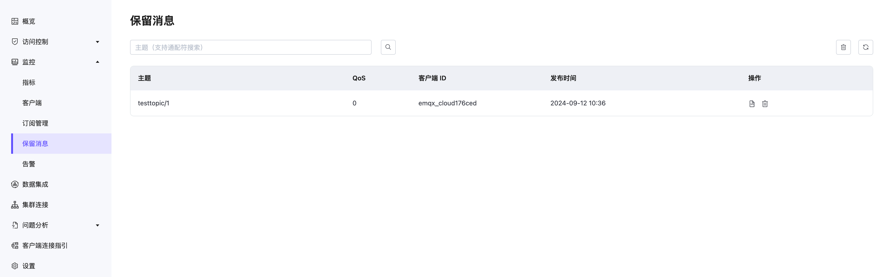
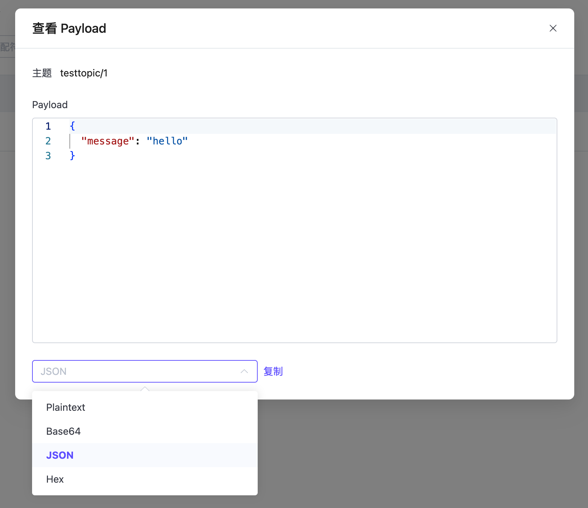

# 保留消息

点击左侧导航菜单中的**监控** -> **保留消息**，可以进入保留消息页面。在该页面可以查看当前系统中所有的保留消息。

当用户发布了一条保留消息时，部署会将这条消息保存在系统中，用户可以在当前保留消息列表页面查看到这条消息。当用户订阅了这条保留消息的主题时，部署会将这条消息发送给用户。保留消息的有效期默认为永不过期，除非用户手动删除这条消息。

## 保留消息列表
保留消息列表呈现当前系统中所有的保留消息。列表内包含了保留消息的主题、保留消息的质量等级 QoS、发布保留消息的时间、还有发布该保留消息的客户端 ID。在列表中，您还可以点击查看 Payload 和删除按钮来查看保留消息的 payload 和删除一条保留消息。点击列表右上角的刷新按钮可以刷新当前保留消息列表。

### 查看 Payload
可查看保留消息的 Payload，可以在保留消息的列表页中点击操作列中的查看按钮来查看保留消息的 Payload。

在 Payload 弹窗中可以查看保留消息的具体的 Payload 内容。可以点击复制按钮来快速复制保留消息的 Payload。在左下角的下拉框中还可以对 Payload 进行格式化输出，这对于一些特殊的 Payload 格式，如 JSON 或 Hex 格式的，可以更加直观地查看。

### 删除保留消息

通常有以下几种方式删除保留消息：
1. 保留消息的主题发布一条空消息。
2. 点击保留消息操作选项中的删除按钮。
3. 点击右上角清除按钮，可清除部署中全部保留消息。

::: tip
保留消息的大小及存储条目限制请查看[配额和限制](../create/restriction.md)。
:::

