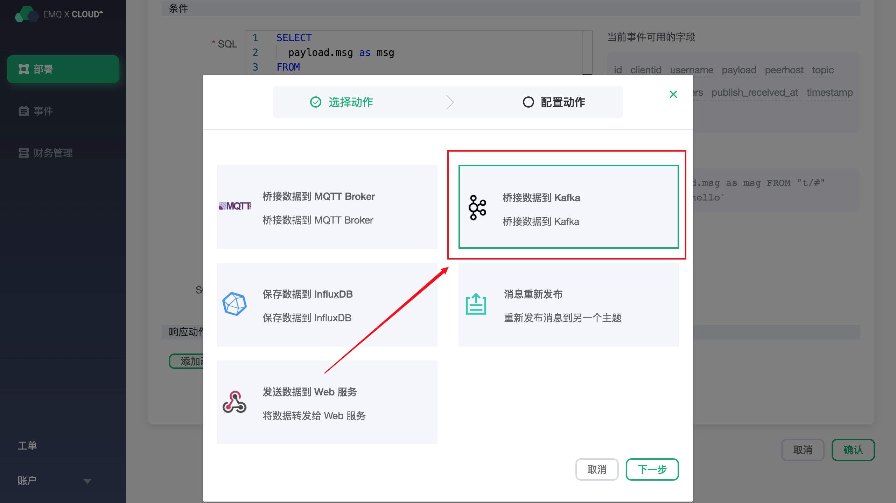
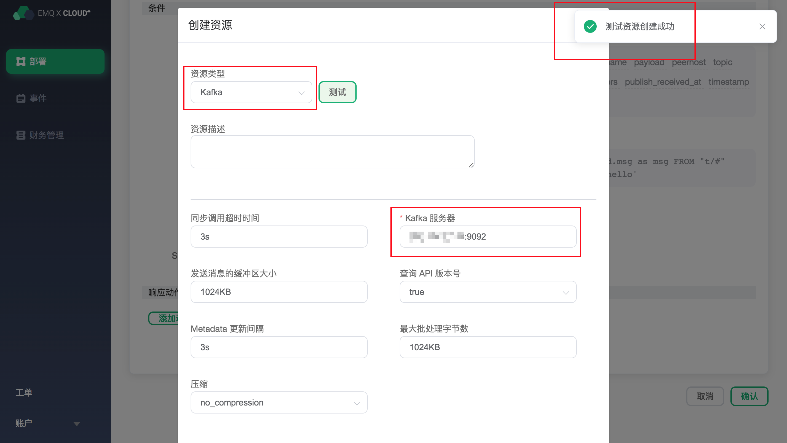
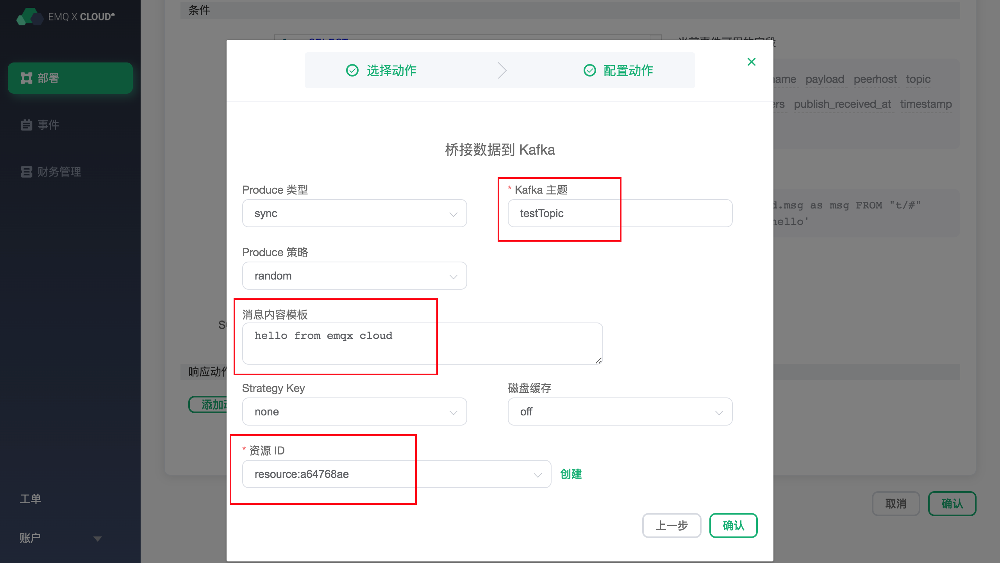
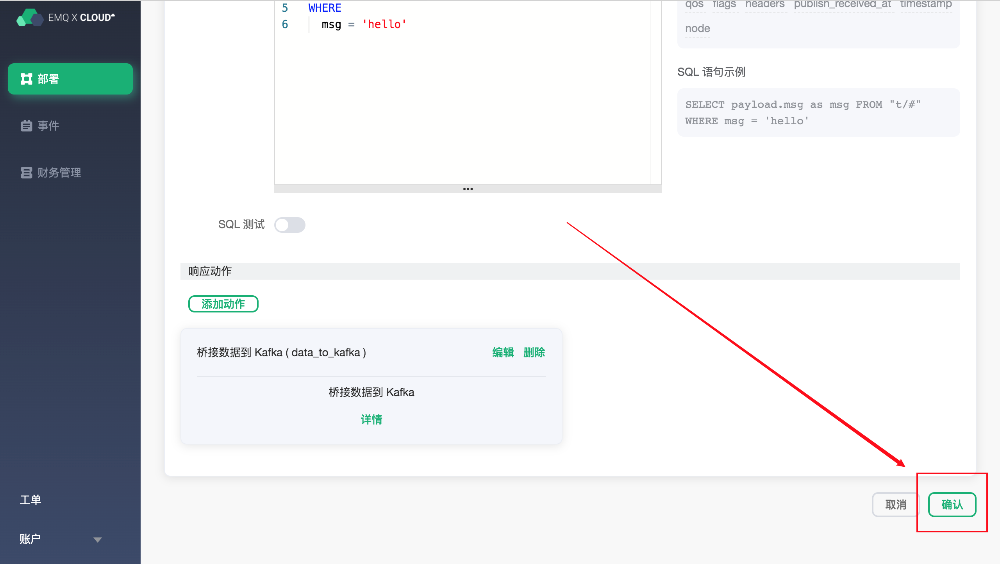
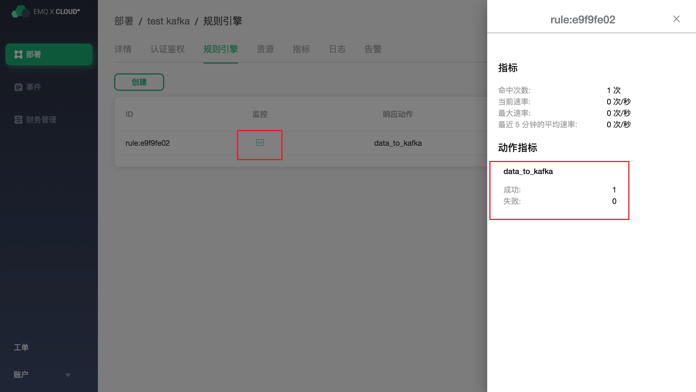
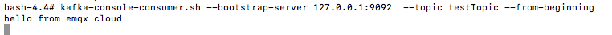

# 使用 EMQ X Cloud 规则引擎——Kafka

[Kafka](https://kafka.apache.org/)是由Apache软件基金会开发的一个开源流处理平台。该项目的目标是为处理实时数据提供一个统一、高吞吐、低延迟的平台，是一个“按照分布式事务日志架构的大规模发布/订阅消息队列”，这使它作为企业级基础设施来处理流式数据非常有价值。

通过 EMQ X Cloud 规则引擎，你可以将数据桥接到 Kafka 服务，也可以设定消息模板，在 Kafka 服务中生产特定的消息。

这篇指南会完成一个 Kafka 规则引擎的创建，实现下面的功能：

* 当有消息 "hello"，发送到 greet 主题时，会触发规则引擎，在 Kafka 服务器上生产一条 "hello from emqx cloud" 消息。


为了实现这个功能，我们会完成以下 4 个任务：

1. 搭建 Kafka 服务
2. 设置规则引擎的筛选条件
3. 创建一个资源和一个动作
4. 完成规则引擎创建，并进行测试

>注意:
>在使用规则引擎前，请先创建部署，并完成[对等连接](../deployments/vpc_peering.md)
>
>请确保以下涉及到的服务器都建立在对等连接下的 VPC 中

### 1. 搭建 Kafka 服务

首先，在完成对等连接的 VPC 中，新建一个服务器，并创建 Kafka 服务，开放 9092 端口，并创建一个名为 `testTopic` 的主题。

```sh
# 安装 zookeeper
docker run -d --restart=always \
    --name zookeeper -p 2181:2181 zookeeper
# 安装 Kafka，开放 9092 端口
docker run -d  --restart=always --name mykafka \
    -p 9092:9092 \
    -e HOST_IP=localhost \
    -e KAFKA_ADVERTISED_PORT=9092 \
    -e KAFKA_ADVERTISED_HOST_NAME=<服务器内网IP> \
    -e KAFKA_BROKER_ID=1 \
    -e KAFKA_LOG_RETENTION_HOURS=12 \
    -e KAFKA_LOG_FLUSH_INTERVAL_MESSAGES=100000 \
    -e KAFKA_ZOOKEEPER_CONNECT=<服务器内网IP>:2181 \
    -e ZK=<服务器内网IP> \
    wurstmeister/kafka
    
# 进入 Kafka 实例，并创建 testTopic 主题
$ docker exec -it mykafka /bin/bash
$ kafka-topics.sh --zookeeper <服务器内网IP>:2181 --replication-factor 1 --partitions 1 --topic testTopic --create
```
 
### 2. 设置规则引擎的筛选条件

进入 [EMQ X Cloud 控制台](https://cloud.emqx.io/console/)，并点击进入要使用桥接 Kafka 的部署。

在部署页面，选择规则引擎，点击创建。


在条件处的 SQL 中，将 FROM 设置为，"greet/#"，最后的 SQL 应该如下：

```sql
SELECT
  payload.msg as msg
FROM
  "greet/#"
WHERE
  msg = 'hello'
```

这个 SQL 可以解读为：当 "greet" 主题收到消息时，选取信息里的 msg 字段。
可以点击 SQL 输入框下的 SQL 测试 ，填写数据：

* topic: greet
* payload:
```json
{
  "msg":"hello"
}
```

点击测试，查看得到的数据结果，如果设置无误，测试输出框应该得到完整的 JSON 数据，如下：
```json
{
  "msg":"hello"
}
```

>注意：如果无法通过测试，请检查 SQL 是否合规，测试中的 topic 是否与 SQL 填写的一致。

### 3. 创建资源和动作

点击添加动作，在选择动作页，选择 桥接数据到 Kafka，点击下一步，在配置动作页面，点击创建资源。




在创建资源页面里，资源类型选择 Kafka，在 Kafka 服务器框里填写服务器的内网 IP 和对应的端口` <ip>:<port>`，这里，我们使用的端口号是 9092。点击测试，右上角返回 “测试资源创建成功” 表示测试成功。



>注意：如果测试失败，请检查是否完成对等连接，详情请看 [VPC 对等连接](http://../deployments/vpc_peering.md)，并检查 URL 是否正确。 

点击确定，返回到配置动作页面，Kafka 主题填写刚刚创建的 testTopic 主题，在消息内容模板里填写 "hello from emqx cloud"，资源 ID 默认，点击确定。



创建好的动作会显示在响应动作一栏里，确认信息无误后，点击右下角的确认，完成规则引擎的配置。



### 4. 测试

>如果您是第一次使用 EMQ X Cloud 可以前往[部署连接指南](http://../deployments/connections.md)，查看 MQTT 客户端连接和测试指南 

我们尝试向 home/sensor 主题发送下面的数据

```json
{
  "msg":"hello"
}
```
在规则引擎页中，点击监控可以看到动作指标数的成功数变为 1。


在 Kafka 实例中，可以看到 EMQ X Cloud 转发过来的消息。

```sh
# 进入 kafka 实例，并查看 testTopic 主题
$ docker exec -it mykafka /bin/bas
$ kafka-console-consumer.sh --bootstrap-server 127.0.0.1:9092  --topic testTopic --from-beginning
```

