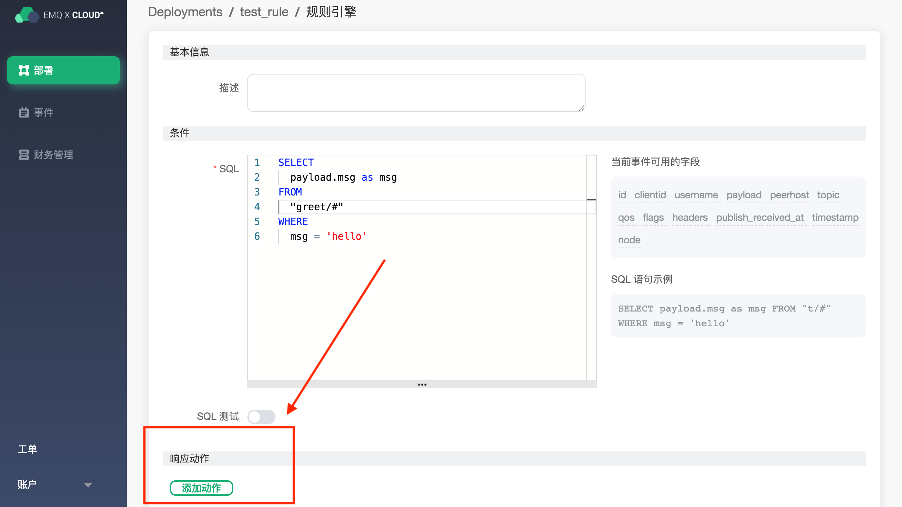

# 使用 EMQ X Cloud 规则引擎——Web Hook

为了方便消息的进一步处理，你可以通过使用规则引擎的 web hook 动作，将特定的消息推送到指定的 web 服务商。

这篇指南会完成一个 web hook 规则引擎的创建，实现下面的功能：

- 当有消息 "hello"，发送到 greet 主题时，会触发规则引擎，发送 "hello emqx！" 到我们的web 服务上。


为了实现这个功能，我们会完成以下 4 个任务：

1. 开启一个简易的 WEB 服务器
2. 设置规则引擎的筛选条件
3. 创建一个资源和一个动作
4. 完成规则引擎创建，并进行测试
>注意:
>
>在使用 web hook 前，请先创建部署，并完成对等连接


#### 1. 创建 web 服务

首先，我们在自己的服务器上创建一个 WEB 服务。可以使用 nc 命令创建一个简易的 web 服务。

```shell
while true; do echo -e "HTTP/1.1 200 OK\n\n $(date)" | nc -l 0.0.0.0 9910; done;
```


#### 2. 设置规则引擎的筛选条件

进入 [EMQ X Cloud 控制台](https://cloud.emqx.io/console/)，并点击进入要使用 web hook 的部署。

在部署页面，选择规则引擎，点击创建。


在条件处的 SQL 中，将 FROM 设置为，"greet/#"，最后的 SQL 应该如下：

```sql
SELECT
  payload.msg as msg
FROM
  "greet/#"
WHERE
  msg = 'hello'
```


#### 3. 创建资源和动作



点击添加动作，在选择动作页，选择 发送数据到 Web 服务，点击下一步，在配置动作页面，点击创建资源。


在创建资源页面里，资源类型选择 WebHook，在请求 URL 里填写 Web 服务器的 URL 地址，然后点击测试。右上角会返回 “测试资源创建成功” 表示测试成功。

>注意：如果测试失败，请检查是否完成对等连接，详情请看 [VPC 对等连接](../deployments/vpc_peering.md)，并检查 URL 是否正确。


点击确定，返回到配置动作页面，默认选择的是刚才创建的资源，在消息内容模板里填写 "hello emqx"，点击确定。


创建好的动作会显示在响应动作一栏里，确认信息无误后，点击右下角的确认，完成规则引擎的配置。


#### 4. 测试

>如果您是第一次使用 EMQ X Cloud 可以前往[部署连接指南](../deployments/connections.md)，查看MQTT 客户端连接和测试指南

当我们发送 "hello" 到 greet 主题，上面创建的规则就会触发，可以看到 WEB 服务已经收到消息 "hello emqx!"

