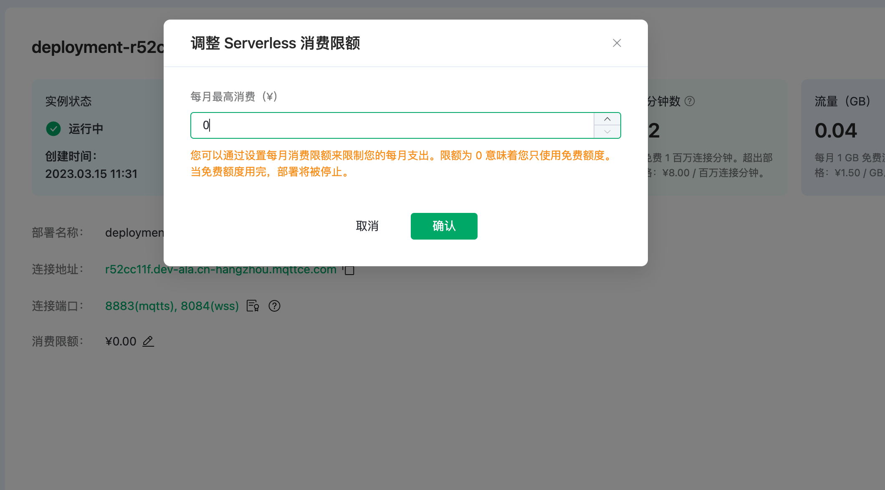
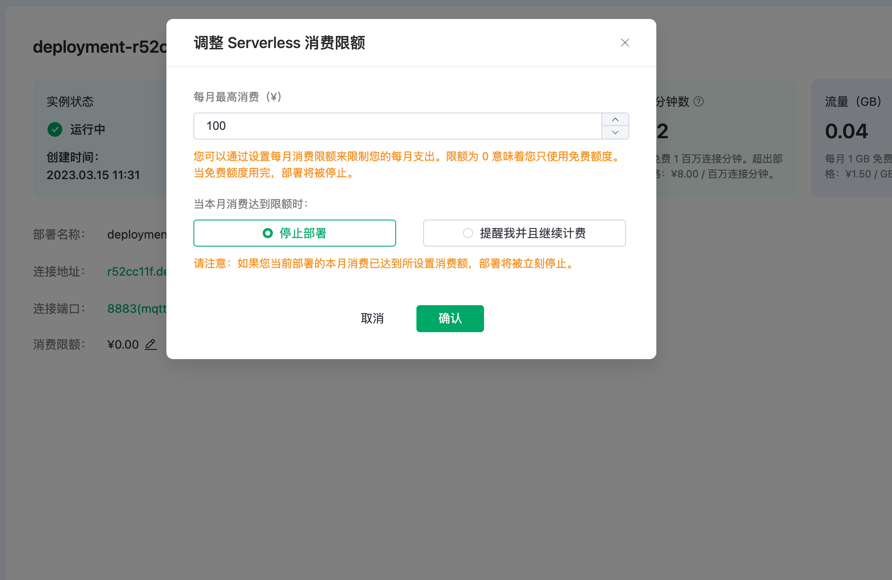

# Serverless 消费限额

消费限额可以让 Serverless 部署每个月的消费额度都控制在设定值之内，或者当达到时给予提醒。消费限额在创建部署时设置，在部署创建完成之后也可以进行修改。

当消费限额设置为 0，部署**只会消耗免费额度**，即每月 1 百万连接分钟和 1 GB 流量。当免费额度用完，部署将被停止。

   

当消费限额设置为 1 - 10000 的整数，可以选择当本月部署的消耗达到限额时的动作。可以选择停止部署，或者提醒并且继续计费。如果您选择后者，我们将以邮件的形式发送提醒，部署则会继续运行和计费。

   

- 当您设置消费限额大于 0，如果您的账户内没有余额，则需要对余额进行充值。
- 如果您的部署当月的消耗已经大于修改的目标限额，限额修改后会造成部署的停止。如原来的消费限额为 100 元，当月已经消费 80 元，如将限额修改为 50 元，修改完成后部署会停止。请谨慎操作。
- 如果部署当月产生了消费，即使没有达到消费限额，然而账户余额用完的情况下，部署仍然会被停止。

