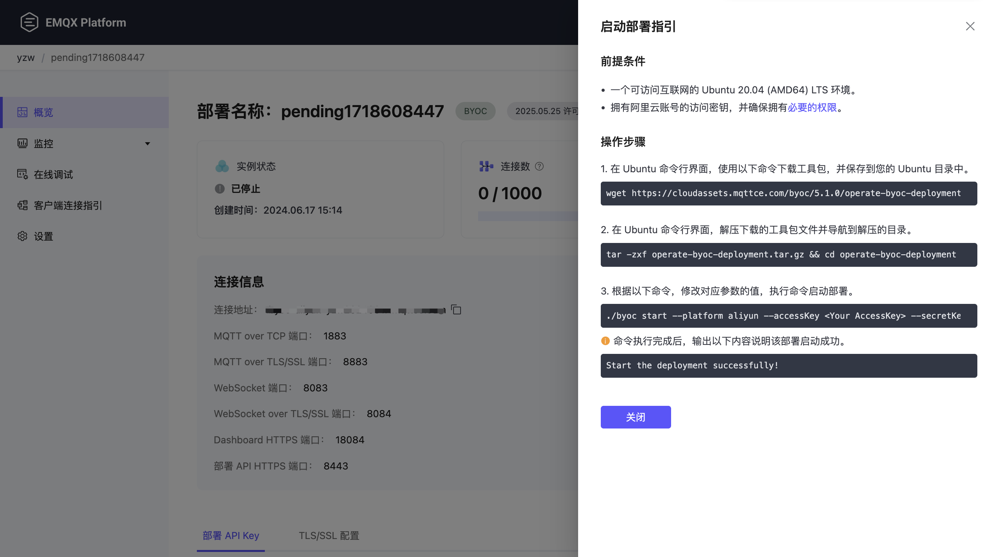
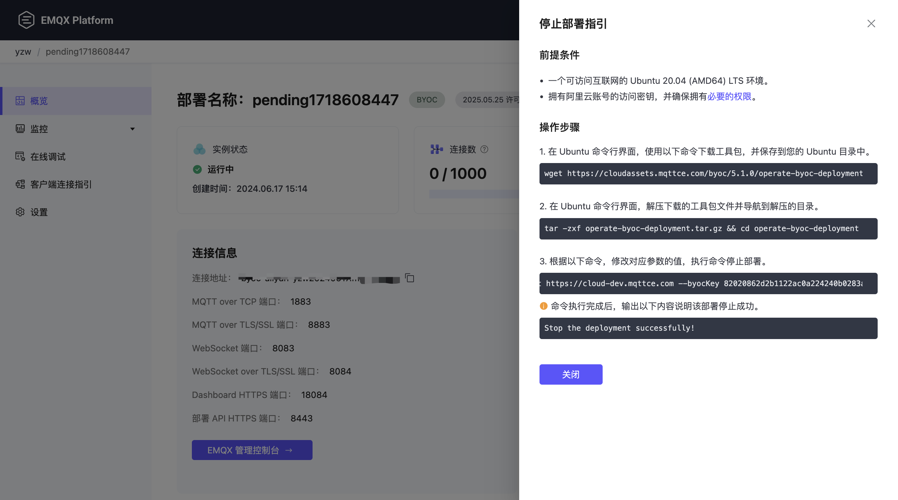

# 启停和删除部署

本页详细介绍了如何在控制台中启动、停止和删除不同版本的部署。


## Serverless 部署

本节描述了如何在控制台中启动、停止和删除 Serverless 部署。

### 启停部署

如需在控制台中启动已经停止的部署，点击部署进入部署概览页面，点击右上角的**启动**按钮。如需停止部署，按照以下步骤操作：

::: warning 注意
停止部署后，设备将不能连接到部署，您的数据和连接地址将会被保留。
:::

1. 在控制台点击您所需要停止的部署，进入部署概览页面。
2. 点击右上角的**停止**按钮，并在弹出框中输入部署名称。
3. 点击**确认**，完成部署停止。


### 删除部署

::: warning 注意
删除部署后，设备将不能连接到部署，部署所有数据和配置将会被删除。
:::

1. 在控制台中，点击您所需要删除的部署，您将进入部署概览页面。
2. 点击右上角的**删除**按钮，并在弹出框中输入部署名称。
3. 点击**确认**，完成部署删除。


## 专有版部署

本节描述了如何在控制台中启动、停止和删除专有版部署。

### 启停部署

如需在控制台中启动已经停止的部署，点击部署进入部署概览页面，点击右上角的**启动**按钮。

如需停止部署，按照以下步骤操作。停止部署之前，您需要确保部署运行状态为**运行中**。

::: warning 注意
停止部署后您将不能连接到部署，您的数据和连接地址将会被保留，同时我们将收取数据保留费用。
:::

1. 在控制台中点击您所需要停止的部署，进入部署概览页面。

2. 点击右上角的**停止**按钮，并在弹出框中输入部署名称。

3. 点击**确认**，完成部署停止。


### 删除部署
删除部署之前，您需要确保部署运行状态为**运行中**。

::: warning 注意
删除部署后您将不能连接到部署，部署所有数据和配置将会被删除, 同时我们将停止部署计费。
:::

1. 在控制台中点击您所需要删除的部署，进入部署概览页面。

2. 点击右上角的**删除**按钮，并在弹出框中输入部署名称。

3. 点击**确认**，完成部署删除。


## BYOC 部署

本节介绍了如何在控制台中启动、停止和删除 BYOC 部署。

### 启动部署

进入控制台，点击您所需要启动的部署，进入部署概览页面。点击右上角的**启动**按钮，弹出**启动部署指引**，如下图所示：



准备一个可访问互联网的 Ubuntu 20.04 (AMD64) LTS 环境，根据**启动部署指引**中生成的操作步骤执行启动命令。在执行操作之前，请确保已经设置了正确的[启动和停止的权限策略](../deployments/byoc_prerequisite.md#云平台账号权限)。

::: tip
请依次复制**启动部署指引**中的命令并将其粘贴到您的 Ubuntu 命令行界面中。此命令包含您在设置页面中提供的值，以及系统预置的信息。
:::

针对不同的部署云平台，具体的操作步骤如下：
:::: tabs
::: tab "阿里云"

1. 在 Ubuntu 命令行界面，使用以下命令下载工具包，并保存到您的 Ubuntu 目录中。

```bash
wget https://cloudassets.emqx.com/cn/byoc-deployments/1.3/operate-byoc-deployment.tar.gz
```

2. 在 Ubuntu 命令行界面，解压下载的工具包文件。

```bash
tar -zxf operate-byoc-deployment.tar.gz && cd operate-byoc-deployment
```

3. 根据以下命令，修改对应参数的值，执行命令启动部署。

```bash
./byoc start \
      --platform aliyun \
      --accessKey <Your Access Key> \
      --secretKey <Your Secret Key> \
      --byocEndpoint https://cloud.emqx.com \
      --byocKey abcdXXXXXXXXXX111
```

注意：在执行`./byoc start`命令前，请填充您的参数后执行。参数释义如下：

- `--accessKey` 您的公有云账号的 AccessKey ID。阿里云平台可以在 [工作台 RAM 访问控制](https://ram.console.aliyun.com/manage/ak) 中查看您的 AccessKey ID。
- `--secretKey` 您的公有云账号的 AccessKey Secret。请使用与 AccessKey ID 对应的 AccessKey Secret。

此外，上述命令中的 `--platform` 为部署的云平台，`--byocEndpoint` 为 EMQX Cloud 访问地址，`--byocKey` 为 BYOC 部署的认证密钥，在控制台生成部署指引时已自动填入相应的值，请勿修改。其中生成的 byocKey 有效期为一小时，请在生成脚本命令后尽快执行。


最终，命令行输出以下内容时，说明部署启动成功。

```bash
Start the deployment successfully!
```

:::
::: tab "亚马逊云科技"

1. 在 Ubuntu 命令行界面，使用以下命令下载工具包，并保存到您的 Ubuntu 目录中。

```bash
wget https://cloudassets.emqx.com/cn/byoc-deployments/1.3/operate-byoc-deployment.tar.gz
```

2. 在 Ubuntu 命令行界面，解压下载的工具包文件。

```bash
tar -zxf operate-byoc-deployment.tar.gz && cd operate-byoc-deployment
```

3. 根据以下命令，修改对应参数的值，执行命令启动部署。

```bash
./byoc start \
      --platform aws_cn \
      --accessKey <Your Access Key> \
      --secretKey <Your Secret Key> \
      --byocEndpoint https://cloud.emqx.com \
      --byocKey abcdXXXXXXXXXX111
```

注意：在执行`./byoc start`命令前，请填充您的参数后执行。参数释义如下：

- `--accessKey`：您的亚马逊云账号中一个用户对应的访问密钥 ID。您可以参考 [管理 IAM 用户的访问密钥](https://docs.amazonaws.cn/IAM/latest/UserGuide/id_credentials_access-keys.html) 文档以获取访问密钥。
- `--secretKey`：您的亚马逊云账号中一个用户对应的访问密钥 Secret。请使用与访问密钥 ID 对应的访问密钥 Secret。

此外，上述命令中的 `--platform` 为部署的云平台，`--byocEndpoint` 为 EMQX Cloud 访问地址，`--byocKey` 为 BYOC 部署的认证密钥，在控制台生成部署指引时已自动填入相应的值，请勿修改。其中生成的 byocKey 有效期为一小时，请在生成脚本命令后尽快执行。


最终，命令行输出以下内容时，说明部署启动成功。

```bash
Start the deployment successfully!
```

:::
::::

### 停止部署

::: warning 注意
停止部署后您将不能连接到部署，您的数据和连接地址将会被保留。
:::

进入控制台，点击您所需要删除的部署，进入部署概览页面。点击右上角的**停止**按钮，弹出**停止部署指引**，如下图所示：



准备一个可访问互联网的 Ubuntu 20.04 (AMD64) LTS 环境，根据**停止部署指引**中生成的操作步骤执行停止命令。在执行操作之前，请确保已经设置了正确的[启动和停止的权限策略](../deployments/byoc_prerequisite.md#云平台账号权限)。

::: tip
请依次复制**停止部署指引**中的命令并将其粘贴到您的 Ubuntu 命令行界面中。此命令包含您在设置页面中提供的值，以及系统预置的信息。
:::

针对不同的部署云平台，具体的操作步骤如下：
:::: tabs
::: tab "阿里云"

1. 在 Ubuntu 命令行界面，使用以下命令下载工具包，并保存到您的 Ubuntu 目录中。
```bash
wget https://cloudassets.emqx.com/cn/byoc-deployments/1.3/operate-byoc-deployment.tar.gz
```

2. 在 Ubuntu 命令行界面，解压下载的工具包文件。
```bash
tar -zxf operate-byoc-deployment.tar.gz && cd operate-byoc-deployment
```

3. 根据以下命令，修改对应参数的值，执行命令停止部署。
```bash
./byoc stop \
      --platform aliyun \
      --accessKey <Your Access Key> \
      --secretKey <Your Secret Key> \
      --byocEndpoint https://cloud.emqx.com \
      --byocKey abcdXXXXXXXXXX111
```
注意：在执行`./byoc stop`命令前，请填充您的参数后执行。参数释义如下：

- `--accessKey` 您的公有云账号的 AccessKey ID。阿里云平台可以在 [工作台 RAM 访问控制](https://ram.console.aliyun.com/manage/ak) 中查看您的 AccessKey ID。
- `--secretKey` 您的公有云账号的 AccessKey Secret。请使用与 AccessKey ID 对应的 AccessKey Secret。

此外，上述命令中的 `--platform` 为部署的云平台，`--byocEndpoint` 为 EMQX Cloud 访问地址，`--byocKey` 为 BYOC 部署的认证密钥，在控制台生成部署指引时已自动填入相应的值，请勿修改。其中生成的 byocKey 有效期为一小时，请在生成脚本命令后尽快执行。


最终，命令行输出以下内容时，说明部署停止成功。
```bash
Stop the deployment successfully!
```
::::
::: tab "亚马逊云科技"

1. 在 Ubuntu 命令行界面，使用以下命令下载工具包，并保存到您的 Ubuntu 目录中。
```bash
wget https://cloudassets.emqx.com/cn/byoc-deployments/1.3/operate-byoc-deployment.tar.gz
```

2. 在 Ubuntu 命令行界面，解压下载的工具包文件。
```bash
tar -zxf operate-byoc-deployment.tar.gz && cd operate-byoc-deployment
```

3. 根据以下命令，修改对应参数的值，执行命令停止部署。
```bash
./byoc stop \
      --platform aws_cn \
      --accessKey <Your Access Key> \
      --secretKey <Your Secret Key> \
      --byocEndpoint https://cloud.emqx.com \
      --byocKey abcdXXXXXXXXXX111
```
注意：在执行`./byoc stop`命令前，请填充您的参数后执行。参数释义如下：

- `--accessKey`：您的亚马逊云账号中一个用户对应的访问密钥 ID。您可以参考 [管理 IAM 用户的访问密钥](https://docs.amazonaws.cn/IAM/latest/UserGuide/id_credentials_access-keys.html) 文档以获取访问密钥。
- `--secretKey`：您的亚马逊云账号中一个用户对应的访问密钥 Secret。请使用与访问密钥 ID 对应的访问密钥 Secret。

此外，上述命令中的 `--platform` 为部署的云平台，`--byocEndpoint` 为 EMQX Cloud 访问地址，`--byocKey` 为 BYOC 部署的认证密钥，在控制台生成部署指引时已自动填入相应的值，请勿修改。其中生成的 byocKey 有效期为一小时，请在生成脚本命令后尽快执行。


最终，命令行输出以下内容时，说明部署停止成功。
```bash
Stop the deployment successfully!
```
:::
::::

### 删除部署
::: tip 前置条件

删除部署之前，您需要确保部署运行状态为**运行中**，并且确保已经删除了部署在 VPC 中创建的所有资源，包括但不限于子网、网关、安全组、自定义路由表、网络ACL、DHCP 选项集以及云企业网，否则可能导致删除失败。

:::

::: warning 注意
删除部署后您将不能连接到部署，部署所有数据和配置将会被删除。
:::

进入控制台，点击您所需要删除的部署，进入部署概览页面。点击右上角的**删除**按钮，弹出**删除部署指引**，如下图所示：


准备一个可访问互联网的 Ubuntu 20.04 (AMD64) LTS 环境，根据**删除部署指引**中生成的操作步骤和命令执行删除。

::: tip
请依次复制**删除部署指引**中的命令并将其粘贴到您的 Ubuntu 命令行界面中。此命令包含您在设置页面中提供的值，以及系统预置的信息。
:::

针对不同的部署云平台，具体的操作步骤如下：
:::: tabs
::: tab "阿里云"

1. 在 Ubuntu 命令行界面，使用以下命令下载工具包，并保存到您的 Ubuntu 目录中。
```bash
wget https://cloudassets.emqx.com/cn/byoc-deployments/1.2/delete-aliyun-byoc-deployment.tar.gz
```

2. 在 Ubuntu 命令行界面，解压下载的工具包文件。
```bash
tar -zxf delete-aliyun-byoc-deployment.tar.gz && cd delete-aliyun-byoc-deployment
```

3. 导航到解压的目录下，根据以下命令，并修改对应参数的值，执行命令进行部署的删除。
```bash
./byoc delete \
      --platform aliyun \
      --accessKey <Your Access Key> \
      --secretKey <Your Secret Key> \
      --byocEndpoint https://cloud.emqx.com \
      --byocKey abcdXXXXXXXXXX111
```
注意：在执行`./byoc delete`命令前，请填充您的参数后执行。参数释义如下：

- `--accessKey` 您的公有云账号的 AccessKey ID。阿里云平台可以在 [工作台 RAM 访问控制](https://ram.console.aliyun.com/manage/ak) 中查看您的 AccessKey ID。
- `--secretKey` 您的公有云账号的 AccessKey Secret。请使用与 AccessKey ID 对应的 AccessKey Secret。

此外，上述命令中的 `--platform` 为部署的云平台，`--byocEndpoint` 为 EMQX Cloud 访问地址，`--byocKey` 为 BYOC 部署的认证密钥，在控制台生成部署指引时已自动填入相应的值，请勿修改。其中生成的 byocKey 有效期为一小时，请在生成脚本命令后尽快执行。

该命令执行后，提示确认需要删除的云资源，输入“yes“回车后继续。

```bash
Do you really want to destroy all resources?
  Terraform will destroy all your managed infrastructure, as shown above.
  There is no undo. Only 'yes' will be accepted to confirm.

  Enter a value: 
```
最终，命令行输出以下内容时，说明部署删除成功。
```bash
Delete the deployment successfully!
```
:::
::: tab "亚马逊云科技"
1. 在 Ubuntu 命令行界面，使用以下命令下载工具包，并保存到您的 Ubuntu 目录中。
```bash
wget https://cloudassets.emqx.com/cn/byoc-deployments/1.2/delete-aws_cn-byoc-deployment.tar.gz
```

2. 在 Ubuntu 命令行界面，解压下载的工具包文件。
```bash
tar -zxf delete-aws_cn-byoc-deployment.tar.gz && cd delete-aws_cn-byoc-deployment
```

3. 导航到解压的目录下，根据以下命令，并修改对应参数的值，执行命令进行部署的删除。
```bash
./byoc delete \
      --platform aws_cn \
      --accessKey <Your Access Key> \
      --secretKey <Your Secret Key> \
      --byocEndpoint https://cloud.emqx.com \
      --byocKey abcdXXXXXXXXXX111
```
注意：在执行`./byoc delete`命令前，请填充您的参数后执行。参数释义如下：

- `--accessKey`：您的亚马逊云账号中一个用户对应的访问密钥 ID。您可以参考 [管理 IAM 用户的访问密钥](https://docs.amazonaws.cn/IAM/latest/UserGuide/id_credentials_access-keys.html) 文档以获取访问密钥。
- `--secretKey`：您的亚马逊云账号中一个用户对应的访问密钥 Secret。请使用与访问密钥 ID 对应的访问密钥 Secret。

此外，上述命令中的 `--platform` 为部署的云平台，`--byocEndpoint` 为 EMQX Cloud 访问地址，`--byocKey` 为 BYOC 部署的认证密钥，在控制台生成部署指引时已自动填入相应的值，请勿修改。其中生成的 byocKey 有效期为一小时，请在生成脚本命令后尽快执行。

该命令执行后，提示确认需要删除的云资源，输入“yes“回车后继续。

```bash
Do you really want to destroy all resources?
  Terraform will destroy all your managed infrastructure, as shown above.
  There is no undo. Only 'yes' will be accepted to confirm.

  Enter a value: 
```
最终，命令行输出以下内容时，说明部署删除成功。
```bash
Delete the deployment successfully!
```
:::
::::


