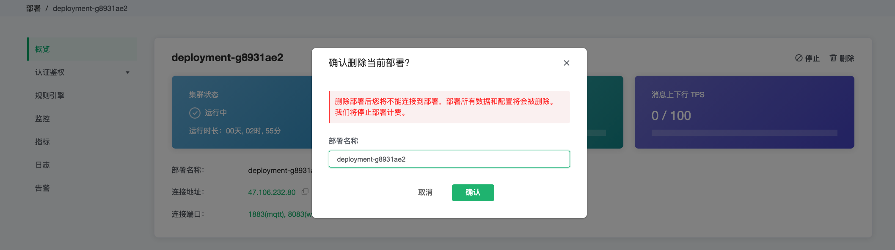
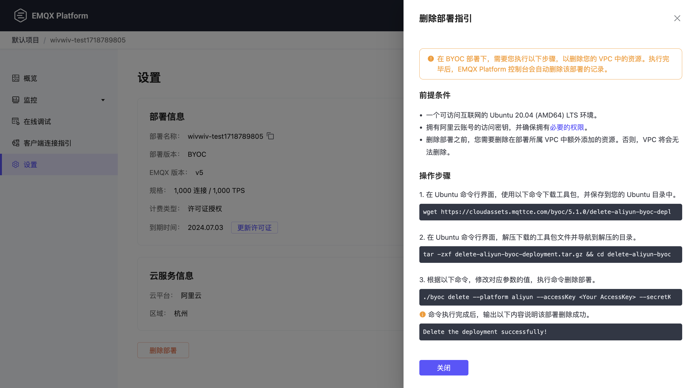

# 停止和删除部署


## Serverless 停止和删除部署

### 停止部署

1. 进入控制台，点击您所需要停止的部署，您将进入部署概览页面

2. 点击停止按钮，并在弹出框中输入部署名称

3. 点击确认，完成部署停止

::: warning
停止部署后，设备将不能连接到部署，您的数据和连接地址将会被保留。
:::


### 删除部署

1. 进入控制台，点击您所需要删除的部署，您将进入部署概览页面

2. 点击删除按钮，并在弹出框中输入部署名称

3. 点击确认，完成部署删除


::: warning
删除部署后，设备将不能连接到部署，部署所有数据和配置将会被删除。
:::


## 专有版停止和删除部署


### 停止部署
::: warning
停止部署后您将不能连接到部署，您的数据和连接地址将会被保留，同时我们将收取数据保留费用。
:::
   
停止部署之前，您需要确保部署运行状态为**运行中**。

1. 进入控制台，点击您所需要停止的部署，您将进入部署详情页面

2. 点击停止按钮，并在弹出框中输入部署名称

3. 点击确认，完成部署停止


### 删除部署
::: warning
删除部署后您将不能连接到部署，部署所有数据和配置将会被删除, 同时我们将停止部署计费。
:::

删除部署之前，您需要确保部署运行状态为**运行中**。

1. 进入控制台，点击您所需要删除的部署，您将进入部署详情页面

2. 点击删除按钮，并在弹出框中输入部署名称

3. 点击确认，完成部署删除




## BYOC 停止和删除部署


### 停止部署
暂不支持通过 UI 的方式停止部署。如您需要暂时停止 EMQX MQTT 服务以节约成本，可在您的公有云控制台中停止相关的虚拟机实例。


### 删除部署
::: warning
删除部署后您将不能连接到部署，部署所有数据和配置将会被删除。
:::

删除部署之前，您需要确保部署运行状态为**运行中**。

1. 进入控制台，点击您所需要删除的部署，您将进入部署详情页面

2. 点击删除按钮，弹出删除部署指引，如下图所示

    

3. 根据删除部署指引，打开您的 Ubuntu 20.04 (AMD64) LTS 环境，依次复制文本框中的命令并将其粘贴到您的 Ubuntu 终端中。

在执行`./byoc delete`命令前，请填充您的参数后执行。参数释义如下：

`--accessKey` 您的公有云账号的 AccessKey ID。阿里云平台可以在 [工作台 RAM 访问控制](https://ram.console.aliyun.com/manage/ak) 中查看您的 AccessKey ID。

`--secretKey` 您的公有云账号的 AccessKey Secret。请使用与 AccessKey ID 对应的 AccessKey Secret。

`--byocKey` 此次 BYOC 删除部署的认证密钥，用于 EMQX Cloud API 的安全认证。由 EMQX Cloud 控制台生成，请勿修改。

示例：

```bash
./byoc delete \
    --accessKey LTAI5t7XXXXXXXXXXXX6A3923 \
    --secretKey g3qQyYeqXXXXXXXXXXXXXLhXuXqN1d \
    --byocKey aaabbbccc
```

当出现以下文字，提示确认需要删除的云资源，输入“yes“回车后继续。

```bash
Do you really want to destroy all resources?
  Terraform will destroy all your managed infrastructure, as shown above.
  There is no undo. Only 'yes' will be accepted to confirm.

  Enter a value: 
```
该命令执行后，输出以下内容说明删除部署执行成功。
```bash
Delete the deployment successfully!
```


