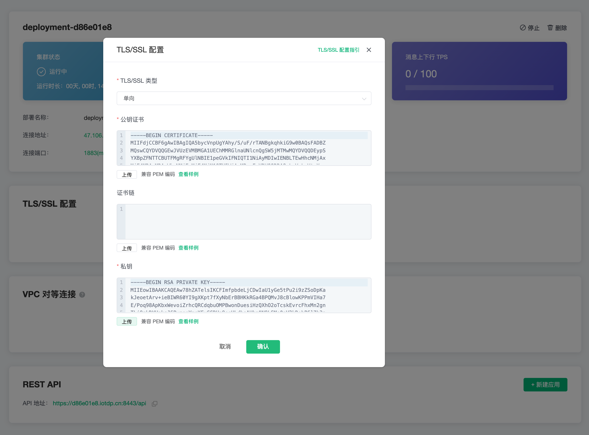
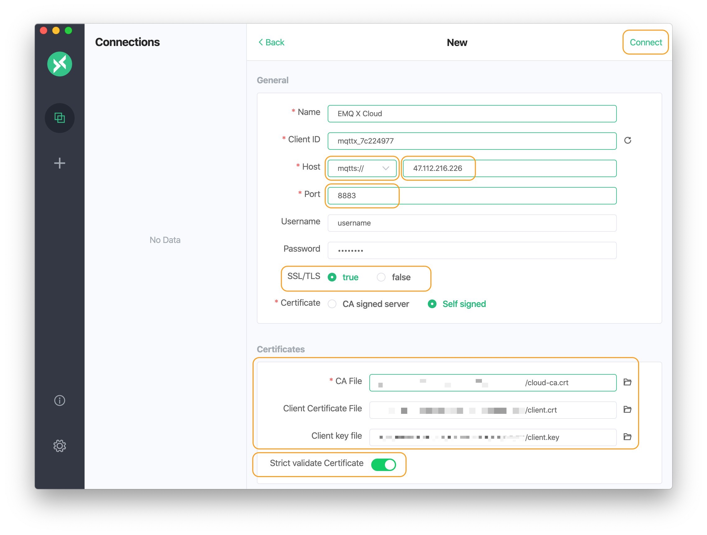

# 配置 TLS/SSL

::: danger
该功能在免费试用和共享部署中不可用
:::

EMQ X Cloud **独享部署** 提供自定义 单向/双向 TLS/SSL 配置，具体如下：

| 认证方式 | 是否支持自签名证书 | 服务器证书 | 证书链 | 私有秘钥 | 客户端 CA 证书 |
| -------- | ------------------ | ---------- | ------ | -------- | -------------- |
| 单向认证 | 支持               | 需要       | 需要   | 需要     | 不需要         |
| 双向认证 | 支持               | 需要       | 需要   | 需要     | 需要           |


## 证书限制

- 证书必须指定加密算法和密钥大小。EMQ X Cloud 支持下列算法：

  - 1024 位 RSA (RSA_1024)
  - 2048 位 RSA (RSA_2048)

- 证书必须是 SSL/TLS X.509 版本 3 证书。它必须包含公有密钥、网站的完全限定域名 (FQDN) 或 IP 地址以及有关发布者的信息。证书可以由您的私有密钥或发证 CA 的私有密钥进行自签名。如果证书由 CA 签名，则在导入证书时必须包含证书链。

- 证书必须是有效的，有效期开始之前和结束的 **60** 天之内，无法导入证书。

- 证书、私有密钥和证书链必须采用 **PEM 编码**。

- 私有秘钥必须是无密码的。

- 证书的加密算法必须与签名 CA 的加密算法匹配。例如，如果签名 CA 的密钥类型为 RSA，则该证书的密钥类型也必须为 RSA。

- 格式说明：

  - 证书格式。

    ```bash
    -----BEGIN CERTIFICATE-----
    Base64–encoded certificate
    -----END CERTIFICATE----- 
    ```

  - 证书链格式。

    ```bash
    -----BEGIN CERTIFICATE-----
    Base64–encoded certificate
    -----END CERTIFICATE----- 
    ```

  - 私有秘钥格式。

    ```bash
    -----BEGIN CERTIFICATE-----
    Base64–encoded certificate
    -----END CERTIFICATE----- 
    ```


## 创建证书

1. 登录 [EMQ X Cloud 控制台](<https://cloud.emqx.io/console>)。
2. 进入部署详情，点击 `+TLS/SSL 配置` 按钮，配置证书内容，您可以上传文件或者直接填写证书内容
   - 认证类型：
     - 单向认证：仅客户端验证服务端证书。
     - 双向认证：客户端和服务端相互验证证书。
   - 证书：服务端证书
   - 证书链：证书链，通常第三方机构签发证书时会提供，如缺失您可以前往 [证书链补全](证书链补全：https://myssl.com/chain_download.html) 补全
   - 私有秘钥：私有秘钥
   - CA 证书：选择双向认证时，需要提供客户端的 CA 证书
3. 填写完成后，点击“确定”。




## 测试连接

测试之前，请确保创建了认证信息，参考 [认证和鉴权](./dashboard/users_and_acl.md)，您可以使用 [MQTTX](<https://mqttx.app/>) 连接和测试。在本教程中我们将使用用 MQTTX 进行测试：
- 新建连接，输入 Name，Client ID 随机生成即可
- 选择 Host，填入部署的连接地址和端口
  - 若选择 SSL 连接，选择 `mqtts://` 和 `8883` 端口
  - 若选择 Websocket with SSL，选择 `wss://` 和 `8084` 端口
- 输入创建的认证信息：用户名和密码
- SSL/TLS 选择 true
- 证书选择
  - 第三方机构认证的证书，不需要提供 CA 证书
  - 自签名证书，提供服务端 CA 证书，若双向认证，还需要提供客户端证书和私钥
- 打开严格模式
- 连接



## 删除证书
删除证书会断开客户端到 `8883` 和 `8084` 的连接，请确保这不会影响到您的业务。
1. 登录 [EMQ X Cloud 控制台](<https://cloud.emqx.io/console>)。
2. 进入部署详情，点击 `TLS/SSL 配置` 部分的证书的删除按钮。
3. 在对话框点击“确定”，完成删除。


## 生成自签名证书

请先确保您已经安装了 [OpenSSL](https://www.openssl.org/)

### CA 证书生成

subj 依据实际使用情况调整。

```bash
openssl req \
    -new \
    -newkey rsa:2048 \
    -days 3650 \
    -nodes \
    -x509 \
    -subj "/C=CN/O=EMQ Technologies Co., Ltd/CN=EMQ CA" \
    -keyout root-ca.key \
    -out root-ca.crt
```

### 服务端证书生成

1. 服务端秘钥生成
```bash
openssl genrsa -out server.key 2048
```

2. 生成服务端证书请求文件 server.csr
```bash
openssl req -new -key server.key -config openssl.cnf -out server.csr
```

3. 用 CA 证书给服务端证书签名
```bash
openssl x509 -req \
    -days 3650 \
    -in server.csr \
    -CA root-ca.crt \
    -CAkey root-ca.key \
    -CAcreateserial -out server.crt \
    -extensions v3_req -extfile openssl.cnf
```

4. 查看服务端证书信息
```bash
openssl x509 -noout -text -in server.crt
```

5. 验证证书
```bash
openssl verify -CAfile root-ca.crt server.crt
```

### 客户端证书生成


1. 客户端秘钥生成
```bash
openssl genrsa -out client.key 2048
```

2. 生成客户端证书请求文件 server.csr
```bash
openssl req -new -key client.key -out client.csr -subj "/CN=Client"
```

3. 用 CA 证书给服务端证书签名
```bash
openssl x509 -req -days 3650 -in client.csr -CA root-ca.crt -CAkey root-ca.key -CAcreateserial -out client.crt
```

4. 查看客户端端证书信息
```bash
openssl x509 -noout -text -in client.crt
```

5. 验证证书
```bash
openssl verify -CAfile root-ca.crt client.crt
```


## 常见问题

1. 证书内容包含多个证书
  
   购买的证书包含中间证书，以文本形式打开证书，多个证书是按照用户证书 - 中间证书 - Root 证书的顺序。一般来说，证书包含用户证书和多个中间证书，您需要将用户证书和中间证书分离开，并将中间证书填入到证书链中。
   ```
   -----BEGIN CERTIFICATE-----

   用户证书
   
   -----END CERTIFICATE-----
   
   -----BEGIN CERTIFICATE-----
   
   中间证书
   
   -----END CERTIFICATE-----
   
   -----BEGIN CERTIFICATE-----
   
   根证书
   
   -----END CERTIFICATE-----
   ```
2. 缺少证书链
  
    证书链补全：https://myssl.com/chain_download.html


