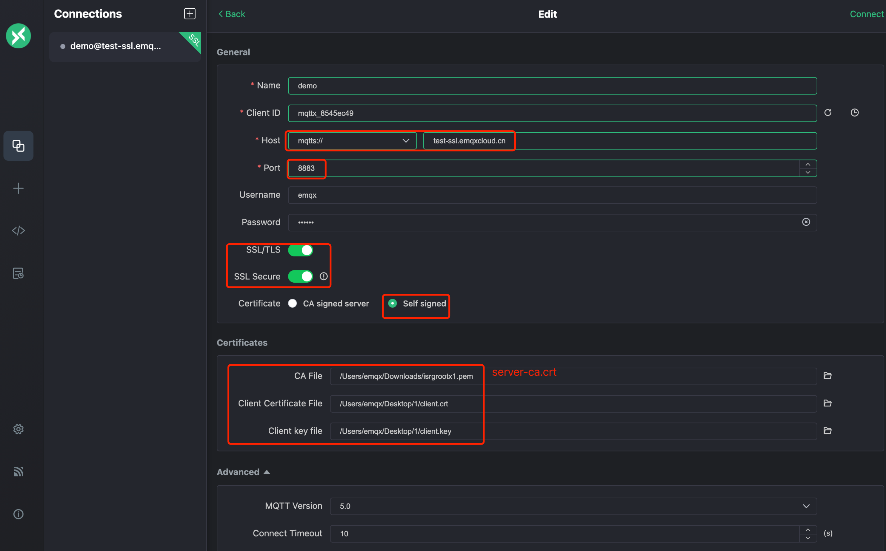

# 专有版 TLS/SSL 配置

::: warning
该功能仅适用于专有版。
:::

EMQX **专业版部署** 推荐使用自定义的证书验证，并且提供单向/双向 TLS/SSL 两种验证模式，具体如下：

| 认证方式 | 是否支持自签名证书 | 服务器证书 | 证书链 | 私有秘钥 | 客户端 CA 证书 |
| -------- | ------------- | ---------- | ------ | -------- | --------------|
| 单向认证 | 支持               | 需要       | 需要   | 需要     | 不需要         |
| 双向认证 | 支持               | 需要       | 需要   | 需要     | 需要           |


## 证书要求

- 证书必须指定加密算法和密钥大小。支持下列算法：

    - 1024 位 RSA (RSA_1024)
    - 2048 位 RSA (RSA_2048)

- 证书（包括证书链，如果适用）：我们只支持上传 **x509** 格式的证书，**请将您的证书（.crt或.pem）和任何相关的证书链文件合并为一个文件后上传**。如果您的证书是由中间证书颁发机构签发的，包含证书链对于确保其被正确识别是非常重要的。

- 证书必须是有效的，有效期开始之前和结束的 **60** 天之内，无法导入证书。

- 证书、私有密钥和证书链必须采用 **PEM 编码**。

- 私有秘钥必须是**无密码**的。

- 私有秘钥支持 `PKCS#1` 和 `PKCS#8` 格式。

- 证书的加密算法必须与签名 CA 的加密算法匹配。例如，如果签名 CA 的密钥类型为 RSA，则该证书的密钥类型也必须为 RSA。

- 格式说明：

    - 证书格式

      ```bash
      -----BEGIN CERTIFICATE-----
      Base64–encoded certificate
      -----END CERTIFICATE----- 
      ```

    - 私有秘钥格式

      ```bash
      -----BEGIN (RSA) PRIVATE KEY-----
      Base64–encoded private key
      -----END (RSA) PRIVATE KEY----- 
      ```

## 创建单向认证

1. 登录 [EMQX Platform 控制台](<https://cloud.emqx.com/console>)。
2. 进入部署详情，点击 **TLS/SSL 配置** 按钮，配置证书内容，您可以上传文件或者直接填写证书内容。
    - TLS/SSL 认证类型：选择单向认证（仅客户端验证服务端证书）。
    - 公钥证书：自定义的服务端证书（包括证书链：通常第三方机构签发证书时会提供，如缺失您可以前往 [证书链补全](https://myssl.com/chain_download.html)）
    - 私钥：私有秘钥
3. 填写完成后，点击 `确定`。


### 使用 MQTTX 测试单向 TLS

测试之前，请确保创建了认证信息，参考 [认证](./default_auth.md)，您可以使用 [MQTTX](<https://mqttx.app/>) 连接和测试。在本教程中我们将使用用 MQTTX 进行测试：

1. 新建连接，输入 Name，Client ID 随机生成即可。
2. 选择 Host，填入部署的连接地址和端口。
    - 若选择 SSL 连接，选择 `mqtts://` 和 `8883` 端口。
    - 若选择 WebSocket with SSL，选择 `wss://` 和 `8084` 端口。
3. 输入创建的认证信息：用户名和密码。
4. 启用 **SSL/TLS**。
5. 选择证书：
    - 如果是 CA 机构认证的证书，点击 `CA signed server`。
    - 如果是自签名证书，点击 `Self signed`，提供自签名服务端 CA 证书。
6. 点击右上角的**连接**。


您还可以查看[单向认证教程视频](https://www.bilibili.com/video/BV1FL4y137YM/?vd_source=e6a065a33d39a5282d8618162b37ad71)了解每一步的设置。


## 创建双向认证

1. 登录 [EMQX Platform 控制台](<https://cloud.emqx.com/console>)。
2. 进入部署详情，点击 **TLS/SSL 配置** 按钮，配置证书内容，您可以上传文件或者直接填写证书内容:
    - TLS/SSL 认证类型：选择双向认证（客户端和服务端相互验证证书）。
    - 公钥证书：自定义的服务端证书（包括证书链：通常第三方机构签发证书时会提供，如缺失您可以前往 [证书链补全](https://myssl.com/chain_download.html)）
    - 私钥：私有秘钥
    - 客户端 CA 证书：选择双向认证时，需要提供客户端的 CA 证书
3. 填写完成后，点击 `确定`。


### 使用 MQTTX 测试双向 TLS

测试之前，请确保创建了认证信息，参考 [认证](./default_auth.md)，您可以使用 [MQTTX](<https://mqttx.app/>) 连接和测试。在本教程中我们将使用用 MQTTX 进行测试：

1. 新建连接，输入 Name，Client ID 随机生成即可。
2. 选择 Host，填入部署的连接地址和端口。
    - 若选择 SSL 连接，选择 `mqtts://` 和 `8883` 端口
    - 若选择 WebSocket with SSL，选择 `wss://` 和 `8084` 端口
3. 输入创建的认证信息：用户名和密码。
4. 启用 SSL/TLS。
5. 选择证书：
    - 如果是 CA 机构认证的服务端证书，点击 `Self signed`，在 CA File 填入证书。
    - 如果是自签名证书，点击 `Self signed`，提供自签名服务端 CA 证书。
    - 双向认证还需填入客户端证书以及客户端密钥。
6. 点击右上角的**连接**。



您还可以查看[双向认证教程视频](https://www.bilibili.com/video/BV1sP4y1c7tN/)了解每一步的设置。


## 删除证书

删除证书会断开客户端到 `8883` 和 `8084` 的连接，请确保这不会影响到您的业务。

1. 登录 [EMQX Platform 控制台](<https://cloud.emqx.com/console>)。
2. 进入部署详情，点击 **TLS/SSL 配置**部分的证书的删除按钮。
3. 在对话框点击“确定”，完成删除。


## 生成自签名证书

请先确保您已经安装了 [OpenSSL](https://www.openssl.org/)。

### 生成自签名服务端证书

1. CA 证书生成 `server-ca.crt`。

   subj 依据实际使用情况调整。

   ```bash
   openssl req \
       -new \
       -newkey rsa:2048 \
       -days 365 \
       -nodes \
       -x509 \
       -subj "/C=CN/O=EMQ Technologies Co., Ltd/CN=EMQ CA" \
       -keyout server-ca.key \
       -out server-ca.crt
   ```
2. 服务端秘钥生成 `server.key`。

```bash
openssl genrsa -out server.key 2048
```

3. 创建 `openssl.cnf` 文件。

**替换 IP.1 地址为当前部署地址**

> 注意：使用亚马逊中国的用户，请将 IP.1 替换成 DNS.1

```
cat << EOF > ./openssl.cnf
[policy_match]
countryName             = match
stateOrProvinceName     = optional
organizationName        = optional
organizationalUnitName  = optional
commonName              = supplied
emailAddress            = optional

[req]
default_bits       = 2048
distinguished_name = req_distinguished_name
req_extensions     = req_ext
x509_extensions    = v3_req
prompt             = no

[req_distinguished_name]
commonName          = Server

[req_ext]
subjectAltName = @alt_names

[v3_req]
subjectAltName = @alt_names

[alt_names]
# EMQX deployment connections address
# 非亚马逊的部署使用 IP.1
IP.1 = <当前部署的地址>
# 亚马逊中国的部署使用 DNS.1
# DNS.1 = <当前部署的地址>
EOF
```

4. 生成服务端证书请求文件 `server.csr`。

```bash
openssl req -new -key server.key -config openssl.cnf -out server.csr
```

5. 用 CA 证书给服务端证书签名，生成服务端证书 `server.crt`。

```bash
openssl x509 -req \
    -days 365 \
    -sha256 \
    -in server.csr \
    -CA server-ca.crt \
    -CAkey server-ca.key \
    -CAcreateserial -out server.crt \
    -extensions v3_req -extfile openssl.cnf
```

6. 查看服务端证书信息。

```bash
openssl x509 -noout -text -in server.crt
```

7. 验证证书。

```bash
openssl verify -CAfile server-ca.crt server.crt
```

### 生成自签名客户端证书

1. CA 证书生成 `client-ca.crt`。

   subj 依据实际使用情况调整。

   ```bash
   openssl req \
       -new \
       -newkey rsa:2048 \
       -days 365 \
       -nodes \
       -x509 \
       -subj "/C=CN/O=EMQ Technologies Co., Ltd/CN=EMQ CA" \
       -keyout client-ca.key \
       -out client-ca.crt
   ```
   
2. 客户端秘钥生成 `client.key`。

```bash
openssl genrsa -out client.key 2048
```

3. 生成客户端证书请求文件 `client.csr`。

```bash
openssl req -new -key client.key -out client.csr -subj "/CN=Client"
```

4. 用 CA 证书给客户端证书签名，生成 `client.crt`。

```bash
openssl x509 -req -days 365 -sha256 -in client.csr -CA client-ca.crt -CAkey client-ca.key -CAcreateserial -out client.crt
```

6. 查看客户端端证书信息。

```bash
openssl x509 -noout -text -in client.crt
```

7. 验证证书。

```bash
openssl verify -CAfile client-ca.crt client.crt
```

## 常见问题

1. 证书内容包含多个证书。

   购买的证书包含中间证书，以文本形式打开证书，多个证书是按照用户证书 - 中间证书 - Root 证书的顺序。一般来说，证书包含用户证书和多个中间证书，您需要将用户证书和中间证书分离开，并将中间证书填入到证书链中。
   ```
   -----BEGIN CERTIFICATE-----
   
   用户证书
   
   -----END CERTIFICATE-----
   
   -----BEGIN CERTIFICATE-----
   
   中间证书
   
   -----END CERTIFICATE-----
   
   -----BEGIN CERTIFICATE-----
   
   根证书
   
   -----END CERTIFICATE-----
   ```
2. 缺少证书链。

   证书链补全：<https://myssl.com/chain_download.html>

