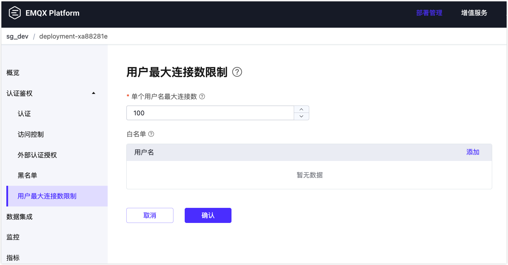
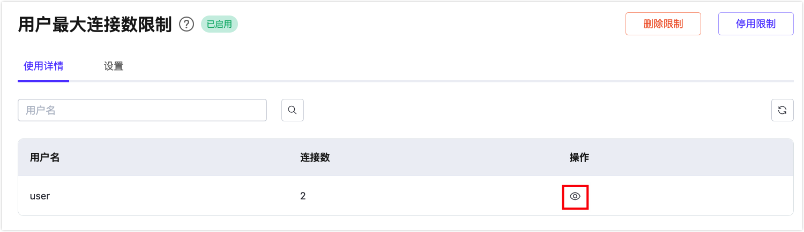

# 用户最大连接数限制

用户最大连接数限制功能用于限制单个 MQTT 用户名的最大连接数。当某个用户名超过其配额时，新的会话连接将被拒绝，并发送相应的 CONNACK 返回码："0x97 配额已超"（MQTT 5.0）或 "0x03 服务不可用"（MQTT 3.1.1）。

## 启用和配置用户最大连接数限制

1. 进入您的部署页面，并从左侧导航菜单中点击**用户最大连接数限制**。

2. 点击**设置限制**以启用该功能。

3. 为用户最大连接数限制配置以下选项：

   - **单个用户名最大连接数**：定义每个用户名允许的最大 MQTT 会话连接数，默认值为 100。此选项适用于除白名单以外的所有用户名。

     ::: tip 提示

     如果 MQTT 客户端使用持久会话连接到部署，即使客户端断开连接，该会话也将保留，直到会话过期并被清除。会话数是通过计算已连接客户端和具有保留会话的已断开客户端的数量得出的。 

     :::

   - **白名单（可选）**：您可以通过点击右侧的**添加**按钮来添加用户名条目。白名单中的用户名不受连接数限制。例如，使用 MQTT 桥接连接到部署的客户端应绕过连接数限制，您可以将 MQTT 桥接使用的用户名添加到白名单中。

4. 点击**确认**以完成设置。

## 管理用户最大连接数限制

启用用户最大连接数限制后，您可以在**使用详情**标签页中监控连接数使用情况。点击右侧的刷新图标以确保加载最新数据。

此页面显示了当前已连接客户端的用户名及其建立的会话连接数。要查看特定用户名的会话连接详情，请点击**操作**列中的查看图标。选择**客户端**弹出窗口中的客户端 ID，将引导您进入**监控** -> **客户端详情**页面。

在**设置**标签页中，您可以修改用户最大连接数限制的配置。

要永久删除会话限制，请点击**删除限制**按钮。请注意，此操作不可撤销。或者，您可以通过点击**禁用限制**按钮暂时停用用户最大连接数限制，保留配置以供将来使用。