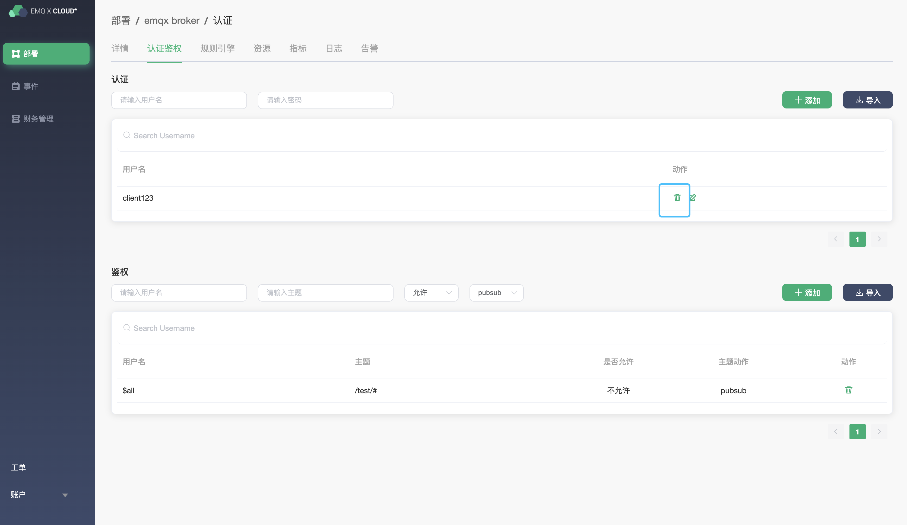
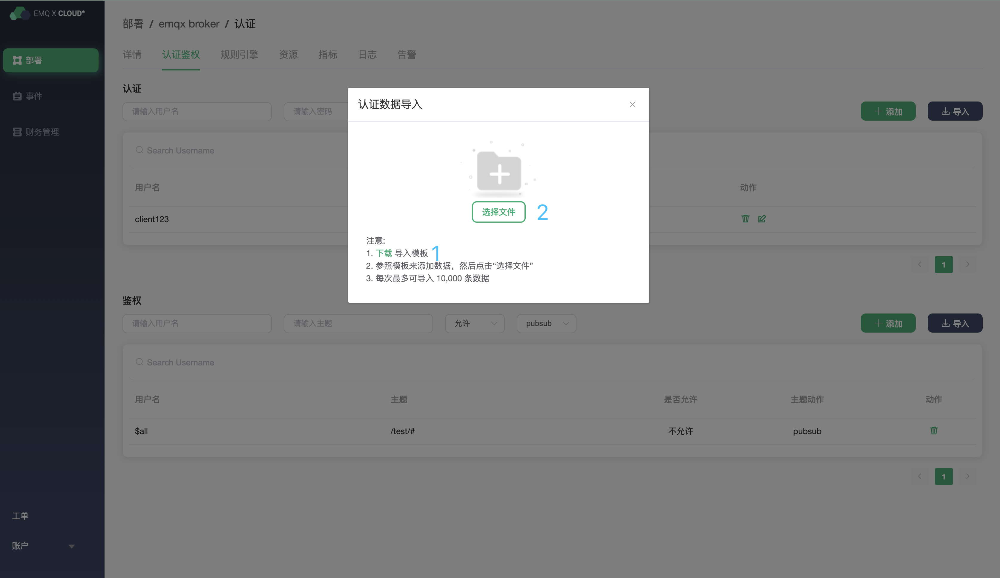
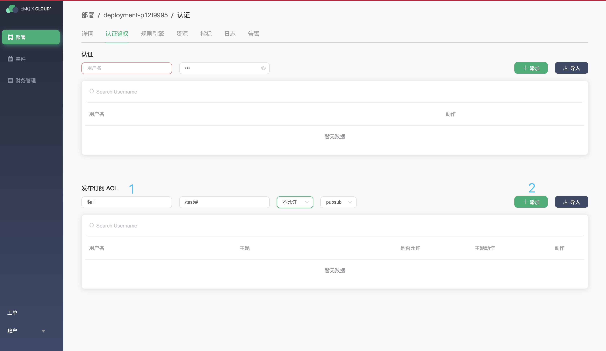
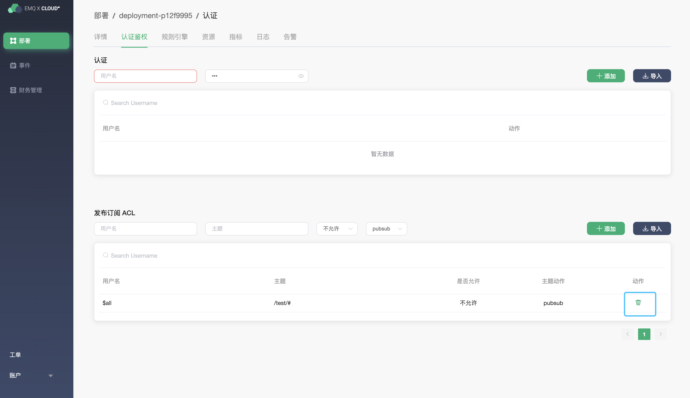
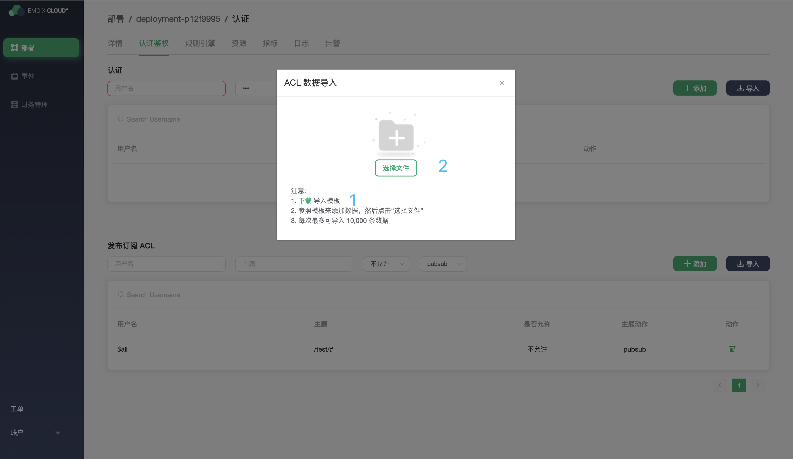
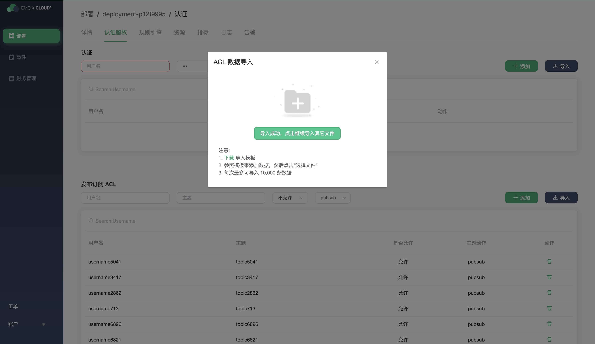

# 认证和鉴权

EMQ X Cloud 完整支持 MQTT 各项安全规范，内置的安全功能无需编程开箱即用，可以快速排除项目中的安全隐患。在使用Users and ACL 时，您需要确保部署状态为 `running`

## 认证

EMQ X Cloud 客户端支持 `username` ,`password` 认证

### 增加客户端认证信息

### 删除客户端认证信息

### 批量导入客户端认证信息

1. 点击导入按钮

2. 下载导入 csv 模板

   

3. 填写客户端认证信息

   > 注意: 你不能更改模板文件格式以及标题头，并且导入username 和 password 只能以中文或者英文大小写字母开头，中间可以包含中文，英文字母大小写，阿拉伯数字0-9，连接符（-），点（.），下划线（_）

   

4. 上传客户端认证 csv

5. 查看导入信息

   

## 发布订阅 ACL

EMQ X Cloud 发布订阅 ACL 支持 `username`, `topic` 模式

### 增加 ACL 信息

### 删除 ACL 信息

### 批量导入 ACL 信息

1. 点击导入按钮

2. 下载导入 csv 模板

   

3. 填写 ACL 信息

   > 注意: 您不能更改模板文件格式以及标题头，并且导入 username  只能以中文或者英文大小写字母开头，中间可以包含中文，英文字母大小写，阿拉伯数字0-9，连接符（-），点（.），下划线（_）

   

4. 上传 ACL信息

5. 查看导入信息

   

