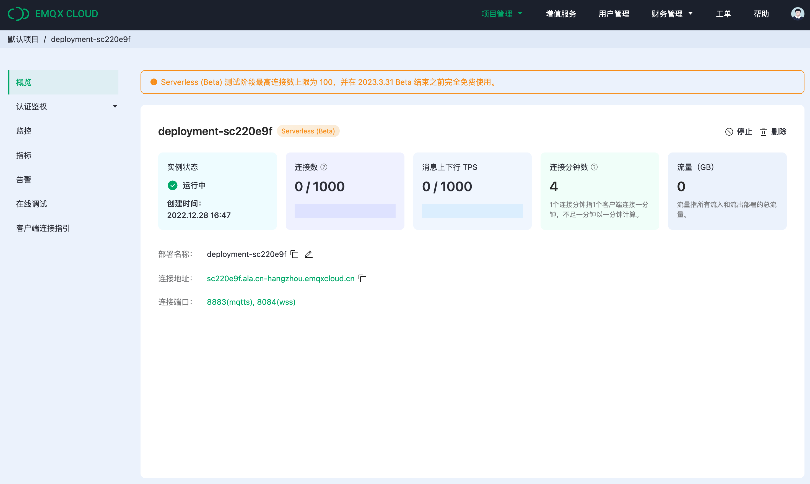
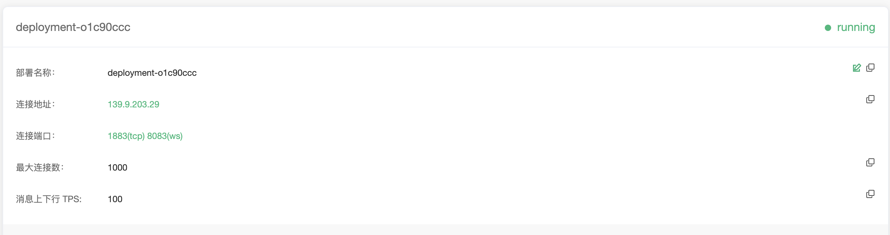

# 部署概览

在部署概览中您可以查找到最重要的连接信息和数据状态，Serverless 和专有版在显示上略有不同。

:::: tabs type:card
::: tab Serverless (Beta) 部署详情
## 查看部署基本信息
部署概览页面可获取到部署最新的状态和连接信息：

- 部署状态：部署运行状态和创建时间。
- 连接数：当前的连接数和最大连接数，在Beta期间，最大的连接数上限为100。
- 消息上下行 TPS：当前每秒钟消息发送和接收条数和上限。
- 连接分钟数：本月已经使用的总连接分钟数。此数值的统计有1小时的延时。
- 流量：本月已经产生入网和出网的流量。此数值的统计有1小时的延时。
- 部署名称：可自定义的部署的名称。
- 连接地址：域名地址。
- 连接端口：默认开启 8883(mqtts) 和 8084(wss) 端口。

Serverless 仅支持 8883(mqtts) 和 8084(wss) 端口。如果客户端需要 CA 文件，请[在此下载](https://assets.emqx.com/data/emqxsl-ca.crt)。

:::
::: tab 专有版

## 查看部署基本信息

部署概览页面可获取到连接地址和连接端口（以下 xxxxx 表示随机端口，具体端口信息以部署概览页面信息为准）：

* 实例状态：运行状态和运行时长
* 连接数：当前连接数和最大连接数
* 消息上下行 TPS：当前每秒钟消息发送和接收条数和上限
* 部署名称：该部署的名称，可以通过点击右侧的编辑按钮进行修改

* 连接地址

  * 专业版部署连接地址：IP

  * 基础版连接地址：以 emqx.cloud 后缀结尾的域名

* 连接端口：

  * 专业版部署端口：默认开启 1883(mqtt)、8083(ws)，您可以通过配置 TLS/SSL 开启 8883(mqtts) 和 8084(wss) 端口。
  * 基础版部署端口：**15xxx**(mqtt)， **8083**(ws)， **15xxx**(mqtts)， **8084**(wss)

## [TLS/SSL 配置](./tls_ssl.md)

EMQX Cloud 提供自定义 **单双向 TLS/SSL** 认证，并支持 **自签名证书** 和 **CA 签名证书**。

## [VPC 对等连接配置](./vpc_peering.md)

EMQX Cloud 支持同云服务商、同区域与客户已有 VPC(Virtual Private Cloud) 创建对等连接。 VPC 对等连接是两个 VPC 之间的网络连接，通过此连接，使两个 VPC 中的实例可以彼此通信，就像它们在同一网络中一样。

## [私网连接 PrivateLink 配置](./privatelink.md)
私网连接（PrivateLink）能够实现 EMQX Cloud 部署所在的专有网络 VPC 与公有云上的服务建立安全稳定的私有连接，简化网络架构，实现私网访问服务，避免通过公网访问服务带来的潜在安全风险。

## [API 访问](../api/introduction.md)

EMQX Cloud 提供了 REST API 以实现与外部系统的集成，例如查询客户端信息、发布消息和创建规则等。

:::
::::

