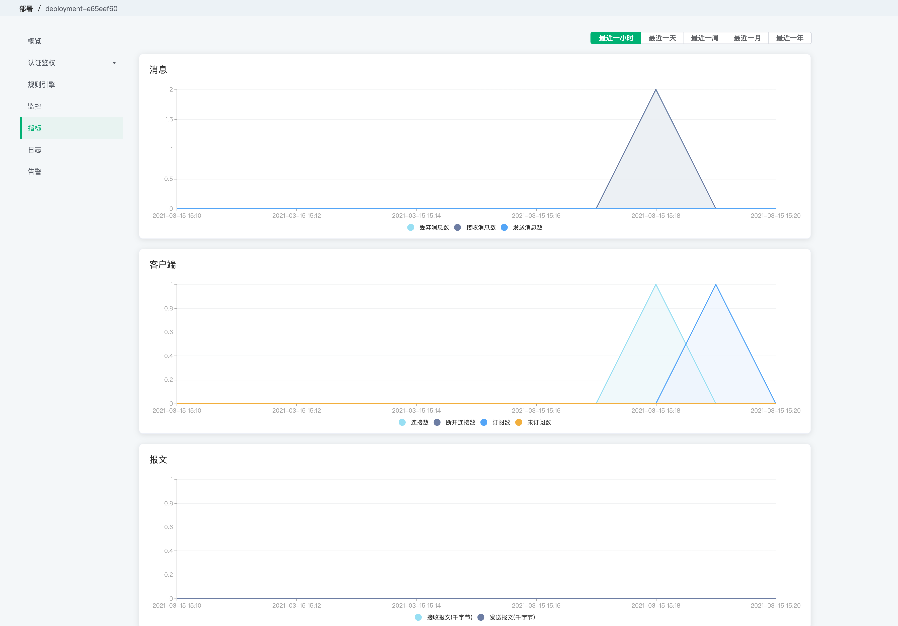

# 查看部署

在本教程中，您将学习如何查看部署信息、获取连接地址、查看 API 地址等功能，

## 查看部署信息

在这里您能查看到如下部署信息：

* 集群状态：运行状态和运行时长
* 连接数：当前连接数和最大连接数
* 消息上下行 TPS：当前每秒钟消息发送和接收条数和上限
* 部署名称：该部署的名称，可以通过点击右侧的编辑按钮进行修改

* 连接地址

  * 独享部署连接地址：IP

  * 免费试用以及共享部署连接地址：以 emqx.cloud 后缀结尾的域名

* 连接端口：

  * 独享部署端口：默认开启 **1883**(tcp)， **8083**(ws)，您可以通过 [配置 TLS/SSL](./tls_ssl.md) 开启 **8883**(tls)， **8084**(wss)
  * 免费试用以及共享部署端口：**11xxx**(tcp)， **8083**(ws)， **11xxx**(tls)， **8084**(wss)

## [TLS/SSL 配置](./tls_ssl.md) 

> 免费试用及共享部署不支持该功能

EMQ X Cloud 提供自定义 **单双向 TLS/SSL** 认证，并支持 **自签名证书** 和 **CA 签名证书**。

## [VPC 对等连接配置](./vpc_peering.md)

> 免费试用及共享部署不支持该功能

EMQ X Cloud 支持同云服务商、同区域与客户已有 VPC(Virtual Private Cloud) 创建对等连接。 VPC 对等连接是两个 VPC 之间的网络连接，通过此连接，使两个 VPC 中的实例可以彼此通信，就像它们在同一网络中一样。

## [API 访问](./api/api.md)

EMQ X Cloud 提供了 REST API 以实现与外部系统的集成，例如查询客户端信息、发布消息和创建规则等。

## [认证鉴权](./auth_and_acl.md)
EMQ X Cloud 提供了认证鉴权功能，可对认证和访问控制进行管理。

## [监控](./monitors.md)
EMQ X Cloud 提供了监控指标，可实时查看连接数，TPS，订阅数和主题数等数据。

## [指标](./metrics.md)

EMQ X Cloud 提供消息、客户端、报文、交付四种集群指标监控，允许用户以及运维人员根据这些指标来了解当前服务状态。

## [日志](./logs.md)

EMQ X Cloud 提供实时在线查看 各节点 EMQ X 日志功能。

## [告警](./alerts.md)

EMQ X Cloud 提供了实时查看告警以及告警集成等功能。

