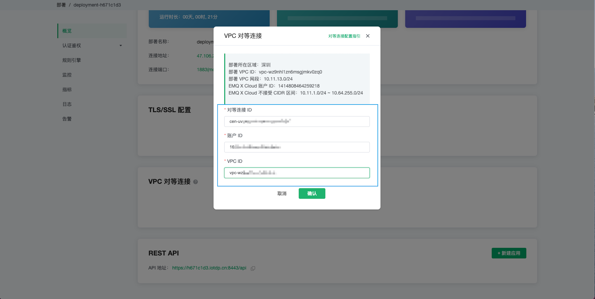
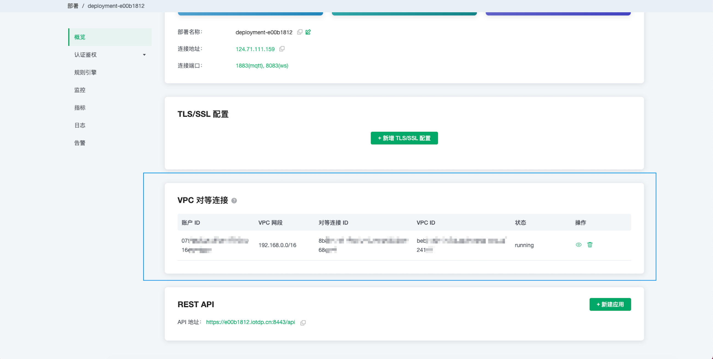
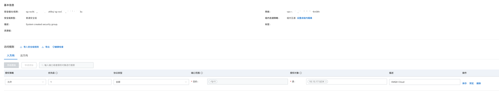
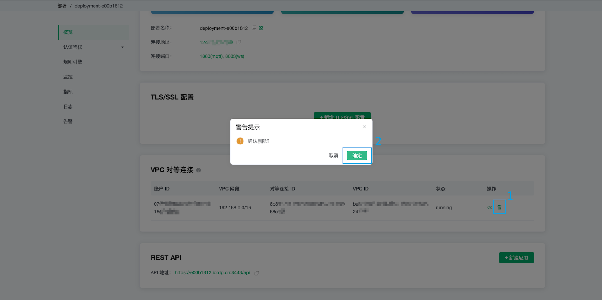
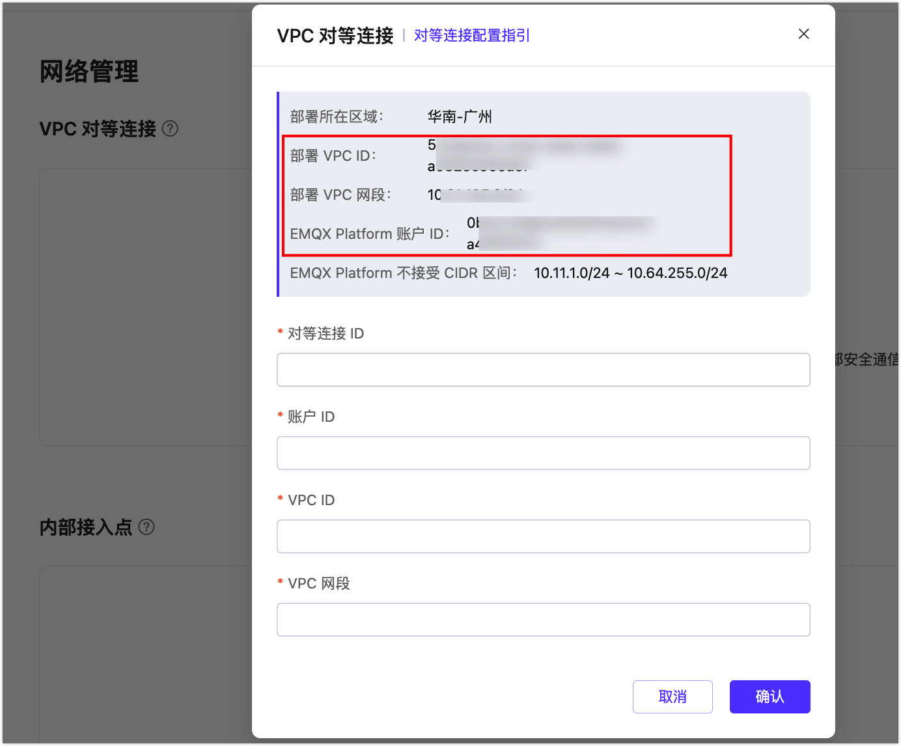
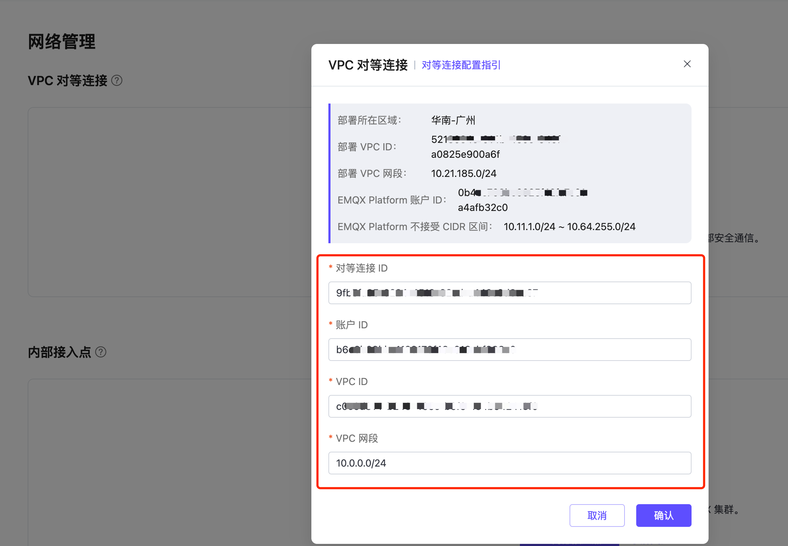
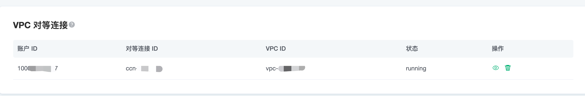
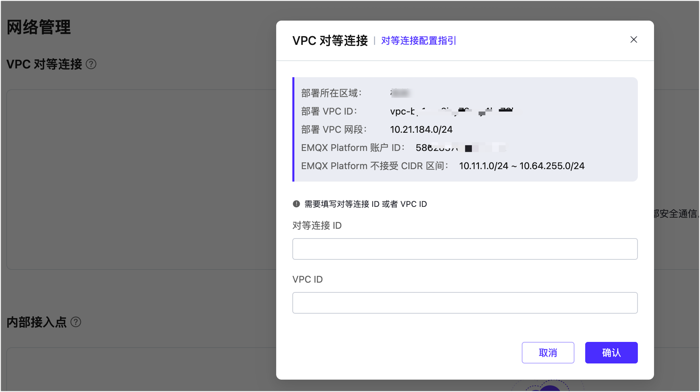
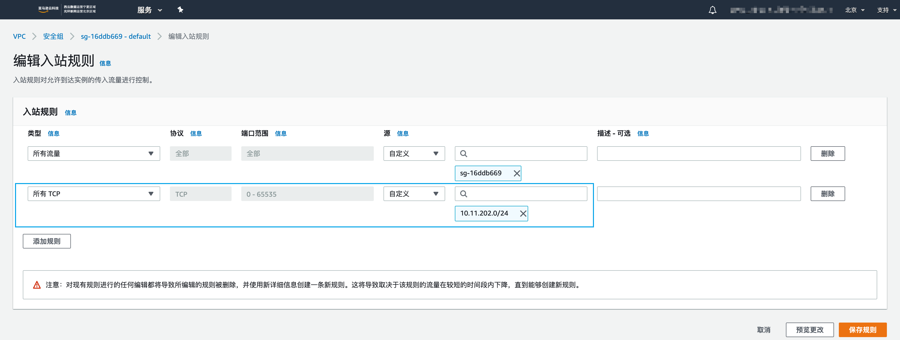

# VPC 对等连接设置

::: danger
该功能在基础版中不可用
:::

VPC 对等连接是两个 VPC 之间的网络连接，通过此连接，使两个 VPC 中的实例可以彼此通信，就像它们在同一网络中一样。

## 注意事项

1. EMQ X Cloud 只支持**同一区域**创建对等连接。
2. EMQ X Cloud 不接收 `10.10.0.0/24 ～ 10.64.255.0/24` 范围内的网段，请合理规划您的 VPC 网段。
3. 对等连接与规则引擎资源相互绑定，创建资源前请先创建对等连接。

## 阿里云平台对等连接

在阿里云平台，VPC 对等连接又称为 [云企业网](https://cn.aliyun.com/product/cbn)

### 创建对等连接

1. 登录您的阿里云账户，并进入[云企业网页面](<https://cen.console.aliyun.com/cen/list>)

2. 切到旧版

3. 点击创建云企业网实例

4. 填写 VPC 相关信息，然后点击确定

   > 注意：一个 VPC 只能关联一个云企业网

   

5. 登录 [EMQ X Cloud 控制台](<https://cloud.emqx.com/console>)，进入所需创建部署详情，点击 `+VPC 对等连接` 按钮，填写您阿里云云企业网相关信息，并记录下 EMQ X Cloud VPC 对等连接提示

   * 对等连接ID == 云企业网实例 ID
   * 账户ID == 阿里云账户ID
   * VPC ID == 挂载到云企业网中的 VPC ID

   

6. 登录您阿里云账号，访问刚创建好的云企业网实例详情，点击加载网络实例，填写 EMQ X Cloud 部署相关信息，点击确定

   > 注意：您需要在10分钟内完成 EMQ X Cloud 对等连接相关信息添加，否则将视为失败

   

7. 登录 EMQ X Cloud 控制台，访问部署详情，查看对等连接状态

   

8. 登录您阿里云账号，配置安全组，允许 EMQ X Cloud 网段访问您的 VPC
  
   

### 删除对等连接

删除对等连接，您需要确保对等连接状态为 `running`

> 注意: 删除对等连接前，请确保部署不存在任何关联的资源，否则将导致不可预估的风险

1. 进入部署详情

2. 点击对等连接右侧 `删除按钮`

   

## 华为云平台对等连接

### 创建对等连接

1. 登录 [EMQ X Cloud 控制台](<https://cloud.emqx.com/console>)，进入所需创建部署详情，点击 `+VPC 对等连接` 按钮，记录以下 EMQ X Cloud VPC 对等连接提示
    > 注意：暂时不要关闭该页面

   * 部署 VPC ID
   * EMQ X Cloud 账户 ID
   * 部署 VPC 网段

   

2. 登录华为云账号，进入控制台 -> 虚拟私有云 VPC

    

3. 点击 `对等连接` -> `创建对等连接`，选择其它账户。填入刚才在 [EMQ X Cloud 控制台](<https://cloud.emqx.com/console>) 记录的信息，点击确定创建对等连接请求

    * 对端项目 ID == EMQ X Cloud 账户 ID
    * 对端 VPC ID == 部署 VPC ID

    

4. 在对等连接信息界面，记录下以下 3 个值
  
    * 1 为 对等连接 ID
    * 2 为 VPC 网段
    * 3 为 VPC ID

    

    

5. 找到 `我的凭证`，记录下用户 ID

    

6. 回到 [EMQ X Cloud 控制台](<https://cloud.emqx.com/console>)。填写步骤 4 记录的 `对等连接 ID`，`VPC 网段`，`VPC ID` 和步骤 5 记录的 `用户 ID`。点击 `确定`，完成对等连接

    

7. 在华为云控制台，打开 `虚拟私有云 VPC` -> `路由表`，将步骤 1 中的部署 VPC 网段加入到对应 VPC 的路由表中
  
    > 注意：下一跳类型为 对等连接

    

8. 在华为云控制台里配置安全组，允许 EMQ X Cloud 网段访问您的 VPC

    

### 删除对等连接

删除对等连接，您需要确保对等连接状态为 `running`

> 注意: 删除对等连接前，请确保部署不存在任何关联的资源，否则将导致不可预估的风险

1. 进入部署详情

2. 点击对等连接右侧 `删除按钮`

   

## 腾讯云平台对等连接

在腾讯云平台，VPC 对等连接又称为 [云联网](https://cloud.tencent.com/document/product/877)。

### 创建对等连接

1. 登录您的腾讯云账户，并进入[云联网](https://console.cloud.tencent.com/vpc/ccn)

2. 点击创建云联网实例

3. 填写 VPC 相关信息，然后点击确定

   > 注意：一个 VPC 只能关联一个云联网

   

4. 登录 [EMQ X Cloud 控制台](<https://cloud.emqx.com/console>)，进入所需创建部署详情，点击 `+VPC 对等连接` 按钮，填写您腾讯云云联网相关信息，并记录下 EMQ X Cloud VPC 对等连接提示

   * 对等连接ID == 云联网实例 ID
   * 账户ID == 云联网实例所在账户 ID
   * VPC ID == 部署 VPC ID

   

5. 登录您腾讯云账号，访问刚创建好的云联网实例详情，在关联实例中，找到请求的 VPC 信息，点击同意

   > 注意：您需要在 10 分钟内完成 EMQ X Cloud 对等连接相关信息添加，否则将视为失败

   

6. 登录 EMQ X Cloud 控制台，访问部署详情，查看对等连接状态

   

7. 在腾讯云控制台配置安全组，允许 EMQ X Cloud 网段访问您的 VPC，来源网段可以在对等连接详情界面中查看

   

### 删除对等连接

删除对等连接，您需要确保对等连接状态为 `running`

> 注意: 删除对等连接前，请确保部署不存在任何关联的资源，否则将导致不可预估的风险

1. 进入部署详情

2. 点击对等连接右侧 `删除按钮`

   

## AWS 平台对等连接

### 创建对等连接

1. 登陆 [EMQ X Cloud 控制台](https://cloud.emqx.com/console)，进入对应的部署，点击 `+ VPC 对等连接` 按钮，在弹出的窗口里，记录下`部署所在区域`、`部署 VPC ID`、`部署 VPC 网段`和 `EMQ X Cloud 账户 ID`，后面的步骤用将会用到这些信息。同时，请不要关闭该窗口。

    

2. 登录亚马逊（中国）控制台，切换区域到步骤 1 里提到的`部署所在区域`，找到`联网` -> `VPC` -> `对等连接`，点击上方的`创建对等连接`

    * 在账户处选择`另一个账户`，`账户 ID` 填入步骤 1 提到的 `EMQ X Cloud 账户 ID`
    * 在区域处选择`此区域`
    * 在 VPC ID (接受方)处，填入步骤 1 提到的 `部署 VPC ID`

    

3. 一旦完成创建，如下图所示。请记录下`请求方拥有者 ID`、`请求者 VPC`、`对等连接 ID`，后面的步骤用将会用到这些信息。

    

4. 回到 [EMQ X Cloud 控制台](https://cloud.emqx.com/console)，填入步骤 3 记录的信息，然后点击确认，完成对等连接。

    * 对等连接 ID 填入 `对等连接 ID`
    * 账户 ID 填入 `请求方拥有者 ID`
    * VPC ID 填入 `请求者 VPC`

    

5. 返回亚马逊（中国）控制台，找到`联网` -> `VPC` -> `路由表`，将步骤 1 记录下的`部署 VPC 网段`加入对应的 VPC 路由表中

    

6. 找到`联网` -> `VPC` -> `安全组`，找到绑定在对应 VPC 上的安全组，修改其中的安全组规则

    

### 删除对等连接

在删除对等连接前，您需要确保对等连接状态为 `running`

> 注意: 删除对等连接前，请确保部署不存在任何关联的资源，否则将导致不可预估的风险

1. 进入部署详情

2. 点击对等连接右侧 `删除按钮`

   
