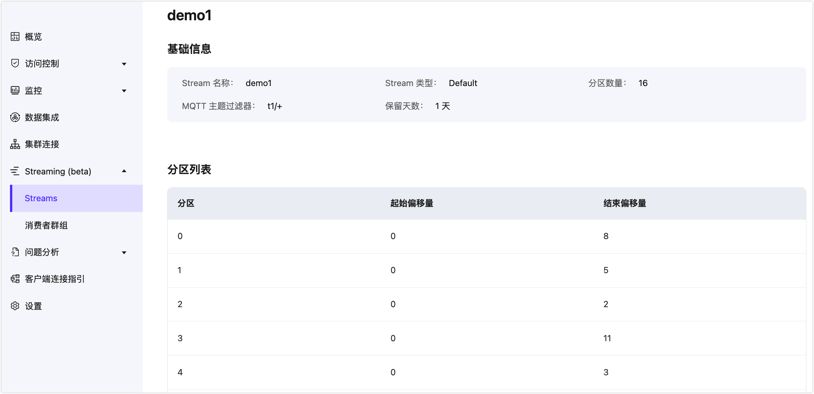
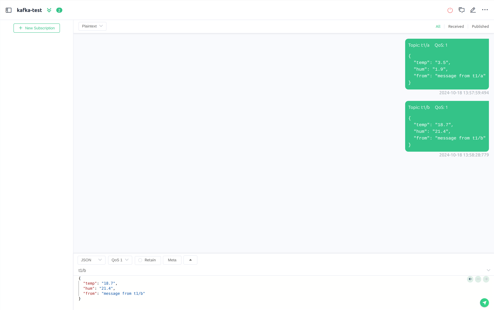
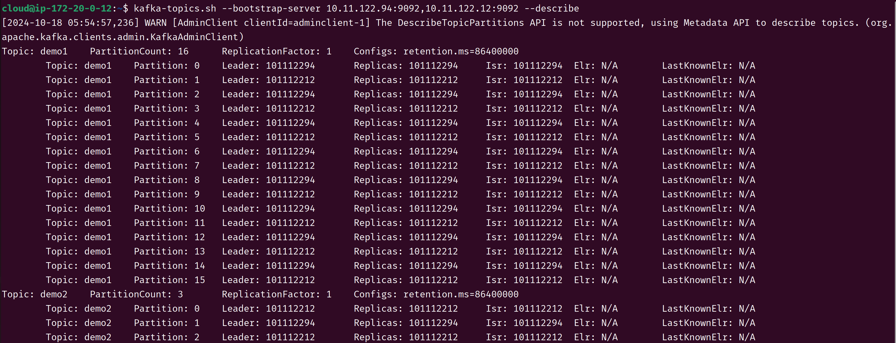
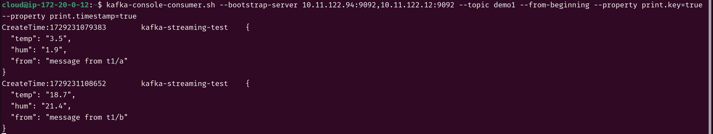
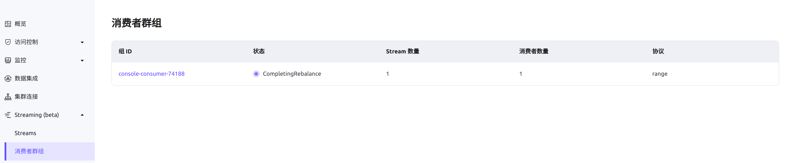
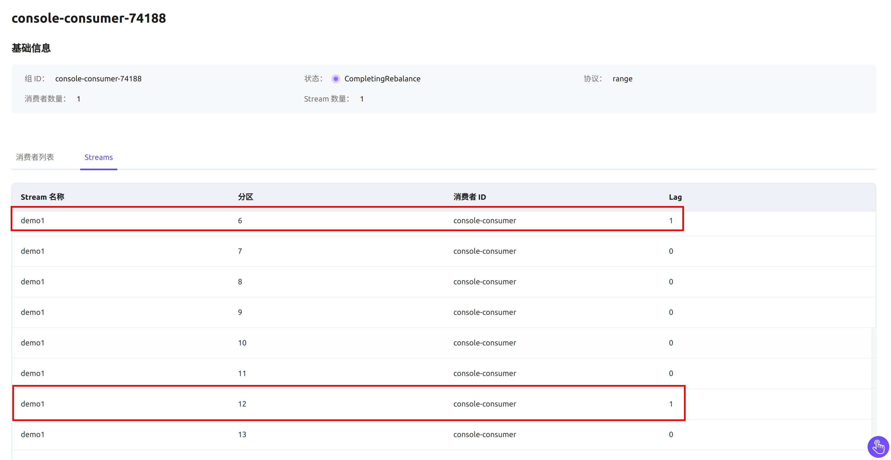

# 在 EMQX 旗舰版中使用 EMQX Streaming

本页面为您提供了如何在旗舰版部署中使用 EMQX Streaming 功能的详细指导。

## 前置准备

在开始之前，请确保您已完成以下步骤：

- 已创建了一个旗舰版部署。有关详细说明，请参考[创建旗舰版部署](../create/premium.md)。
- 已为您的部署启用 VPC 对等连接。有关说明，请参考 [VPC 对等连接设置](../deployments/vpc_peering.md)。
- 已设置用于发布消息的 MQTT 客户端。
- 已准备好用于消费消息的 Kafka 客户端。

## 在 EMQX Platform 控制台中启用 EMQX Streaming

EMQX Streaming 功能只能通过提交工单来激活。

1. 登录 EMQX Platform，进入您的部署，导航到 **Streaming (beta)**。
2. 点击页面上的 **开通 Streaming (beta)** 按钮提交工单。

一旦 EMQX Streaming 被激活，Kafka 端点信息将显示在 **Streaming (beta)** -> **Streams** 页面的中。

## 创建 Stream

用户可以创建两种类型的 stream：Default 和 Free。Default stream 与 MQTT 主题过滤器关联，默认创建 16 个分区，用于存储所有匹配的 MQTT 消息。Free stream 独立于 MQTT 主题运作，具有可自定义的分区数量，为非 MQTT 使用场景提供了更大的灵活性。

两种类型的 stream 的保留时间都固定为 1 天，且无法修改。

1. 导航到 **Streaming (beta)** -> **Streams**。
2. 在 Streams 页面点击**新建**。在**新建 Streams** 弹窗中，完成以下设置：
   - **Stream 名称**：为 stream 提供一个名称，例如 `demo1`。Kafka 客户端的 Kafka 主题必须与 stream 名称匹配。
   - **Stream 类型**：选择 stream 类型。
     - **Default**：Default stream 与 MQTT 主题过滤器关联，匹配该过滤器的 MQTT 消息将保存到该 stream 中。
     - **Free**：Free stream 不与 MQTT 主题过滤器关联，通常用于其他数据处理用途。
   - **MQTT 主题过滤器**：如果选择了 `Default` 类型，输入一个 MQTT 消息的主题过滤器。匹配该过滤器的 MQTT 消息将保存到相应的 default stream 中。本示例中，输入 `t1/+`。
   - **分区数量**：如果选择了 `Free` 类型，请指定分区数量，以便 stream 在扩展性和并行处理方面进行划分。
3. 点击**确认**。

新的 stream 创建完成后，它将出现在 Streams 列表中。点击 Stream 名称，可以查看分区偏移量及其他 stream 的详细信息。



## 使用 MQTT 客户端发布消息

您可以使用 [MQTTX](https://mqttx.app/) 模拟一个 MQTT 客户端，并将消息发布到 `t1/a` 和 `t1/b` 主题。



## 使用 Kafka CLI 消费消息

请按照以下步骤下载官方 Kafka CLI 工具：

1. 从 [Kafka 下载页面](https://kafka.apache.org/downloads)下载并安装官方 Kafka CLI 工具。
2. 配置 Kafka CLI 工具以连接 EMQX Platform 部署概览中提供的 Kafka 端点。

### 检索主题信息

使用 Kafka CLI，可以通过 `describe` 命令检索主题信息。确保 `bootstrap-server` 选项设置为**部署概览**页面上显示的 Kafka 端点。

示例命令：

```bash
kafka-topics.sh --describe --bootstrap-server <kafka-endpoint>
```



### 从主题中消费消息

要使用 Kafka CLI 消费消息，请执行以下命令：

```bash
kafka-console-consumer.sh --bootstrap-server <kafka-endpoint> --topic <stream-name> --from-beginning
```

此命令将从指定 stream 的开头开始消费消息。您应看到先前发布的消息被成功消费。



## 在 EMQX Platform 控制台中查看已消费的消息

要验证已消费的消息，导航到 EMQX Platform 控制台的 **Streaming (beta)** -> **消费者群组**。



点击**组 ID** 以查看有关消费者组的详细信息，例如消费者列表及其消费进度。



## 删除 Stream

要删除一个 stream：

1. 进入 **Streaming (beta)** -> **Streams**。
2. 点击要删除的 Stream **操作**列下的删除图标。
3. 点击**确认**删除。