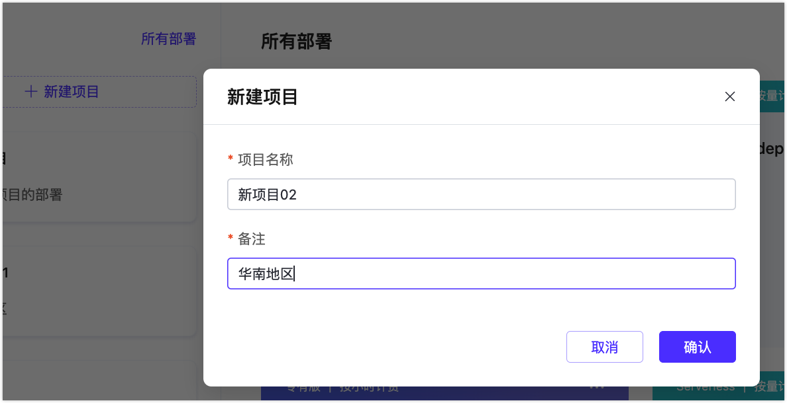
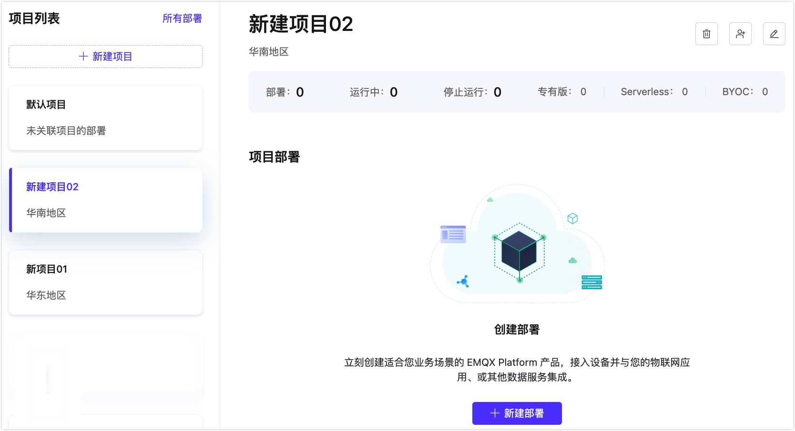
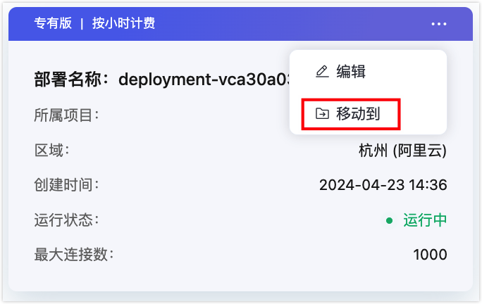
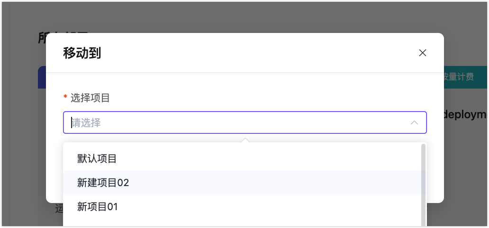
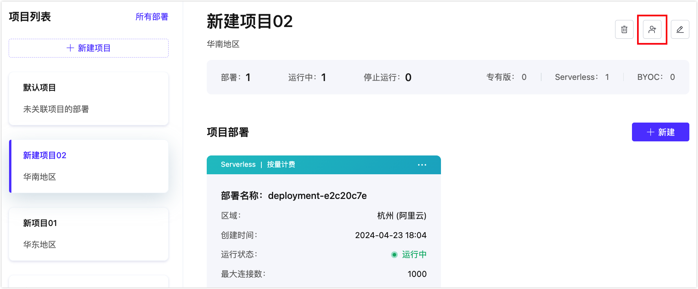
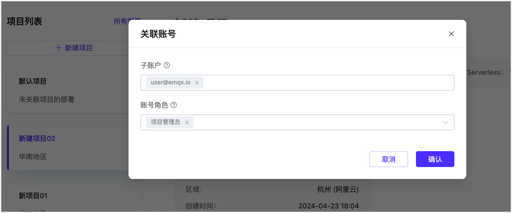
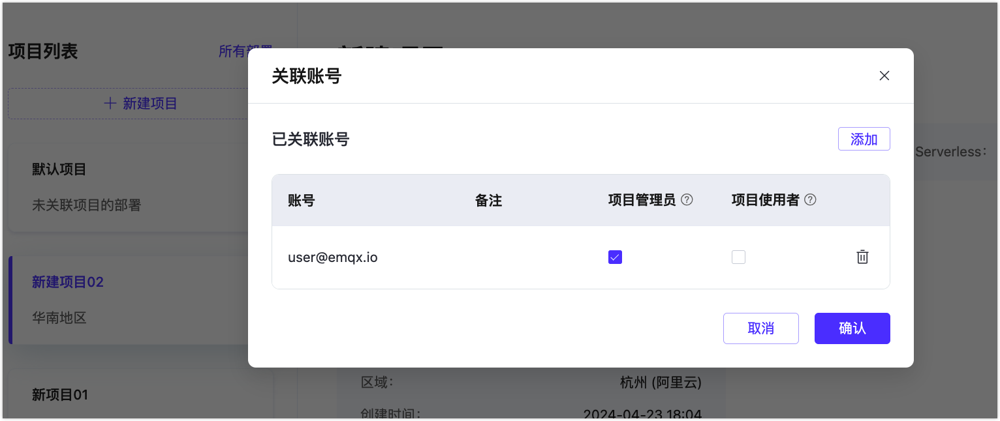

# 管理项目

项目提供了一个企业中多个组织或者部门独立使用和管理 MQTT 集群的能力，可以分配不同的角色对平台的各项能力进行更加精细化的管理。基于项目，每个组织或者部门可以单独管理自己的 MQTT 集群，并可以独立核算。在多项目的机制下，部署需建立在项目下面，并且一个部署只能属于一个项目。

## 项目列表

进入**部署管理**，在页面左侧可以看到项目列表

## 创建项目

点击**新建项目**，在弹框中输入项目名称和备注，可以创建一个新项目。

## 在项目下创建部署

选中左侧项目，可以在选中项目下创建部署

## 移动部署到其他项目

点击部署右上角的菜单，选择移动项目

在项目列表选择目标项目

点击确认后，便可以将部署移动到新的项目下

## 更新项目

选择一个项目，点击右上角修改按钮，可以对项目名称和描述进行修改更新。

## 删除项目

> 删除项目之前请确保项目下没有部署

选择一个项目，点击右上角删除按钮，

## 关联子用户账号

1. 选择一个项目，点击右上角关联账号按钮，可设置该项目[子用户](./role.md)。

   

2. 选择子账号，并未账号添加角色。

   

3. 确认关联的账号，或者可以继续添加子账号。

   
