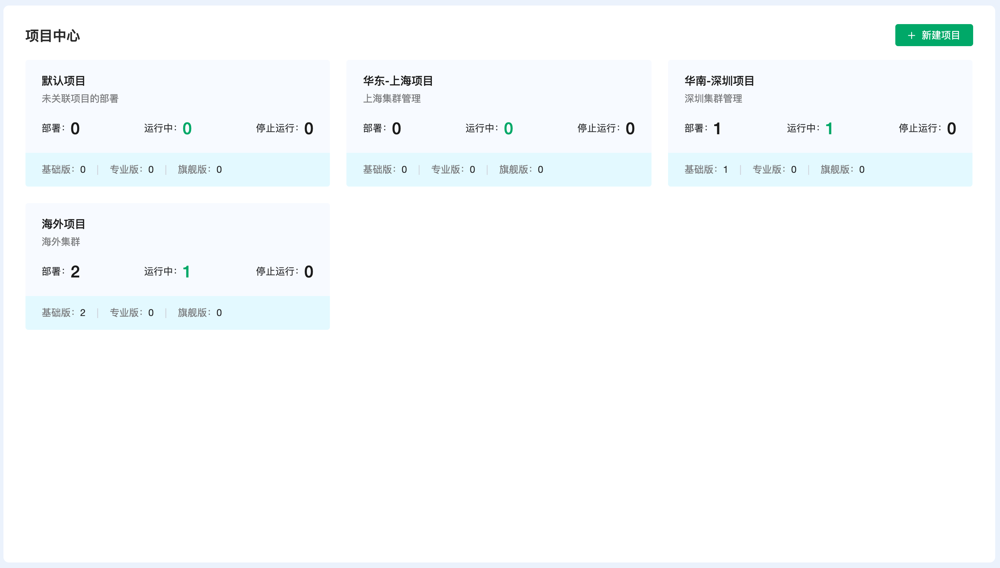
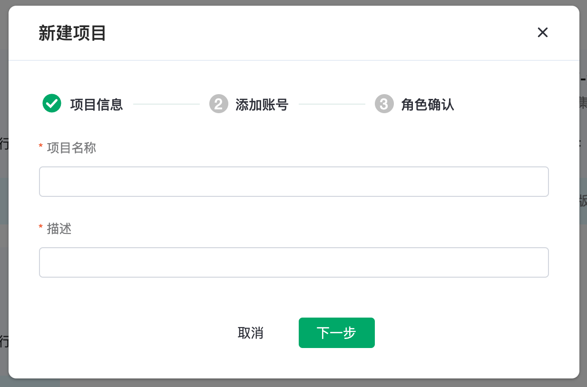
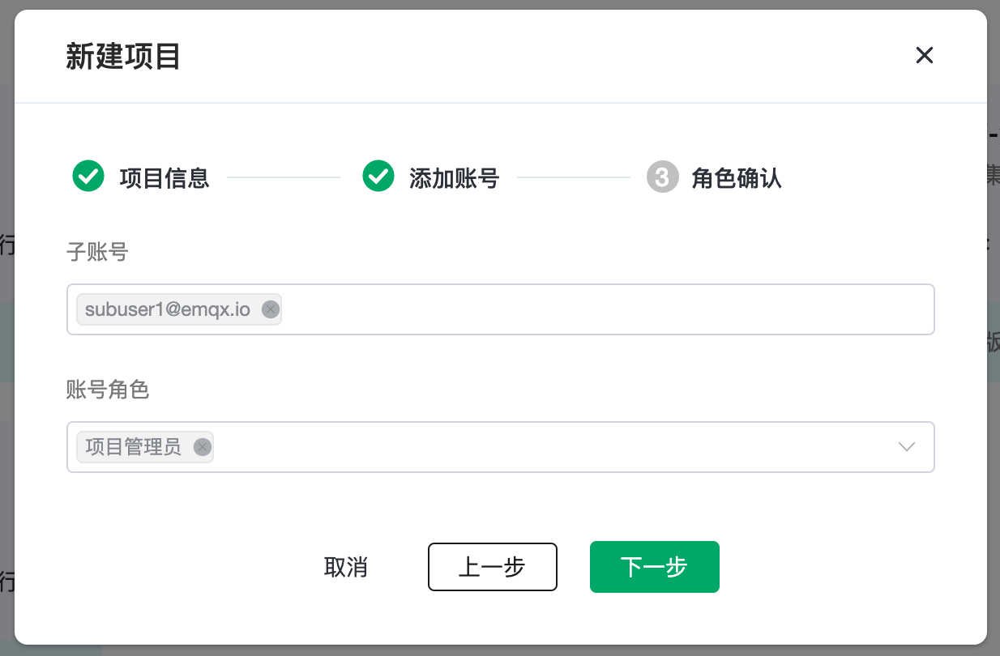
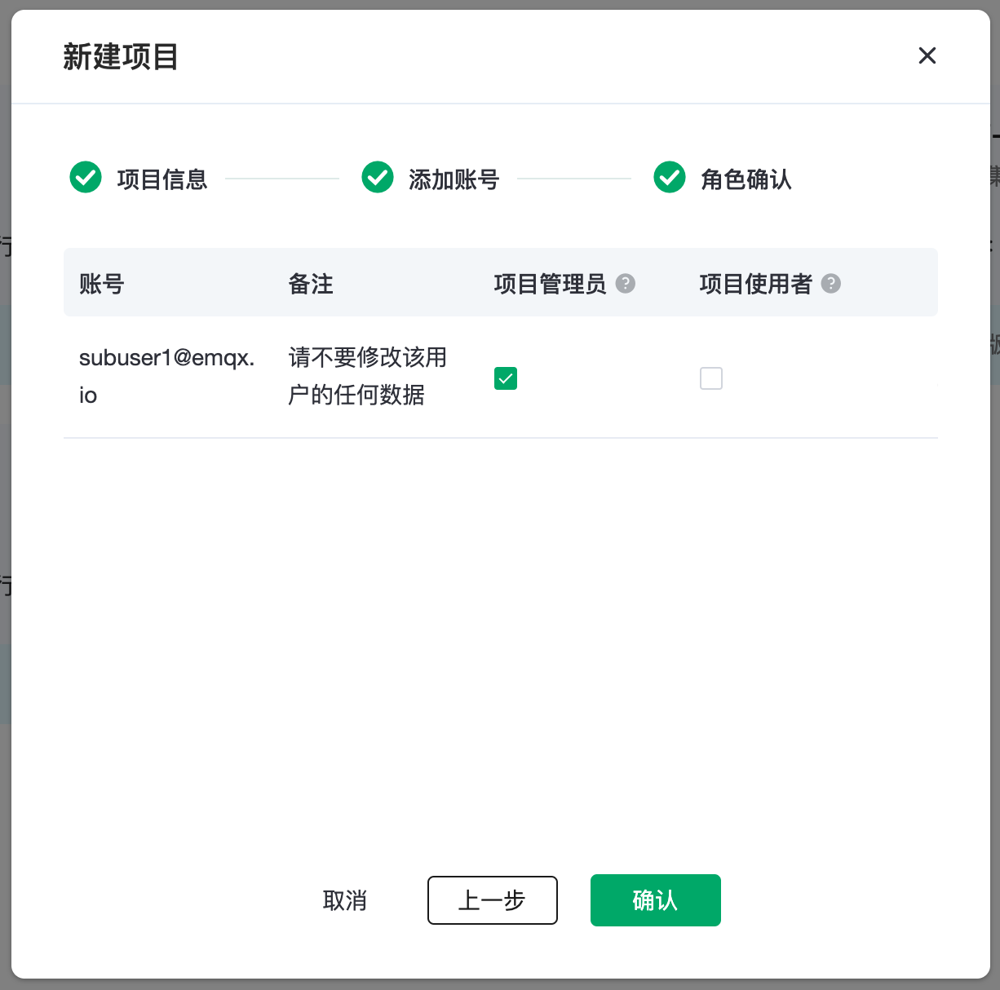
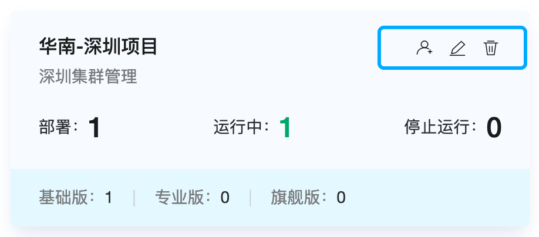
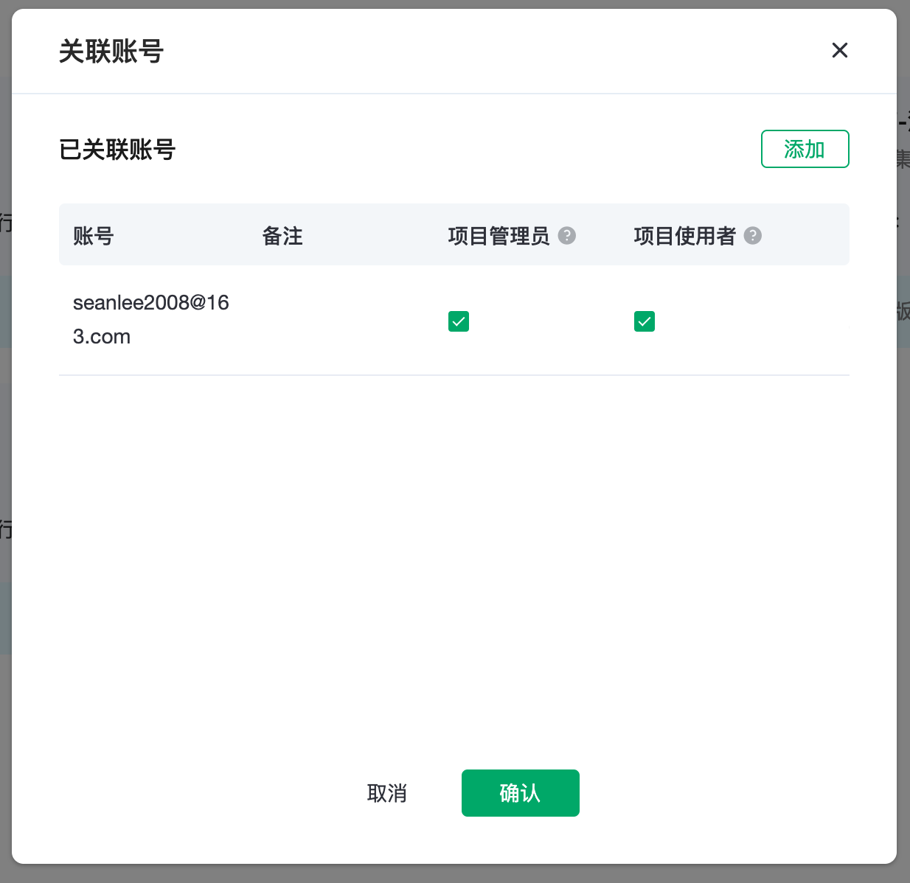
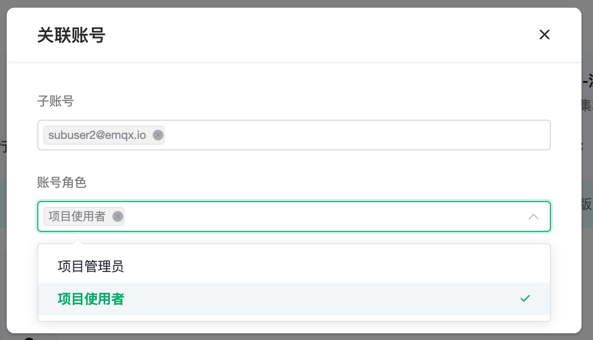
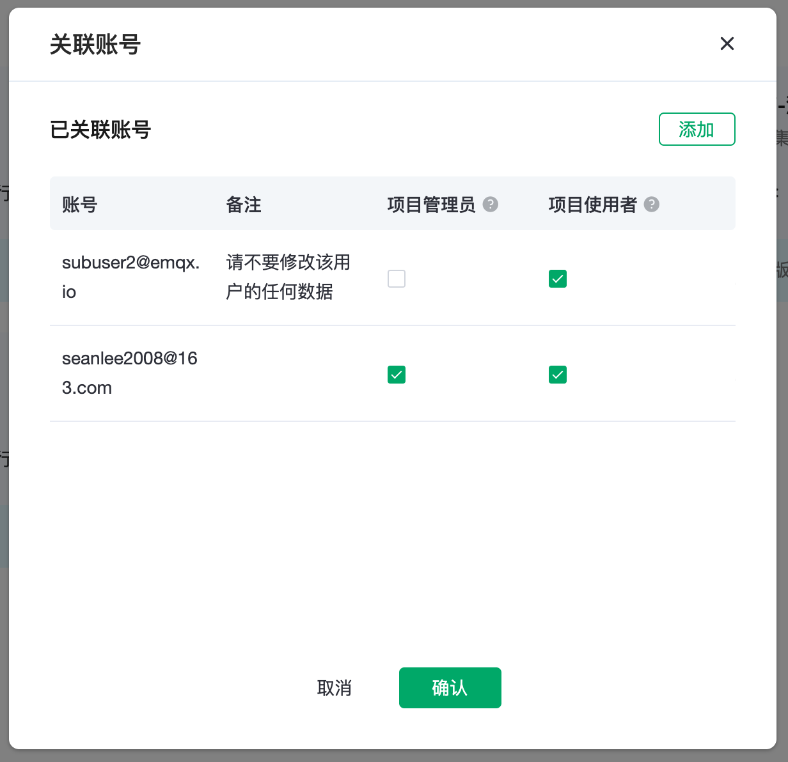
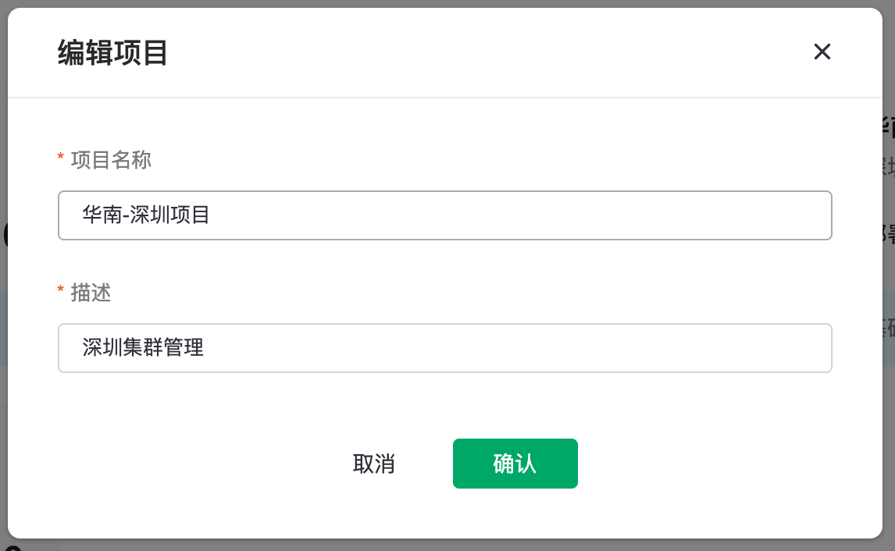

# 项目中心

项目中心提供了一个企业中多个组织或者部门独立使用和管理 MQTT 集群的能力，可以分配不同的角色对平台的各项能力进行更加精细化的管理。基于项目中心，每个组织或者部门可以单独管理自己的 MQTT 集群，并可以独立核算。在多项目的机制下，部署需建立在项目下面，并且一个部署只能属于一个项目。

## 新建项目

点击右上角`新建项目`按钮开始新建，新建项目分为三个步骤：

1. 填写项目的名称以及备注。

2. 搜索并选择子账号，搜索时需要输入完整的账号名称，并为子账号设置角色，如果你还没有创建子账号，可以在用户管理中创建子账号。[了解更多角色相关的信息](../users/user.md)。这里我们为子账号 `subuser1@emqx.io`赋予项目管理员的角色。在子账号输入框里，可以添加多个子账号。
> 如果不需要设置子账号可以点击下一步跳过设置。

3. 再确认列表中可以再次修改账号的角色或删除账号的授权，点击确认。这样就完成了一个项目的创建。
> 取消账号全部的角色等同于删除该账号的项目授权。

## 项目列表

在项目中心的面板中可以看到每一个项目的部署的数量，运行中部署的数量和已经停止的部署数量。

拥有项目管理权限的账号在鼠标移至项目区块上时，可以显示添加账号，编辑项目和删除项目的按钮。

### 项目账号授权
在项目授权列表可以看到目前已经授权的账号，可以以项目维度对账号修改角色，可选择的角色为：

**项目管理员**：拥有查看修改项目的权限和修改删除部署的权限

**项目使用者**：拥有查看项目的权限和查看编辑部署的权限

[点击查看角色的权限区分](../users/intro.md)

点击`添加`可以绑定新的账号，搜索并添加子账号，点击确定即可返回账号列表。

### 编辑项目
可以对项目的名称和备注进行编辑修改。

### 删除项目
删除项目之后不可恢复，**删除项目之前必须先清空项目下的部署**。

