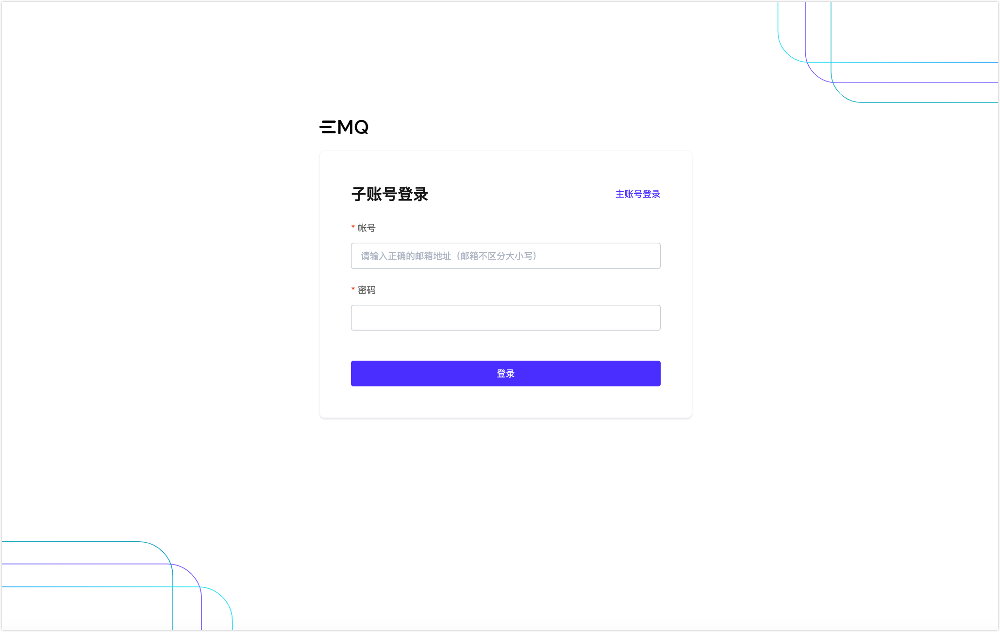

# 简介

用户管理提供了企业用户对于多角色的管理需求，对不同角色分配了不同操作权限和项目权限。企业内可以邀请不同的人员来对资源做精细化管理。

## 子账号角色体系
子账号是由 EMQX Cloud 用户自己在平台上创建的账号，子账号也需要通过邮箱认证之后激活。平台账号邮箱目前不能注册同账号下的子账号。子账号邮箱可以注册成一个 EMQX Cloud平台账号，也可以同时成为其他平台账号的子账号，通过不同的登录界面以登录不同的账号体系。

子用户的登录界面，仅用于子账号的登录

## 子账号分类
**管理员**：和平台账号一样，拥有平台全部的权限，是子账号体系里的超级管理员。要注意的是，管理员虽然功能上和平台账号等同，但仍属于子账号的体系。

**项目管理员**：拥有查看修改项目的权限和修改删除部署的权限。项目管理员主要用于项目部署相关管理，比如一个组织或者部门需要单独拥有
一个项目管理集群，需要制定一个人专门负责某些项目，与此同时，没有其他未授权的项目的权限。

**项目使用者**：拥有查看项目的权限和查看编辑部署的权限。项目使用者通常是业务人员，除了查看项目和查看部署权限，可以查看部署详情，使用数据集成和监控，进一步处理的相关业务需求。

**财务**：拥有财务管理权限，并可以查看项目和部署。财务人员可以掌握当前平台账号出账情况，并可以管理余额，发票等情况。

**审计**：可以查看项目和部署，并可以查看子用户和财务情况。审计角色针对了公司内部审计的需要，可以有平台各项功能的查看权限。

角色权限表

<table>
   <tr>
      <th colspan="2">功能</th>
      <th>项目管理员</th>
      <th>项目使用者</th>
      <th>财务</th>
      <th>审计</th>
   </tr>
   <tr>
      <td rowspan="21">部署</td>
      <td>查看部署列表</td>
      <td>&#10003</td>
      <td>&#10003</td>
      <td>&#10003</td>
      <td>&#10003</td>
   </tr>
   <tr>
   	  <td>部署列表新建项目</td>
      <td>&#10007</td>
      <td>&#10007</td>
      <td>&#10007</td>
      <td>&#10007</td>
   </tr>
   <tr>
   	  <td>部署列表修改项目</td>
      <td>&#10003</td>
      <td>&#10007</td>
      <td>&#10007</td>
      <td>&#10007</td>
   </tr>
   <tr>
   	  <td>部署列表删除项目</td>
      <td>&#10007</td>
      <td>&#10007</td>
      <td>&#10007</td>
      <td>&#10007</td>
   </tr>
   <tr>
   	  <td>创建部署</td>
      <td>&#10003</td>
      <td>&#10007</td>
      <td>&#10007</td>
      <td>&#10007</td>
   </tr>
   <tr>
   	  <td>移动部署至其他项目</td>
      <td>&#10003</td>
      <td>&#10007</td>
      <td>&#10007</td>
      <td>&#10007</td>
   </tr>
   <tr>
   	<td>启动/停止部署</td>
      <td>&#10003</td>
      <td>&#10007</td>
      <td>&#10007</td>
      <td>&#10007</td>
   </tr>
   <tr>
   	<td>删除部署</td>
      <td>&#10003</td>
      <td>&#10007</td>
      <td>&#10007</td>
      <td>&#10007</td>
   </tr>
   <tr>
   	<td>修改部署名称</td>
      <td>&#10003</td>
      <td>&#10003</td>
      <td>&#10007</td>
      <td>&#10007</td>
   </tr>
	<tr>
   	<td>转包年</td>
      <td>&#10003</td>
      <td>&#10007</td>
      <td>&#10007</td>
      <td>&#10007</td>
   </tr>
   <tr>
      <td>续购包年</td>
      <td>&#10003</td>
      <td>&#10007</td>
      <td>&#10007</td>
      <td>&#10007</td>
   </tr>
    <tr>
   	<td>TLS/SSL 配置</td>
      <td>&#10003</td>
      <td>&#10003</td>
      <td>只读</td>
      <td>只读</td>
   </tr>
   <tr>
   	<td>VPC 对等连接配置</td>
      <td>&#10003</td>
      <td>&#10003</td>
      <td>只读</td>
      <td>只读</td>
   </tr>
   <tr>
   	<td>REST API 设置</td>
      <td>&#10003</td>
      <td>&#10003</td>
      <td>只读</td>
      <td>只读</td>
   </tr>
   <tr>
   	<td>认证鉴权设置</td>
      <td>&#10003</td>
      <td>&#10003</td>
      <td>只读</td>
      <td>只读</td>
   </tr>
   <tr>
   	  <td>数据集成设置</td>
      <td>&#10003</td>
      <td>&#10003</td>
      <td>只读</td>
      <td>只读</td>
   </tr>
   <tr>
   <td>监控</td>
      <td>&#10003</td>
      <td>&#10003</td>
      <td>只读</td>
      <td>只读</td>
   </tr>
   <tr>
   <td>指标</td>
      <td>&#10003</td>
      <td>&#10003</td>
      <td>&#10003</td>
      <td>&#10003</td>
   </tr>
   <tr>
   <td>日志</td>
      <td>&#10003</td>
      <td>&#10003</td>
      <td>&#10003</td>
      <td>&#10003</td>
   </tr>
   <tr>
   <td>告警</td>
      <td>&#10003</td>
      <td>&#10003</td>
      <td>只读</td>
      <td>只读</td>
   </tr>
   <tr>
   <td>在线调试</td>
      <td>&#10003</td>
      <td>&#10003</td>
      <td>&#10007</td>
      <td>&#10007</td>
   </tr>
   <tr>
      <td rowspan="2">用户管理</td>
      <td>查看用户列表</td>
      <td>&#10007</td>
      <td>&#10007</td>
      <td>&#10007</td>
      <td>&#10003</td>
   </tr>
   <tr>
      <td>用户管理操作</td>
      <td>&#10007</td>
      <td>&#10007</td>
      <td>&#10007</td>
      <td>&#10007</td>
   </tr>
   <tr>
      <td rowspan="5">项目管理</td>
      <td>查看项目列表</td>
      <td>&#10003</td>
      <td>&#10003</td>
      <td>&#10003</td>
      <td>&#10003</td>
   </tr>
   <tr>
   	<td>创建项目</td>
      <td>&#10007</td>
      <td>&#10007</td>
      <td>&#10007</td>
      <td>&#10007</td>
   </tr>
   <tr>
   	<td>删除项目</td>
      <td>&#10007</td>
      <td>&#10007</td>
      <td>&#10007</td>
      <td>&#10007</td>
   </tr>
   <tr>
      <td>修改项目</td>
      <td>&#10003</td>
      <td>&#10007</td>
      <td>&#10007</td>
      <td>&#10007</td>
   </tr>
   <tr>
      <td>项目关联子账号</td>
      <td>&#10007</td>
      <td>&#10007</td>
      <td>&#10007</td>
      <td>&#10007</td>
   </tr>
	<tr>
      <td rowspan="11">财务管理</td>
      <td>查看财务</td>
      <td>&#10007</td>
      <td>&#10007</td>
      <td>&#10003</td>
      <td>&#10003</td>
   	</tr>
   	<tr>
      <td>充值/绑定信用卡</td>
      <td>&#10007</td>
      <td>&#10007</td>
      <td>&#10003</td>
      <td>&#10007</td>
   	</tr>
   	<tr>
      <td>查看交易记录</td>
      <td>&#10007</td>
      <td>&#10007</td>
      <td>&#10003</td>
      <td>&#10003</td>
   	</tr>
   	<tr>
      <td>查看历史账单和小时账单</td>
      <td>&#10007</td>
      <td>&#10007</td>
      <td>&#10003</td>
      <td>&#10003</td>
   	</tr>
   	<tr>
      <td>查看代金券</td>
      <td>&#10007</td>
      <td>&#10007</td>
      <td>&#10003</td>
      <td>&#10003</td>
   	</tr>
   	<tr>
      <td>查看发票</td>
      <td>&#10007</td>
      <td>&#10007</td>
      <td>&#10003</td>
      <td>&#10003</td>
   	</tr>
   	<tr>
      <td>申请开票</td>
      <td>&#10007</td>
      <td>&#10007</td>
      <td>&#10003</td>
      <td>&#10007</td>
   	</tr>
   	<tr>
      <td>查看发票地址</td>
      <td>&#10007</td>
      <td>&#10007</td>
      <td>&#10003</td>
      <td>&#10003</td>
   	</tr>
   	<tr>
         <td>修改发票地址</td>
         <td>&#10007</td>
         <td>&#10007</td>
         <td>&#10003</td>
         <td>&#10007</td>
   	</tr>
      <tr>
         <td>订单管理</td>
         <td>&#10007</td>
         <td>&#10007</td>
         <td>&#10003</td>
         <td>只读</td>
      </tr>
      <tr>
         <td>续费管理</td>
         <td>&#10003</td>
         <td>&#10007</td>
         <td>&#10003</td>
         <td>只读</td>
      </tr>
   <tr>
      <td rowspan="4">增值服务</td>
      <td>查看增值服务列表</td>
      <td>&#10003</td>
      <td>&#10003</td>
      <td>只读</td>
      <td>只读</td>
   </tr>
   <tr>
      <td>开通增值服务</td>
      <td>&#10003</td>
      <td>&#10007</td>
      <td>&#10007</td>
      <td>&#10007</td>
   </tr>
   <tr>
      <td>增值服务开通之后使用</td>
      <td>&#10003</td>
      <td>&#10003</td>
      <td>只读</td>
      <td>只读</td>
   </tr>
   <tr>
      <td>删除增值服务</td>
      <td>&#10003</td>
      <td>&#10007</td>
      <td>&#10007</td>
      <td>&#10007</td>
   </tr>
   <tr>
      <td colspan="2">事件</td>
      <td>&#10003</td>
      <td>&#10003</td>
      <td>&#10003</td>
      <td>&#10007</td>
   </tr>
   <tr>
      <td colspan="2">工单</td>
      <td>&#10003</td>
      <td>&#10003</td>
      <td>&#10003</td>
      <td>&#10003</td>
   </tr>
</table>

