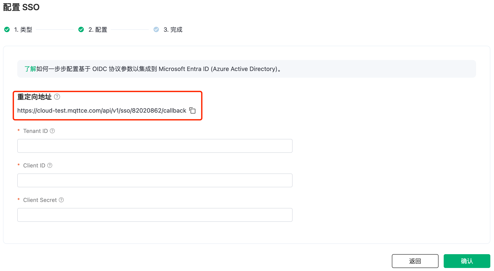
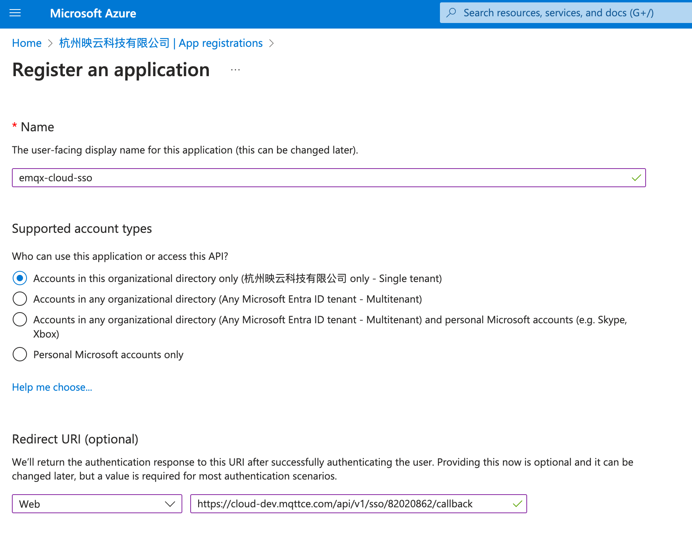
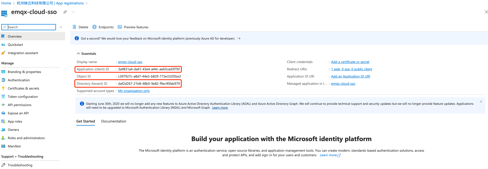
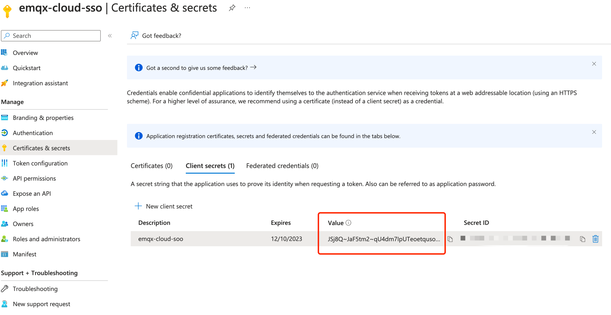
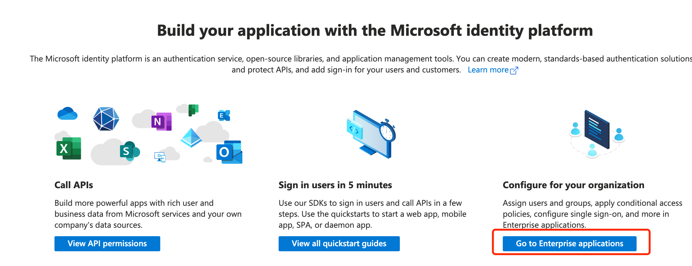
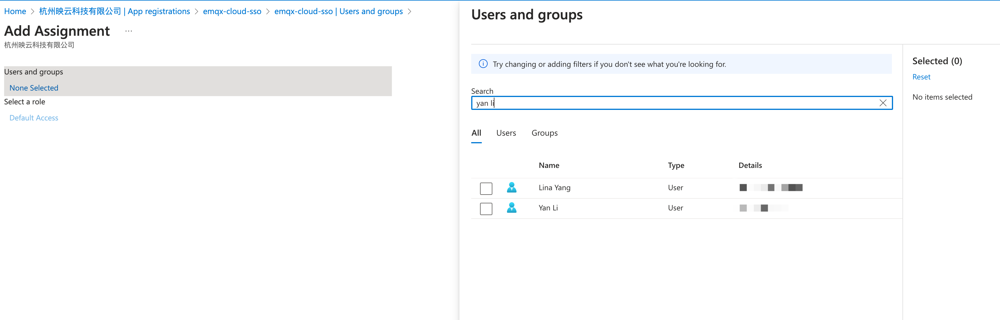
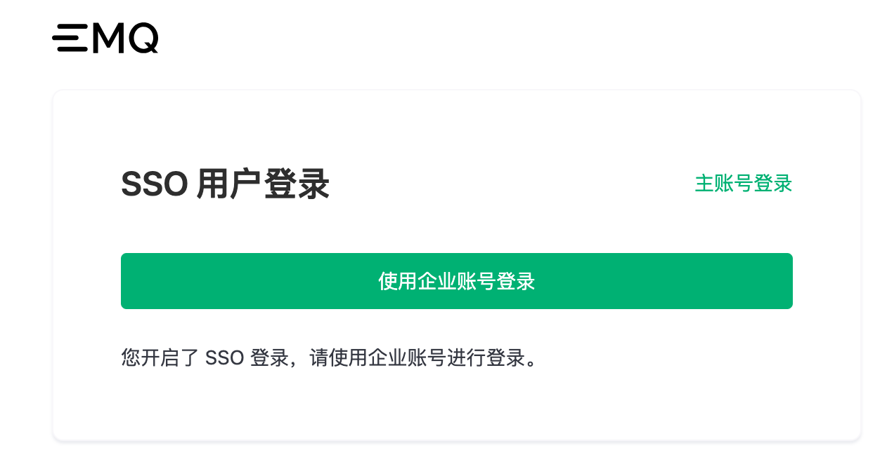

# 配置使用 Azure AD 授权的 SSO

如果您使用 Azure Active Directory (Microsoft Entra ID，本文简称 Azure AD) 管理您的企业账号，可以在 EMQX Platform 中选择 Azure AD 作为授权服务器配置并开启单点登录（Single Sign-On, SSO）。同时，您还需要在 Azure AD 中进行 OpenID Connect (OIDC) 配置。本页提供了在 EMQX 和 Azure AD 中进行 OIDC 配置的示例，帮助您理解企业 Identity Provider (IdP) 与 EMQX Platform 之间进行连接授权 SSO 的端到端配置流程。

## 前置准备
- 已有一个 EMQX Platform 主账号 (Root account)。
- 已有一个 Azure AD 租户，在 Azure AD 租户中，已有一个管理员用户。
- 您需要通过管理员用户（已授予全局管理员权限）执行 Azure AD 示例中的操作。关于如何在 Azure AD 中创建用户和为用户授权，请参见 [Azure AD 文档](https://learn.microsoft.com/zh-cn/azure/active-directory/fundamentals/)。

## 步骤一：在 EMQX Platform 开启 SSO 配置

1. 登录 EMQX Platform 主账号 (Root account)。

2. 点击右上角的用户图标，在下拉菜单中选择 **SSO**。

3. 进入 SSO 配置流程，点击**开启 SSO**。

4. 选择 `Azure AD` 作为 OIDC 身份提供者，点击**下一步**按钮。

5. 这时可以在页面上查看到**重定向地址**，此地址将在之后的配置中用到。
   
   

## 步骤二：在 Azure AD 中注册新应用
1. 使用管理员用户账号登录 [Azure 门户](https://portal.azure.com/#home)。

2. 点击左上角图标，定位到 **Azure Active Directory** 产品页面。

3. 点击左侧菜单中的 **App registrations**。

4. 在主界面选择 **New registrations**。填写或选择以下信息：

   - 填入需要注册的应用的名称，例如 `emqx-cloud-sso`。
   - 选择需要使用该应用的 Azure 租户。
   - 在 Redirect URI (optional) 下拉框中选择 `Web`，并填入**步骤一**中的重定向地址。

   

5. 完成之后点击 **Register** 就会进入新注册应用 `emqx-cloud-sso` 的 Overview 页面。

## 步骤三：在 EMQX Platform 中配置 SSO 信息

转到 EMQX Platform 的**配置 SSO** 页面，按以下步骤配置信息：

1. 在 EMQX Platform 的**配置 SSO** 页面配置以下信息：

   - **Tenant ID**：填写 Azure 门户 `emqx-cloud-sso` 应用 Overview 页面中的 Directory (tenant) ID。

   - **Client ID**：填写 Azure 门户 `emqx-cloud-sso` 应用 Overview 页面中的 Application (client) ID。

     

2. 在 Microsoft Azure 中点击左侧导航菜单中的 **Certificates & secrets**。

2. 在主页面中选择 **Client secrets**，点击 **+ New client secret**，填写描述和过期时间，生成 Client secret。复制 **Value**。

     

3. 将 Value 粘贴到 EMQX Platform 的**配置 SSO** 页面上的 **Client Secret** 中。

4. 点击**确认**完成配置。

5. 如果配置成功，即可进入 SSO 成功开启页面，可获取到用于 SSO 登录的地址。

## 步骤四：在 Azure AD 中创建用户并授权应用
1. 在 Azure 门户的 `emqx-cloud-sso` 应用 Overview 中，点击右下 **Go to Enterprise applications**。
    

2. 在左侧导航菜单点击 **Users and groups**。

3. 在主界面选择 **+ Add user/group**，选择需要授权的用户，如 Jack@emqx.io。同样也可以对用户组进行授权。

  

4. 选择用户之后，点击 **Assign**，完成用户的授权。

## 步骤五：在 EMQX Platform 中创建子用户
1. 用 EMQX Platform 主账号进入控制台的用户管理页面。
2. 点击右上角 **+ 新建用户**。
3. 在弹窗内的账号中输入和在 Okta 中授权的相同的邮箱账号： Jack@emqx.io。并且给该账号分配一个角色。请参考[角色权限](./role.md)来设置不同的角色。
 
4. 最后使用用户管理页面中的子账号登录地址进行登录，点击**使用企业账号登录**，浏览器将会跳转到 Microsoft 的登录界面。

5. 在 Microsoft 的登录界面上完成登录流程，浏览器会自动返回到 EMQX Platform 完成 SSO 登录。

