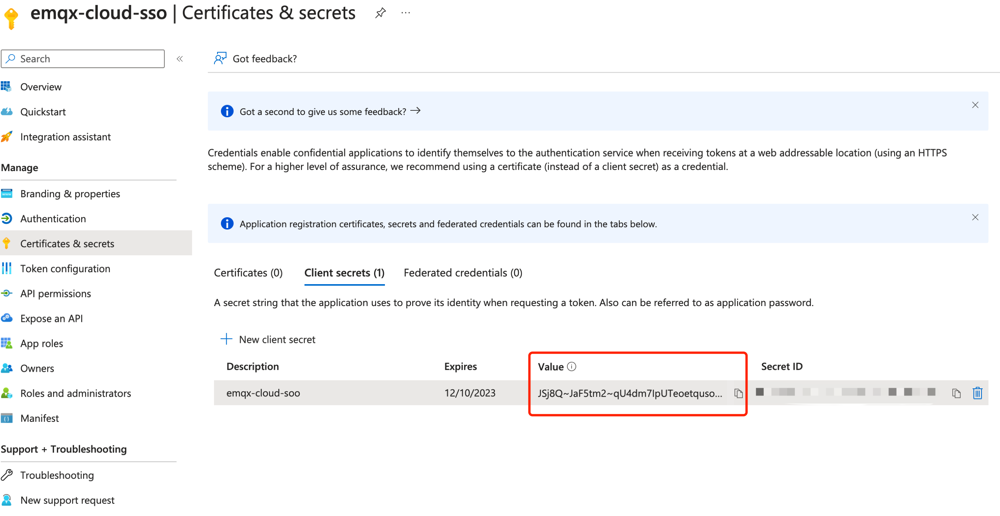

# 使用 Azure Active Directory (Microsoft Entra ID) 进行 SSO

本文提供一个以Azure Active Directory (Microsoft Entra ID)(本文简称 Azure AD)进行 SSO 配置示例，帮助您理解企业 IdP 与 EMQX Cloud 进行 SSO 的端到端配置流程。

## 前置条件
1. 拥有一个 EMQX Cloud 主账号 (Root account)
2. 拥有一个 Azure AD 租户，在 Azure AD 租户中，您有一个管理员用户
3. 您需要通过管理员用户（已授予全局管理员权限）执行本示例Azure AD中的操作。关于如何在Azure AD中创建用户和为用户授权，请参见 [Azure AD 文档](https://learn.microsoft.com/zh-cn/azure/active-directory/fundamentals/)。

## 步骤一：在 EMQX Cloud 选择 SSO 配置
1. 登录 EMQX Cloud 主账号 (Root account)
2. 点击右上角的用户图标，在下拉菜单中选择 SSO
3. 进入 SSO 配置流程，点击 `开启 SSO`
4. 选择 `Azure Active Directory (Microsoft Entra ID)`，点击下一步按钮
5. 这时可以在页面上查看到重定向地址，此地址将在之后的配置中用到

## 步骤二：在 Azure AD 中创建应用
1. 管理员用户登录 [Azure 门户](https://portal.azure.com/#home)
2. 点击左上角图标，定位到 'Azure Active Directory' 产品页面
3. 点击左侧菜单 `App registrations`
4. 在主界面选择 `New registrations`
5. 输入需要创建的应用的名称 'emqx-cloud-sso'
6. 选择需要使用的 Azure 租户
7. 在 Redirect URI (optional) 中选择 Web，并填入步骤一中的重定向地址
8. 输入完成之后点击 `Register`

## 步骤三：在 EMQX Cloud 中配置信息
1. 在创建好的应用中获取到 Directory (tenant) ID，填入到 EMQX Cloud 配置页中的 Tenant ID
2. 在创建好的应用中获取到 Application (client) ID，填入到 EMQX Cloud 配置页中的 Client ID

3. 在 Client credentials 点击 Add a certificate or secret 
4. 点击 `+ New client secret`，填写描述和过期时间，生成 Client Secret

5. 复制 Secret ID 并填到 EMQX Cloud 中
6. 点击 `确认`，创建 SSO
7. 如果配置成功，即可进入 SSO 成功开启页面，可获取到用于 SSO 登录的地址

## 步骤四：在 Azure AD 中创建用户并授权应用
1. 在 'emqx-cloud-sso' 中，点击右下 `Go to Enterprise applications`

2. 在左侧菜单选中 `Users and groups`
3. 在主界面选择 `+ Add user/group`，选择需要授权的用户，如 Jack@emqx.io。同样也可以对用户组进行授权。

4. 选择用户之后，点击 `Assign`
5. 这样我们在 Azure AD 完成了用户的授权

## 步骤五：在 EMQX Cloud 中创建子用户
1. 用 EMQX Cloud 主账号进入控制台的用户管理页面页面
2. 点击右上角 `+ 新建用户`
3. 在弹窗内的账号中输入和再 Azure AD 中授权的相同的邮箱账号： Jack@emqx.io. 并且给改账号分配一个角色。请参考[多角色管理](./role.md)来设置不同的角色。

4. 最后使用用户管理页面中的子账号登录地址进行登录，点击`使用企业账号登录`

5. 跳转到 Microsoft 的登录界面，完成登录流程，浏览器会自动返回到 EMQX Cloud 完成 SSO 登录。

