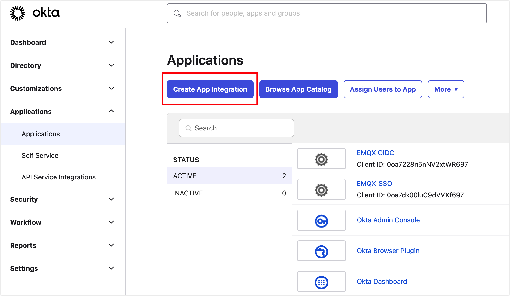

# 配置使用 Okta 授权的 SSO

如果您使用 Okta 管理您的企业账号，可以在 EMQX Cloud 中选择 Okta 作为授权服务器配置并开启单点登录（Single Sign-On, SSO）。同时，您还需要在 Okta 中进行 OpenID Connect (OIDC) 配置。本页提供了在 EMQX 和 Okta 中进行 OIDC 配置的示例，帮助您理解企业 Identity Provider (IdP) 与 EMQX Cloud 之间进行连接授权 SSO 的端到端配置流程。

## 前置准备
- 已有一个 EMQX Cloud 主账号 (Root account)。
- 已有一个 Okta Workforce Identity 的管理员账号。
- 了解如何使用 Okta 做企业账号管理，请参见 [Okta 文档](https://help.okta.com/oie/en-us/content/topics/identity-engine/oie-get-started.htm)。

## 步骤一：在 EMQX Cloud 开启 SSO 配置
1. 登录 EMQX Cloud 主账号 (Root account)。
2. 点击右上角的用户图标，在下拉菜单中选择 **SSO**。
3. 进入 SSO 配置流程，点击**开启 SSO**。
4. 选择 `Okta` 作为 OIDC 身份提供者，点击**下一步**按钮。
5. 这时可以在页面上查看到**重定向地址**，此地址将在之后的配置中用到。

## 步骤二：在 Okta 中创建应用
1. 使用管理员账号登录 [Okta Workforce Indentity](https://www.okta.com/workforce-identity/)。

   ::: tip

   您可能需要点击**管理员**按钮进入管理员界面。

   :::

2. 在管理员界面，点击左侧菜单中的 **Applications** -> **Applications**。

3. 在主界面点击 **Create App Integration**。

   

4. 在弹窗中，选择 **OIDC - OpenID Connect** 作为 **Sign-in method**，选择 **Web Application** 作为 **Application type**，点击 **Next** 进入配置页面。

5. 在 **New Web App Integration** 配置页面中，填写以下配置信息：

   - **App integration name**：填写 App 名称，例如 `EMQX-SSO`。
   - **Sign-in redirect URIs**：填写步骤一中的重定向地址。
   - **Controlled access**：您可以根据实际情况填写，此示例选择 `Skip group assignment for now`。

7. 完成之后点击 **Save** 就会进入所创建应用的 General 页面。

## 步骤三：在 EMQX Cloud 中配置 SSO 信息
转到 EMQX Cloud 的**配置 SSO** 页面，按以下步骤配置信息：

1. 在 EMQX Cloud 的**配置 SSO** 页面配置以下信息：
   - **Domain**：填写 `trial-9021952.okta.com` 作为 Okta 的域名字段。Domain 的字段格式为 `{YourOktasubdomain}.okta.com`。
   - **Client ID**：填入在 Okta 的应用概览页面获取到的 Client ID。
   - **Client Secret**：填入在 Okta 的应用概览页面获取到的 Client Secret。
   - **Server**: 如果没有自己的认证服务器，默认为 `default`；如有自己的验证服务，请填写 `authorizationServerId` 。更多 Okta 的认证设置请参考[相关文档](https://developer.okta.com/docs/concepts/auth-servers/)。
   
   
   
2. 点击**确认**完成配置。

7. 如果配置成功，即可进入 SSO 成功开启页面，可获取到用于 SSO 登录的地址。

## 步骤四：在 Okta 中添加用户并授权应用
1. 在 Okta 管理员界面的左侧菜单栏中选择 **Directory** -> **People**。

2. 在主界面点击 **Add Persion**。

3. 填入用户信息，如 Jack@emqx.io。同样也可以对用户组进行授权。

4. 点击 **Save** 回到 **People** 页面。

   

5. 点击用户名称进入用户信息界面，点击 **Assign Applications**，授权在步骤二中创建的应用 `EMQX-SSO`，点击 **Assign**，根据需要填写更多用户信息，点击 **Save and Go Back**。

6. 您可以看到应用已被授权（**Assigned**)。点击 **Done** 完成对用户的应用授权。

## 步骤五：在 EMQX Cloud 中创建子用户
1. 用 EMQX Cloud 主账号进入控制台的用户管理页面。
2. 点击右上角 **+ 新建用户**。
3. 在弹窗内的账号中输入和在 Okta 中授权的相同的邮箱账号： Jack@emqx.io。并且给该账号分配一个角色。请参考[角色权限](./role.md)来设置不同的角色。

4. 最后使用用户管理页面中的子账号登录地址进行登录，点击**使用企业账号登录**，浏览器将会跳转到 Okta 的登录界面。

5. 在 Okta 的登录界面上完成登录流程，浏览器会自动返回到 EMQX Cloud 完成 SSO 登录。

