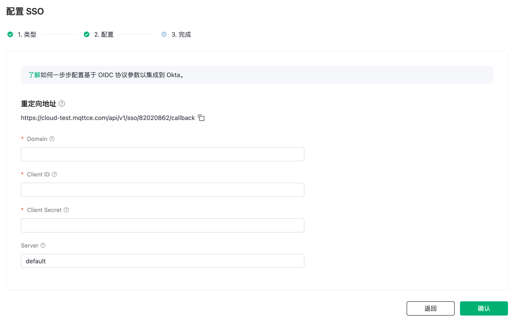
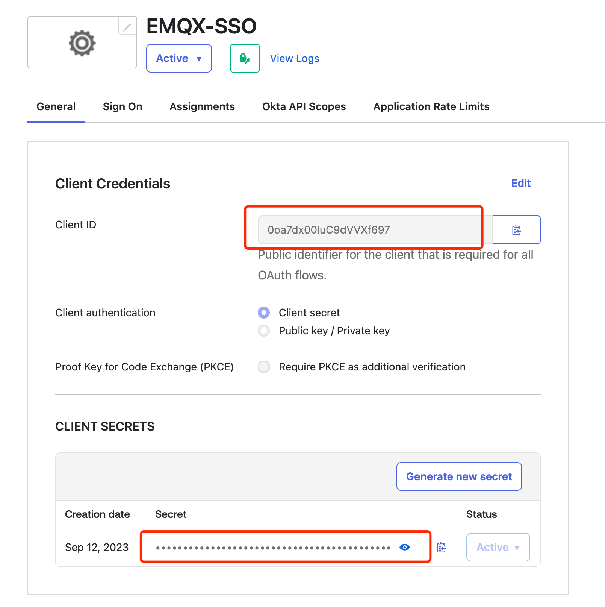
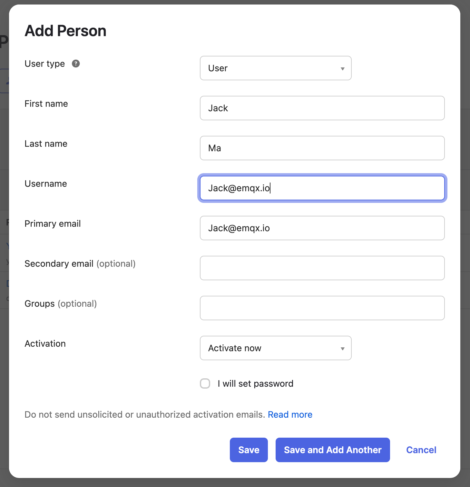

# 使用 Okta 进行 SSO

本文提供一个以 Okta 进行 SSO 配置示例，帮助您理解企业 IdP 与 EMQX Cloud 进行 SSO 的端到端配置流程。

## 前置条件
1. 拥有一个 EMQX Cloud 主账号 (Root account)
2. 拥有一个 Okta Workforce Identity 的管理员账号
3. 如何使用 Okta 做企业账号管理，请参见 [Okta 文档](https://help.okta.com/oie/en-us/content/topics/identity-engine/oie-get-started.htm)。

## 步骤一：在 EMQX Cloud 选择 SSO 配置
1. 登录 EMQX Cloud 主账号 (Root account)
2. 点击右上角的用户图标，在下拉菜单中选择 SSO
3. 进入 SSO 配置流程，点击 `开启 SSO`
4. 选择 `Okta`，点击下一步按钮
5. 这时可以在页面上查看到重定向地址，此地址将在之后的配置中用到

## 步骤二：在 Okta 中创建应用
1. 管理员用户登录 [Okta Workforce Indentity](https://www.okta.com/workforce-identity/)
2. 在控制台，点击左侧菜单 `Application` - `Application`
3. 在主界面点击 `Create App Integration`
4. 在弹窗中，'Sign-in method' 选择 `OIDC - OpenID Connect`; 'Application type' 选择 `Web Application`
5. 进入配置页面，填写 App 名称，在 'Sign-in redirect URIs' 中填写步骤一中的重定向地址
 
6. 表单中 'Assignments - Controlled access' 根据实际情况填写，这里我们先选择 'Skip group assignment for now'，然后点击 'Save'
7. 完成之后就会进入 Application 的概览页面

## 步骤三：在 EMQX Cloud 中配置信息
1. Domain 字段填写 Okta 的域名字段，Domain 的字段为 '{YourOktasubdomain}.okta.com'， 示例中，我们的 Domain 地址为： 'trial-9021952.okta.com'
2. 在 Application 的页面获取到 Client ID，填入到 EMQX Cloud 配置页中的 Client ID
3. 在 Application 的页面获取到 Client Secret，填入到 EMQX Cloud 配置页中的 Client 

4. 如果没有自己的认证服务器，默认为 'default'，如有自己的验证服务，请填写 'authorizationServerId' 
5. 更多 Okta 的认证设置请参考[相关文档](https://developer.okta.com/docs/concepts/auth-servers/)。
6. 点击 `确认`，创建 SSO
7. 如果配置成功，即可进入 SSO 成功开启页面，可获取到用于 SSO 登录的地址

## 步骤四：在 Okta 中创建用户并授权应用
1. 在控制台中，选择 `Directory` - `People`
2. 在主界面选择 `Add Persion`
3. 创建用户，如 Jack@emqx.io。同样也可以对用户组进行授权。

4. 选择用户之后，点击 `Save`
5. 进入到用户界面，点击 `Assign Applications`，授权创建的应用 'EMQX-SSO',点击 `Save and Go Back`
6. 完成对用户的应用授权

## 步骤五：在 EMQX Cloud 中创建子用户
1. 用 EMQX Cloud 主账号进入控制台的用户管理页面页面
2. 点击右上角 `+ 新建用户`
3. 在弹窗内的账号中输入和再 Okta 中授权的相同的邮箱账号： Jack@emqx.io. 并且给改账号分配一个角色。请参考[多角色管理](./role.md)来设置不同的角色。

4. 最后使用用户管理页面中的子账号登录地址进行登录，点击`使用企业账号登录`

5. 跳转到 Okta 的登录界面，完成登录流程，浏览器会自动返回到 EMQX Cloud 完成 SSO 登录。

