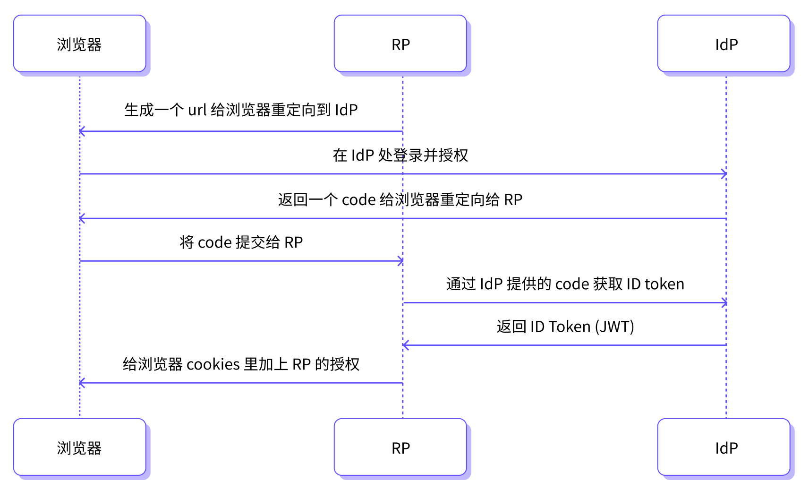

# 单点登录（SSO）功能概览

单点登录 （Single Sign-On, SSO） 是一种身份验证服务，允许用户使用一组用户名和密码就能够访问多个与该身份验证服务关联的不同应用或系统。 在 EMQX Cloud 中开启 SSO 功能之后，用户可以方便地使用企业账号管理系统登录到 EMQX Cloud 部署控制台。

EMQX Cloud 基于 [OpenID Connect (OIDC)](https://openid.net/developers/how-connect-works/) 标准实施 SSO 功能。当用户使用企业账号进行单点登录时，EMQX Cloud 作为应用服务器（也称为 “Relying Party, RP”）可以从一个授权的身份提供者（企业自有的身份管理服务器）获取用户的基本身份信息，用户便可以通过企业账号一键登录 EMQX Cloud。

## 基本概念

在使用单点登录功能之前，您需要了解以下几个基本概念：

- **OpenID Provider (OP)** 或 **Identity Provider (IdP)**： 授权的身份提供者或授权服务器，常见的企业 IdP 有 Okta 和 Azure Active Directory (AAD)。
- **RP**：应用服务器，即将其用户身份验证功能外包给 IdP（身份提供者）的应用程序或网站。EMQX Cloud 作为提供单点登录服务的应用服务器也被称为服务提供商（Service Provider, SP）。
- **ID Token**：身份验证成功后，身份提供者返回的身份标识符，是一个 JWT 格式的字符串，用于获取用户的基本信息。

## 授权流程

用户使用 SSO 登录 EMQX Cloud 的基本工作流程如下图所示：

1. 用户使用浏览器登录应用服务器，即 EMQX Cloud。
1. EMQX Cloud 在 IdP 处登录并授权。
2. IdP 返回授权码 （code） 给浏览器并重定向到 EMQX Cloud。
3. EMQX Cloud 通过 IdP 提供的 code 获取 ID Token，并发送给 IdP 验证。
4. IdP 返回 ID Token 给 EMQX Cloud。
5. EMQX Cloud 给浏览器加上授权，并完成登录。

## 配置步骤

为了建立 EMQX Cloud 与企业 IdP 之间的互信关系，需要进行 EMQX Cloud 作为服务提供商的 OIDC 配置和企业 IdP 的 OIDC 配置，配置完成后才能进行 SSO 登录。以下为通用的配置步骤：

1. 在企业 IdP 中配置 EMQX Cloud 元数据信息。
2. 获得企业 IdP 中生成的元数据信息，在 EMQX Cloud 填入相关信息，完成 SSO 配置。
4. 在企业 IdP 中创建用户并授权 EMQX Cloud 应用。
5. 在 EMQX Cloud 创建对应子账号。
6. 使用专有的 SSO 登录地址完成登录。

## 配置示例
以下为您提供了使用常见的企业 IdP（Okta 和 Azure AD）进行授权的 SSO 配置示例：

[配置使用 Okta 授权的 SSO](./sso_okta.md)  
[配置使用 Azure AD 授权的 SSO](./sso_azure.md)

