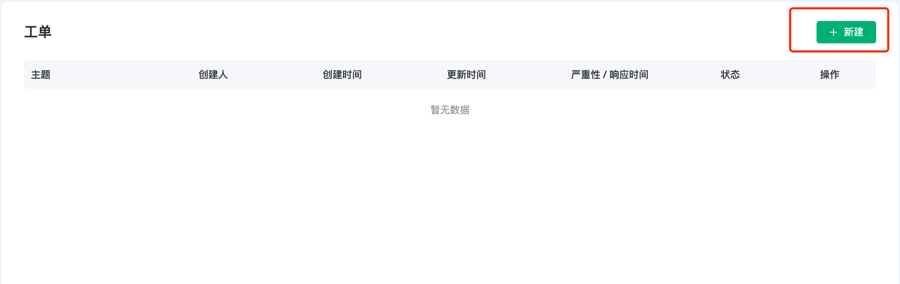
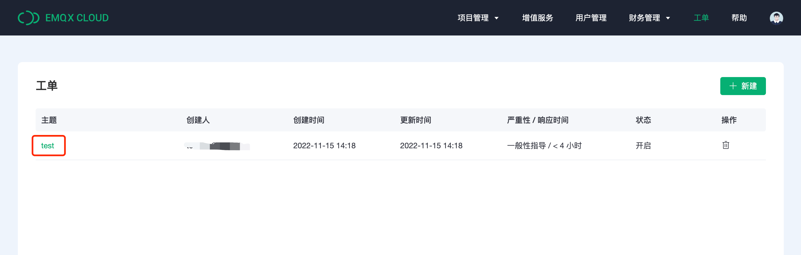
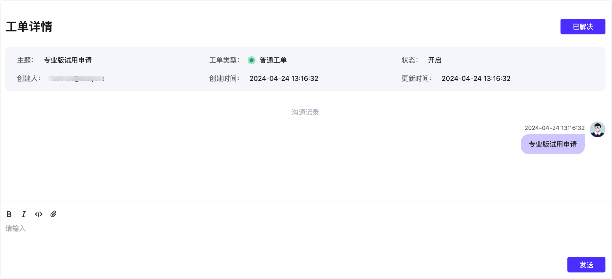
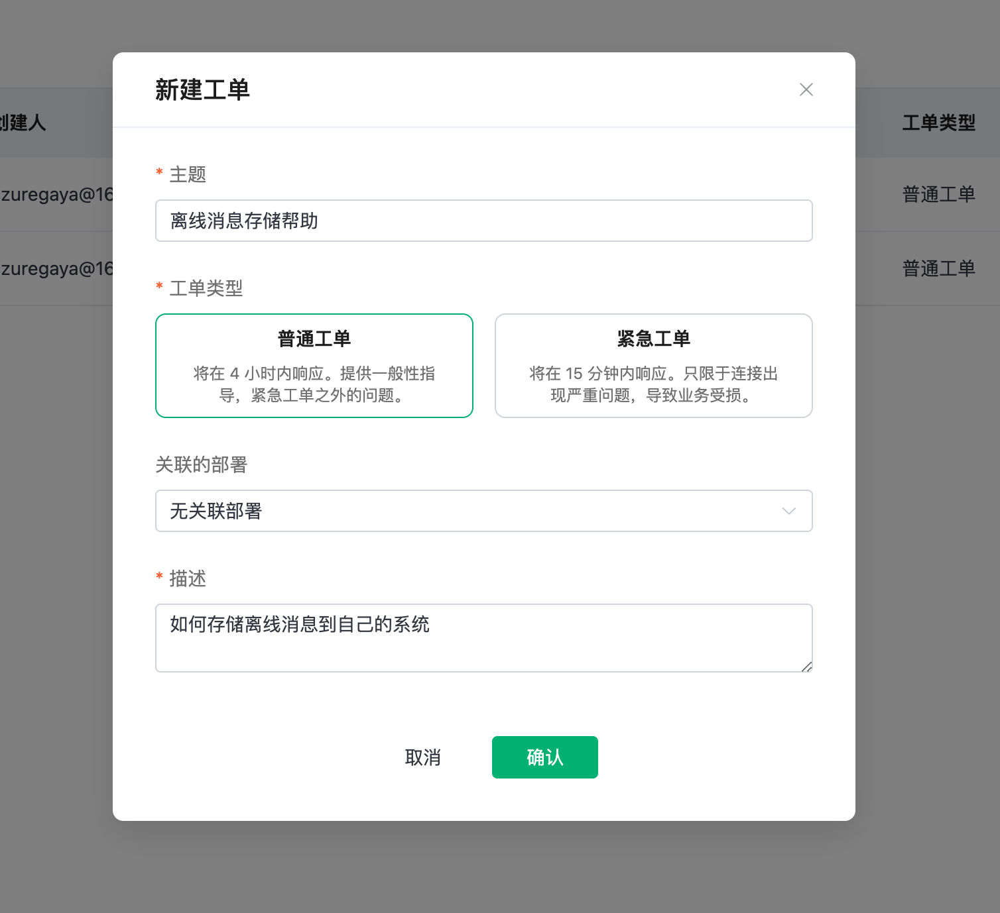

# 工单

您可以通过下面的步骤进入进入工单系统：

1. 登录 [EMQX Platform 控制台](https://cloud.emqx.com/console/)。
2. 点击顶部菜单中右上角的 **工单** 进入工单列表页面。

## 查看工单详情

您可以点击工单列表中的主题名进入相应工单详情页面。

## 创建工单

1. 点击右上角的 **新建** 按钮。
2. 在弹出的对话框中输入以下信息，带星号为必填项。
   - 填写工单的主题。
   - 根据问题的紧急程度选择**普通工单**或**紧急工单**。
   - 根据情况从下拉框中选择关联的部署。
   - 填写问题描述。
3. 点击**确认**提交工单。

