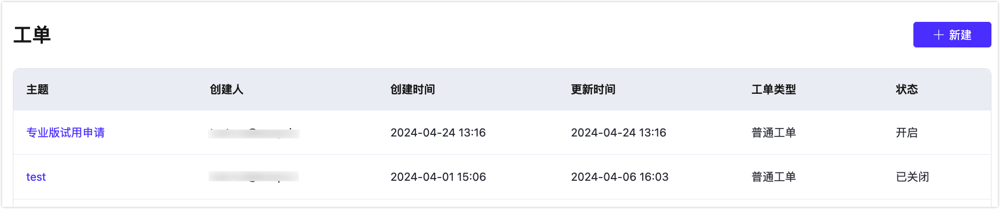
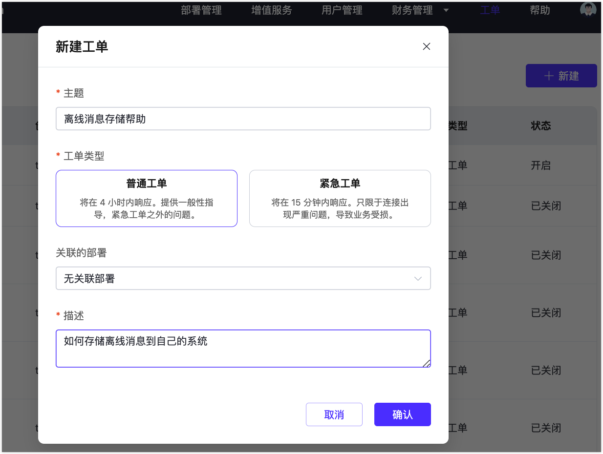

# 联系我们

## 工单联系

您可以通过下面的步骤进入进入工单系统：

1. 登录 [EMQX Cloud 控制台](https://cloud.emqx.com/console/)
2. 点击顶部菜单中右上角的 `工单` 进入工单列表页面

### 创建工单

1. 点击右上角的 `新建` 按钮
2. 在弹出的对话框中输入 `主题` 和 `描述`

### 查看工单详情

您可以点击工单列表中的主题名进入相应工单详情页面

