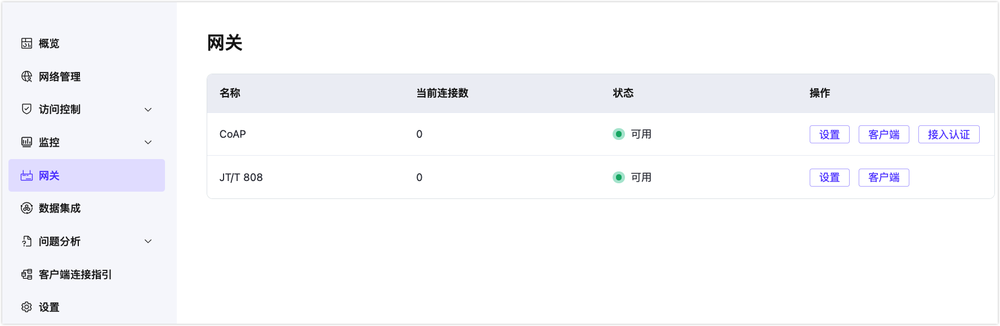

# 网关

::: tip 提示

网关为专有版和旗舰版功能。

:::

网关在 EMQX Platform 中负责实现不同协议与 MQTT 的高效转换与集成。网关为设备接入 EMQX 平台提供了灵活的协议适配能力，支持多种协议的互联互通，满足复杂物联网场景下的需求。通过网关，用户可以实现设备数据的无缝接入，保证数据质量，同时简化了协议转换的复杂性。

当前支持的协议包括：

- **CoAP 协议**：一种轻量级协议，专为受资源限制的设备和网络设计，适合低功耗和低带宽场景。
- **JT/T 808 协议**：中国国家车联网标准，广泛用于车辆定位与管理，支持车辆状态监控和数据交互。

未来可根据用户需求扩展更多协议支持。

## 开通网关服务

用户需提交[工单](../feature/tickets.md)申请开通所需的网关服务。目前支持 **[CoAP](./coap.md)** 和 **[JT/T 808](./jt808.md)** 网关服务。如果需要其他协议网关服务，也可以提交工单联系我们。服务成功开通后，部署详情页面左侧菜单将显示**网关**菜单。

## 使用权限

- **更新网关配置**：管理员、项目管理员、项目使用者拥有此权限。
- **只读权限**：其他角色仅具备网关信息的查看权限。