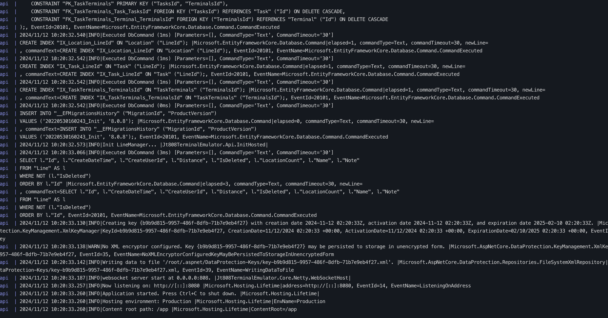
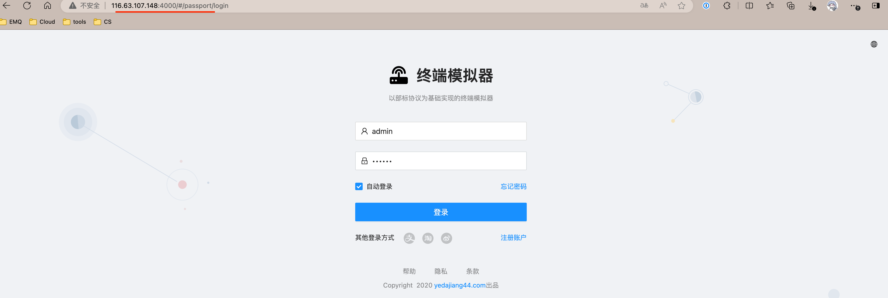
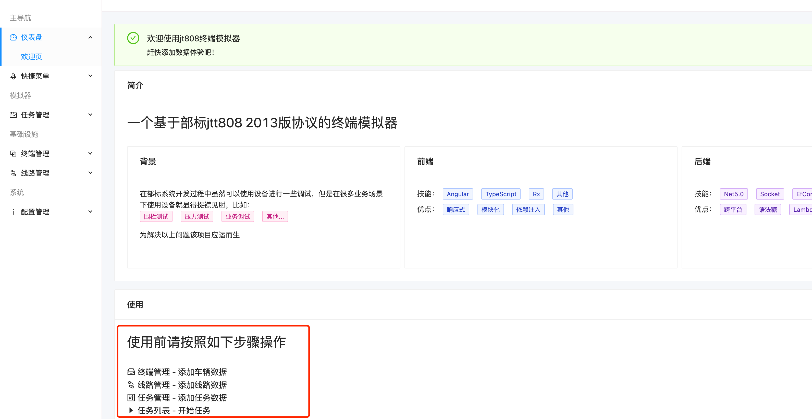
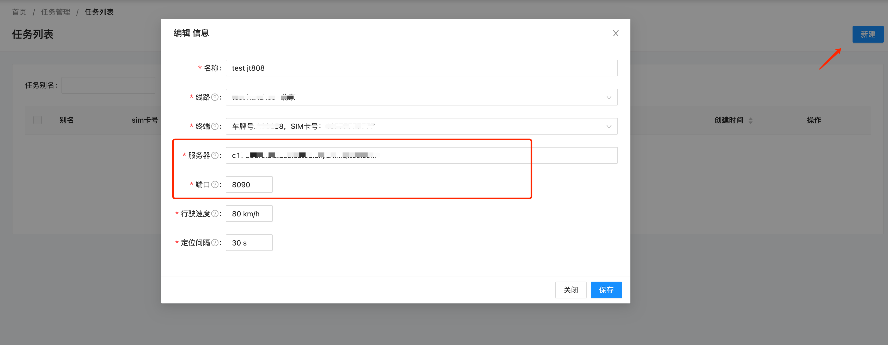
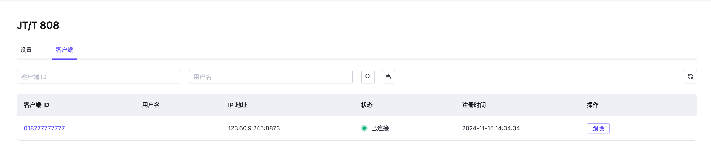

# JT/T 808 协议网关

JT/T 808 网关是 EMQX 专为车联网场景设计的协议适配组件，支持车辆定位、状态监控、数据交互等功能，广泛应用于车载终端与监控平台之间的通信。

## 基本设置

点击 JT/T 808 网关**操作**列中的**设置**按钮即可对网关进行基本设置：

- **挂载点**：设置一个字符串作为发布或订阅时所有主题的前缀，提供一种在不同协议之间实现消息路由隔离的方法，例如 `jt808/${clientid}/`。此主题前缀由网关管理，客户端在发布和订阅时无需显式添加此前缀。
- **最大帧长度**：网关能够处理的帧的最大大小。默认值设置为 `8192`，使网关能够适应各种数据包大小。
- **重试间隔**：消息发送失败时网关尝试重发的时间间隔。默认值为 `8秒`。
- **最大重试次数**：网关尝试发送消息的最大尝试次数。超过此数值后，如果消息仍无法发送，则会被丢弃。默认值为：`3`。
- **最大消息队列长度**：下行流消息传递的最大消息队列长度。默认值为：`10`。
- **空闲超时时间**：设置客户端无活动状态下被视为断开连接的持续时间（以秒为单位）。默认值：`30秒`。
- **上行主题**：用于发布消息从网关到 EMQX Platform 的 MQTT 主题模式。定义了 JT/T 808 客户端消息如何映射到 MQTT 主题进行上行通信。默认主题为：`jt808/${clientid}/${phone}/up`。
- **下行主题**：用于从 EMQX Platform 到网关再到 JT/T 808 客户端发送消息的 MQTT 主题模式。定义了 MQTT 消息服务器的消息如何路由到 JT/T 808 客户端进行下行通信。默认主题为：`jt808/${clientid}/${phone}/dn`。
- **允许匿名**：此设置决定网关是否允许客户端无需认证即可连接。如果设置为 `true`，客户端可以在不提供认证凭证的情况下连接。

## 客户端

在 JT/T 808 页面的**客户端**标签页中可以查看连接到部署的客户端的基本信息。在**操作**列中，可以选择将某一客户端踢除。

### 使用客户端工具测试连接

您可以使用一个模拟 JT/T 808 协议网关客户端，按照以下步骤测试连接。

1. 访问 JT/T 808 终端模拟器的仓库：[yedajiang44/GpsTerminalEmulator](https://gitee.com/yedajiang44/GpsTerminalEmulator/tree/master)。根据该库的 README 文件说明，使用 docker 安装运行。

   ```bash
   ## 安装 Docker Compose
   sudo curl -L "https://github.com/docker/compose/releases/download/$(curl -s https://api.github.com/repos/docker/compose/releases/latest | grep tag_name | cut -d '"' -f 4)/docker-compose-$(uname -s)-$(uname -m)" -o /usr/local/bin/docker-compose
   sudo chmod +x /usr/local/bin/docker-compose
   
   ## 创建目录
   mkdir jt808terminalemulator
   cd jt808terminalemulator
   mkdir data
   
   ## 复制粘贴 https://gitee.com/yedajiang44/GpsTerminalEmulator/blob/master/docker-compose.yml#
   nano docker-compose.yml
   
   ## 启动服务
   sudo docker-compose up -d
   
   
   ## 检查服务状态，启动后，使用以下命令查看服务状态：
   sudo docker-compose ps
   
   ## 遇到问题查看日志
   sudo docker-compose logs -f
   ```

   如返回以下内容则表示运行成功：

   

2. 通过` server-ip:4000` 访问到终端模拟器管理页面。

   

3. 按照其说明的操作步骤添加好车辆数据和线路数据。

   

   添加任务数据时，服务器填写部署的连接地址，端口填写 `8090`，具体以部署概览页面中显示的为准。点击**保存**默认开始任务。

   

完成上述操作后，可以在 JT/T 808 网关的客户端列表中看到上述客户端已连接。

您可以点击客户端列表中的客户端 ID 查看客户端更详细的信息。点击**踢除**按钮可以让客户端断开连接。

## 配置接入认证/鉴权

配置详见[接入认证/鉴权](https://docs.emqx.com/zh/emqx/latest/gateway/jt808.html#配置接入认证-鉴权)。用户需根据车联网终端的需求完成认证配置。

## 数据交互格式

参考 EMQX 文档 [JT/T 808 2013 数据交互格式](https://docs.emqx.com/zh/emqx/latest/gateway/jt808_data_exchange.html)。
