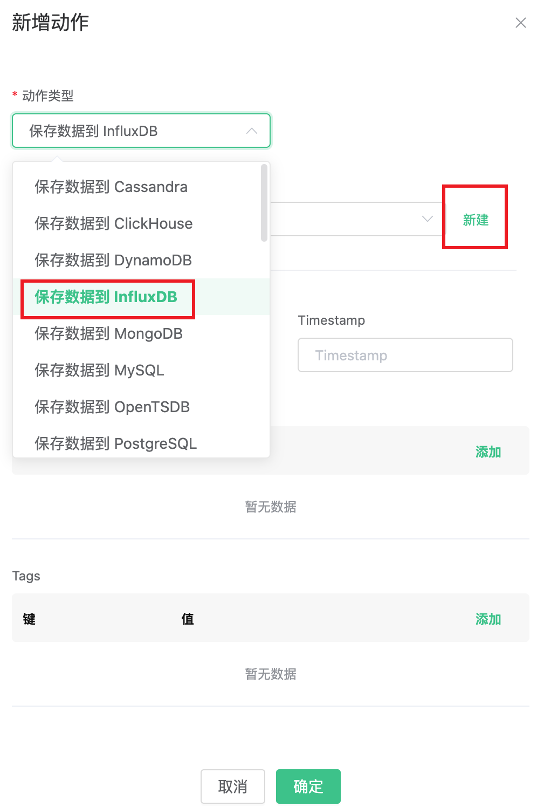
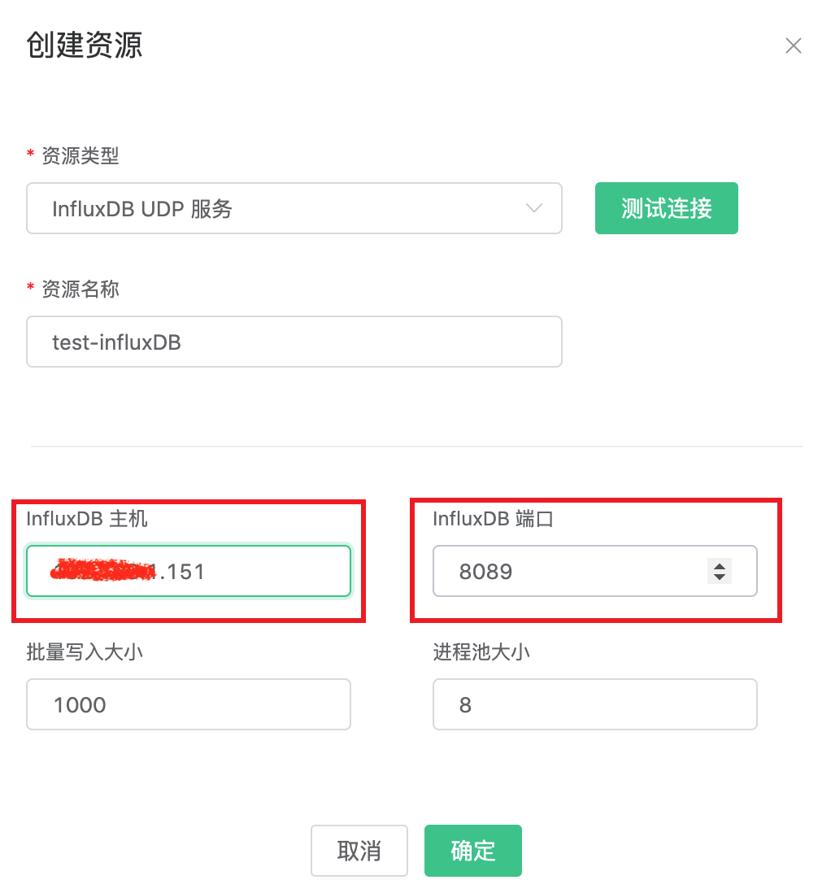
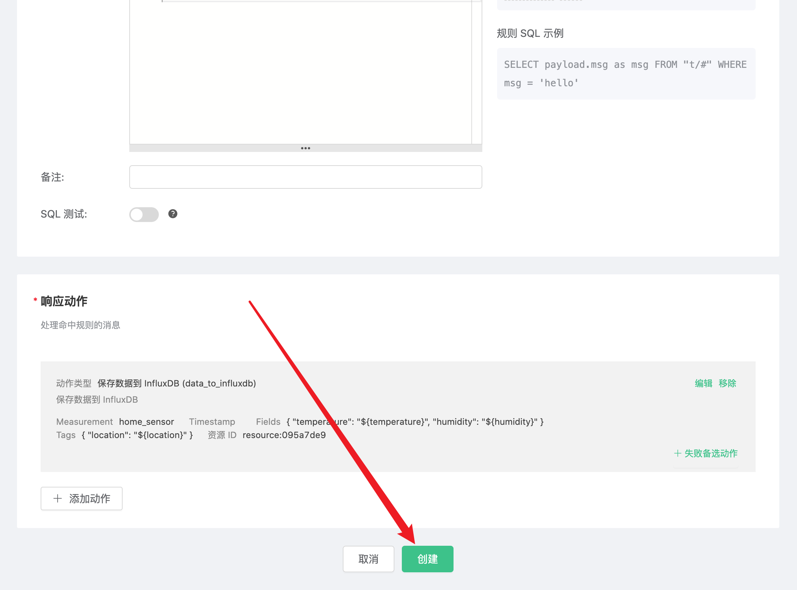

# 使用 EMQ X Cloud 规则引擎——InfluxDB

[InfluxDB](https://www.influxdata.com/) 是一个用于存储和分析时间序列数据的开源数据库，内置 HTTP API，类 SQL 语句的支持和无结构的特性对使用者而言都非常友好。它强大的数据吞吐能力以及稳定的性能表现使其非常适合 IoT 领域。

通过 EMQ X Cloud 规则引擎，我们可以自定义 Template 文件，然后将 JSON 格式的 MQTT 消息转换为 Measurement 写入 InfluxDB。


这篇指南会完成一个 InfluxDB 规则引擎的创建，实现下面的功能：

* 记录每个房间的温度和湿度情况。当有温度和湿度的监控消息，发送到 home/sensor 主题时，会触发规则引擎，将这条数据记录在 InfluxDB 中。


为了实现这个功能，我们会完成以下 4 个任务：

1. 安装并初始化 InfluxDB 
2. 设置规则引擎的筛选条件
3. 创建一个资源和一个动作
4. 完成规则引擎创建，并进行测试

>注意:
>
>在使用规则引擎前，请先创建部署。
>
>对于独享部署用户：请先完成[对等连接](../../deployments/vpc_peering.md)，并确保以下涉及到的服务器都建立在对等连接下的 VPC 中，下文提到的 IP 均指资源的内网 IP
>
>对于免费试用及共享部署用户：无需完成对等连接，下文提到的 IP 均指资源的公网 IP


#### 1. 安装并初始化 InfluxDB

首先，我们在自己的服务器上创建一个 InfluxDB。为了快速创建 InfluxDB，这里我们使用 docker 进行快速安装，并开放 **8089** UDP 端口，数据库名为 **db**.

```shell
$ docker pull influxdb
$ git clone -b v1.0.0 https://github.com/palkan/influx_udp.git
$ cd influx_udp
$ docker run --name=influxdb --rm -d -p 8086:8086 -p 8089:8089/udp -v ${PWD}/files/influxdb.conf:/etc/influxdb/influxdb.conf:ro -e INFLUXDB_DB=db influxdb:latest
```


#### 2. 设置规则引擎的筛选条件

进入 [EMQ X Cloud 控制台](https://cloud.emqx.io/console/)，并点击进入要使用 InfluxDB 的部署。

在部署页面，选择规则引擎，点击创建。


我们的目标是：只要 home/sensor 主题有监控信息时，就会触发引擎。这里需要对 SQL 进行一定的处理：

* 仅针对主题 "home/sensor"
* 获取我们需要的三个数据 location、temperature、humidity 

根据上面的原则，我们最后得到的 SQL 应该如下：

```sql
SELECT
  payload.location as location,
  payload.data.temperature as temperature,
  payload.data.humidity as humidity
FROM
  "home/sensor"
```

SQL 中的 payload 表示我们向 EMQX Cloud 传的数据。其 JSON 结构如下：

```json
{
  "location": "房间",
  "data":{
    "temperature": "温度",
    "humidity": "湿度"
  }
}
```
这个 SQL 可以解读为：当 "home/sensor" 主题收到消息时，选取信息里的 location、data.temperature、data.humidity 三个字段。

可以点击 SQL 输入框下的 **SQL 测试** ，填写数据：

* topic: home/sensor
* payload:
```json
{
  "location": "bedroom",
  "data":{
    "temperature": 26,
    "humidity": 46.4
  }
}
```
点击测试，查看得到的数据结果，如果设置无误，测试输出框应该得到完整的 JSON 数据，如下：

```json
{
  "temperature": 25,
  "location": "bedroom",
  "humidity": 46.4
}
```


>注意：如果无法通过测试，请检查 SQL 是否合规，测试中的 topic 是否与 SQL 填写的一致。

  

#### 3. 创建资源和动作

点击添加动作，在选择动作页中，选择**保存数据到 InfluxDB**，点击下一步，当配置动作页面，点击创建资源。



在创建资源页面里，资源类型选择 **InfluxDB UDP 服务**, 服务器地址处填写 **<服务器 IP>:8089**

>注意：目前 InfluxDB 使用的是 UDP 端口，所以无法检测是否连接成功



点击确定，返回到配置动作页面，默认选择的是刚才创建的资源。其他字段可以参照下表。

| 参数   | 必填   | 类型   | 意义   |
|:----|:----|:----|:----|
| Measurement   | 是   | str   | 指定写入到 InfluxDB 的  measurement   |
| Fields  | 是   | str   | 指定写入到 InfluxDB 的 fields 的值从哪里获取   |
| Tags  | 否   | str  | 指定写入到 InfluxDB 的 tags 的值从哪里获取   |
| Timestamp Key   | 否   | str   | 指定写入到 InfluxDB 的 timestamp 的值从哪里获取   |

针对我们的情况，这部分可以这样填写


* Measurement 可以随意设置，我们这里填写 "home_sensor"
* Field Keys 填写我们需要记录的两个数据：temperature 和 humidity
* Tag Keys 这里我们设置成 location
* Timestamp Key 默认为空

填写完成后，点击确定。

创建好的动作会显示在响应动作一栏里，确认信息无误后，点击右下角的确认，完成规则引擎的配置。




#### 4. 测试

>如果您是第一次使用 EMQ X Cloud 可以前往[部署连接指南](../../connect_to_deployments/README.md)，查看 MQTT 客户端连接和测试指南

我们尝试向 home/sensor 主题发送下面的数据

```json
{
  "location": "bedroom",
  "data":{
    "temperature": 25,
    "humidity": 46.4
  }
}
```
在规则引擎页中，点击监控可以看到动作指标数的成功数变为 1。


打开服务器，查看 InfluxDB 里的数据。

```shell
$ docker exec -it InfluxDB influx
$ use db
$ select * from "home_sensor"
```
可以看到，刚才发送的消息已经存入了 InfluxDB 中。

```plain
> select * from "home_sensor"
name: home_sensor
time                humidity location temperature
----                -------- -------- -----------
1592984201145230677 46.4     bedroom  25
```

> 注意：
>
> 在 influxDB 中，数据类型以第一个值为准。如果你误将字符串传给 humidity 和 temperature。
>
> 可以通过在数据库里，输入命令 `DROP SERIES FROM home_sensor` 清除
