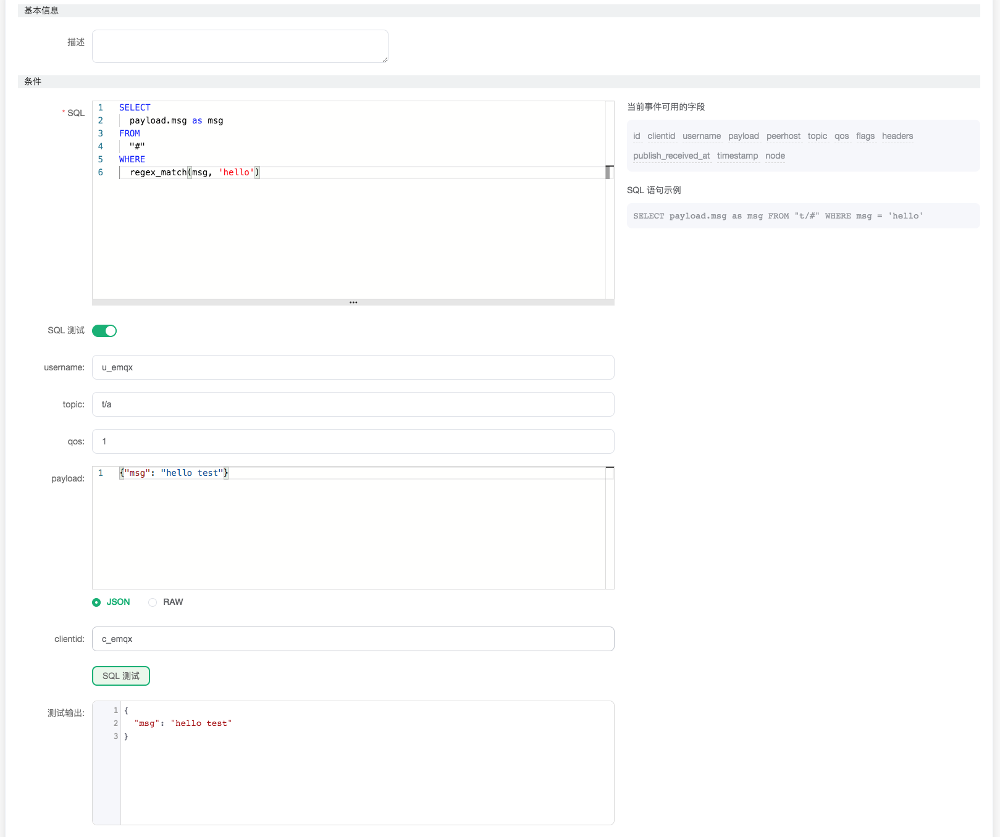
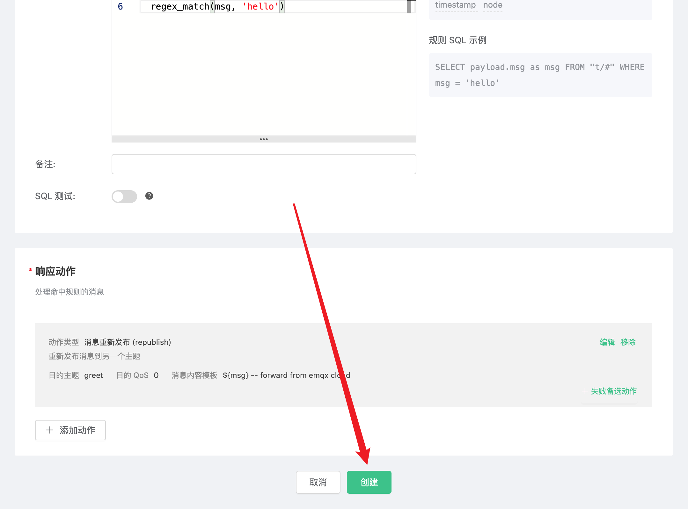

# 使用 EMQ X Cloud 规则引擎消息重新发布

当有消息满足某一特征时，你希望在不编写代码的情况下，将它发布到其它上主题。EMQ X Cloud 为你准备了这样的服务：通过使用 EMQ X Cloud 规则引擎——消息重新发布，你可以轻松实现这一功能。

这篇指南会完成一个 `消息重新发布` 规则引擎的创建，实现下面的目标：

* 当任一消息的 msg 包含 'hello' 字符串时，将消息转发到 greet 主题

为了实现这个功能，我们会依次完成以下 3 个任务：

1. 设置规则引擎的筛选条件
2. 创建一个资源和一个动作
3. 完成规则引擎创建，并进行测试

### 1. 设置规则引擎的筛选条件

进入 [EMQ X Cloud 控制台](https://cloud.emqx.io/console/)，并点击进入要使用 `消息重新发布` 的部署。

在部署页面，选择规则引擎，点击创建。


我们的目标是：任何消息中，只要 msg 中包含 'hello' 字符串，就会触发引擎。这里需要对 SQL 进行一定的处理：

* 针对所有的主题，即 '#'
* 对 payload 中的 msg 进行正则匹配，含有 'hello' 字符串再执行规则引擎

根据上面的原则，我们最后得到的 SQL 应该如下：

```sql
SELECT
  payload.msg as msg
FROM
  "#"
WHERE  
  regex_match(msg, 'hello')
```
可以点击 SQL 输入框下的 SQL 测试 ，填写数据：

* topic: t/a
* payload:
```json
{
  "msg":"hello test"
}
```
点击测试，查看得到的数据结果，如果设置无误，测试输出框应该得到完整的 JSON 数据，如下：

```json
{
  "msg":"hello test"
}
```

测试输出与预期相符，我们可以进行后续步骤。
>注意：如果无法通过测试，请检查 SQL 是否合规



### 2. 创建动作

点击添加动作，在选择动作页，选择 `消息重新发布`，点击下一步


在配置动作页面中，目的主题设为 greet，在消息内容模板里填写 "${msg} -- forward from emqx cloud"，目的 QoS 默认。点击确定。


创建好的动作会显示在响应动作一栏里，确认信息无误后，点击右下角的创建，完成规则引擎的配置。



### 3. 测试

>如果您是第一次使用 EMQ X Cloud 可以前往[部署连接指南](../../connect_to_deployments/README.md)，查看 MQTT 客户端连接和测试指南 

我们尝试向 test 主题发送下面的数据

```json
{
  "msg": "hello"
}
```
在规则引擎页中，点击监控可以看到动作指标数的成功数变为 1。


同时收到了来自主题 greet 的消息转发。


