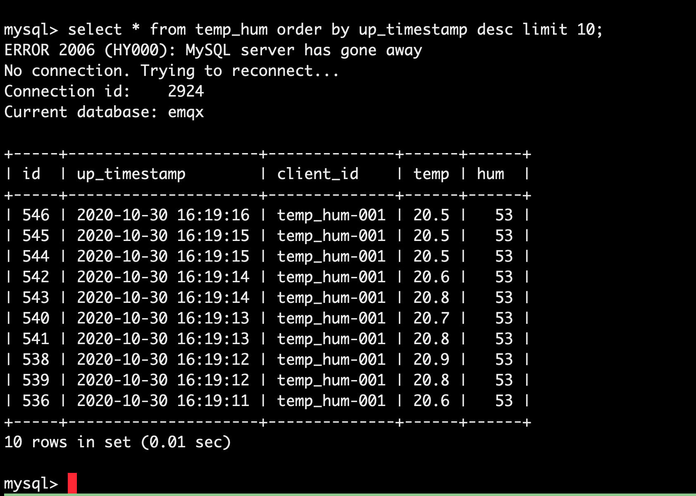

# EMQ X Cloud 规则引擎对接 MySql

在本文中我们将模拟温湿度数据并通过 MQTT 协议上报到 EMQ X Cloud，然后使用 EMQ X Cloud 规则引擎将数据转存到 MySQL。

在开始之前，您需要完成以下操作：
* 已经在 EMQ X Cloud 上创建部署(EMQ X 集群)。
* 对于独享部署用户：请先完成 [对等连接的创建](../../deployments/vpc_peering.md)，下文提到的 IP 均指资源的内网 IP。
* 对于免费试用及共享部署用户：无需完成对等连接，下文提到的 IP 均指资源的公网 IP。


### MySQL 配置

1. MySQL 安装

   ```bash
   docker run -d --restart=always \
     --name mysql \
     -p 3306:3306 \
     -e MYSQL_ROOT_PASSWORD=public \
     -d mysql/mysql-server:5.7
   ```

2. 数据库创建

   ```sql
   CREATE DATABASE emqx;
   ```


3. 温湿度表创建

   使用以下 SQL 语句将创建 `temp_hum` 表，该表将用于存放设备上报的温度和湿度数据。

   ```sql
   CREATE TABLE `temp_hum` (
     `id` int(11) unsigned NOT NULL AUTO_INCREMENT,
     `up_timestamp` timestamp NULL DEFAULT NULL,
     `client_id` varchar(32) DEFAULT NULL,
     `temp` float unsigned DEFAULT NULL,
     `hum` float unsigned DEFAULT NULL,
     PRIMARY KEY (`id`),
     KEY `up_timestamp_client_id` (`up_timestamp`,`client_id`)
   ) ENGINE=InnoDB AUTO_INCREMENT=26 DEFAULT CHARSET=utf8mb4;
   ```

4. 设置允许 EMQ X 集群 IP 段访问数据库(可选)
   对于独享部署，获取部署网段可以前往部署详情 → 查看对等连接信息，复制部署 VPC 网段。
   
   ```sql
   # 独享部署
   GRANT ALL PRIVILEGES ON *.* TO root@'10.11.30.%' IDENTIFIED BY 'public' WITH GRANT OPTION;
   
   # 免费试用或共享部署
   GRANT ALL PRIVILEGES ON *.* TO root@'%' IDENTIFIED BY 'public' WITH GRANT OPTION;
   ```

5. 插入测试数据，并查看数据
   
   ```sql
   INSERT INTO temp_hum(up_timestamp, client_id, temp, hum) values (FROM_UNIXTIME(1603963414), 'temp_hum-001', 19.1, 55);
   
   select * from temp_hum;
   ```
   
   


### EMQ X Cloud 规则引擎配置

进入部署详情点击 EMQ X Dashbaord 将进入 Dashbaord

1. 资源创建

   点击左侧菜单栏规则 → 资源，点击新建资源，下拉选择 MySQL 资源类型。填入刚才创建好的 mysql 数据库信息，并点击测试如果出现错误应及时检查数据库配置是否正确。
   
   
2. 规则测试
   点击左侧菜单栏规则 → 规则，点击创建，然后输入如下规则匹配 SQL 语句。在下面规则中我们从 `temp_hum/emqx` 主题读取消息上报时间 `up_timestamp`、客户端 ID、消息体(Payload)，并从消息体中分别读取温度和湿度。
   
   ```sql
   SELECT 
   
   timestamp as up_timestamp, clientid as client_id, payload.temp as temp, payload.hum as hum  
   
   FROM  
   
   "temp_hum/emqx"  
   ```
   
   
3. 添加响应动作

   点击左下角添加动作，下拉选择 → 保存数据到 MySQL 选择第一步创建好的资源，并输入以下数据插入 SQL 模板。

   ```sql
   insert into temp_hum(up_timestamp, client_id, temp, hum) values (FROM_UNIXTIME(${up_timestamp}/1000), ${client_id}, ${temp}, ${hum}) 
   ```
   

4. 点击创建规则，并返回规则列表
   


5. 查看规则监控
   
   

   

### 测试
1. 使用 [MQTT X](https://mqttx.app/) 模拟温湿度数据上报

   需要将 broker.emqx.io 替换成已创建的部署[连接地址](../deployments/view_deployment.md)，并在 EMQ X Dashboard 中添加[客户端认证信息](../deployments/dashboard/users_and_acl.md)。
   
   

   


2. 查看数据转存结果

   ```sql
   select * from temp_hum order by up_timestamp desc limit 10;
   ```
   
