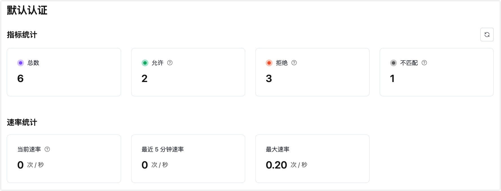

# EMQX 专有版 v5 新功能

EMQX 专有版，因其在专有云环境中托管 MQTT 集群而闻名，一直是 EMQX 产品系列中的核心产品。我们很高兴地宣布，EMQX 专有版已升级至最新版本，引入了一系列新功能和能力，旨在支持各行业关键任务的物联网应用。

## 增强的指标和可观测性

升级后的监控系统提供了全面而精细的指标显示，提供了更深入的见解，涵盖了客户端连接、认证、授权和数据集成指标。

### 客户端指标

专有版 v5 控制台下，将连接到服务的每个客户端的指标按类别如消息、数据包和字节进行组织。这种详细的细分便于对客户端活动进行深入分析，并在下方以直观的图表格式展示所有相关指标。 

### 认证/授权指标

在 EMQX 专有版 v5 中，我们引入了详细的指标，能够揭示认证和授权过程，帮助及早识别潜在问题。新增的认证 API 使认证过程的管理更加无缝和有效。 

### 数据集成指标

以前的 v4 提供的指标有限，为故障排除提供的信息不多。v5 显著扩展了与规则和动作相关的指标范围，扩大了可观察方面的范围，确保全面了解数据处理活动。 

## 可用性提升

EMQX 专有版 v5 中的可用性提升包括一个高级的保留消息管理系统，它提供详尽的洞察和便捷的删除功能，以及一个友好的界面，用于认证/授权数据源排序，便于清楚地展示执行顺序。

### 保留消息管理

EMQX 专有版 v5 在控制台中引入了一个保留消息管理系统，这是相比 v4 版本显著的进步，v4 版本中只显示保留消息的数量。这个新系统允许查看消息主题、QoS、发布时间和有效载荷的详细视图，并提供删除单个消息或同时清除所有保留消息的选项。这种方法比以前发送空消息到主题以进行删除的做法有了明显的改进。 

### 认证/授权数据源排序

EMQX 专有版 v5 允许配置和排序扩展的认证/授权数据源，包括默认数据源。用户现在可以通过简单的拖放界面轻松调整认证链的执行顺序，提供清晰直观的认证逻辑可视化。 

## 高级功能

本节介绍了 EMQX 专有版 v5 的一些高级功能。

### MQTT over QUIC

QUIC 这是支撑下一代互联网协议 HTTP/3 的传输协议。专有版 v5 利用 QUIC 为现代移动互联网提供了增强的连接性。与传统的 TCP/TLS 协议相比，这项技术减少了连接开销和消息延迟，使 EMQX 专有版成为利用这项前沿技术进行 MQTT 通信的先驱。

### 证书吊销列表（CRL）

CRL 是由证书颁发机构（CA）维护的列表，详细记录了被吊销的证书及其序列号和吊销日期。通过这个功能，EMQX 专有版在 SSL/TLS 握手阶段检查客户端的证书是否已被吊销，确保连接的安全性。

### 在线证书状态协议（OCSP）Stapling

这种方法提供了另一层证书吊销检查。启用 OCSP Stapling 后，EMQX 专有版将查询 OCSP 服务器以获取证书状态，并缓存结果。在 SSL 握手期间，EMQX 将与证书链一起向客户端呈现 OCSP 数据进行验证。

通过 EMQX 专有版 v5 的强大功能，提升您的物联网解决方案，释放您的物联网数据管理潜力。
