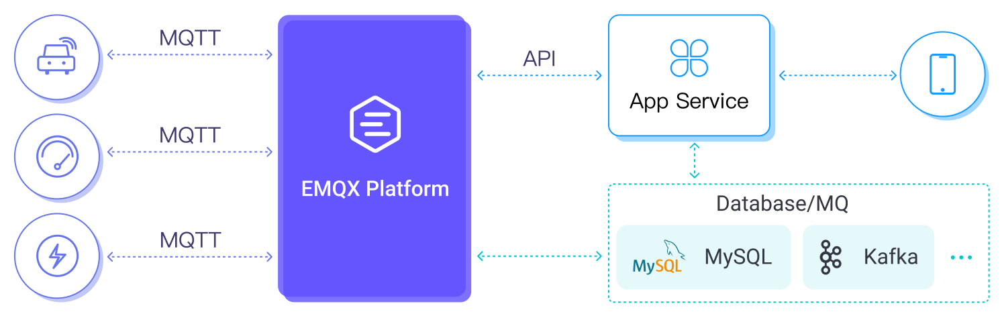

# EMQX Cloud 概览

EMQX Cloud 是 EMQ 推出的一款面向物联网领域的 MQTT 消息中间件产品。作为全球首个 MQTT 5.0 消息云服务，EMQX Cloud 提供了一站式运维代管、独有隔离环境的 MQTT 消息服务。在万物互联的时代，EMQX Cloud 可以帮助您快速构建面向物联网领域的行业应用，轻松实现物联网数据的采集、传输、计算和持久化。

<!--  -->

## 功能概述

借助云服务商提供的基础计算设施，EMQX Cloud 面向全球数十个国家与地区提供服务，为 5G 与万物互联应用提供低成本、安全可靠的云服务。

EMQX Cloud 可用根据不同的业务场景架构不同的解决方案，主要的模型有 3 种：

### 双向通信
EMQX Cloud 支持海量设备及应用端连接，为应用程序及物联网设备提供安全可靠的双向通信能力。在该模型中，EMQX Cloud 提供的 MQTT 服务将海量设备与应用连接起来，支持应用与设备间的双向通信，也支持设备与设备间的双向通信。

#### 应用场景举例：智能家居
该模型适用于有类即时通讯需求的物联网应用，例如在典型的智能家居场景中，手机 APP 获取智能设备的状态信息，并且用户可以通过 APP 向智能设备发送控制指令，设备也可以随时上报状态信息到 APP 端。

### 数据采集

EMQX Cloud 支持设备数据上云，通过海量 Topic 及数据集成的支持，低代码的方式即可实现数据的采集、过滤、转换、计算及持久化。

#### 应用场景举例：智慧工业
该模型适用于有数据采集和持久化需求的物联网应用，比较典型的智慧工业场景，各个物联网传感器将实时采集的数据汇集到边缘网关，通过边缘网关将数据上传到 MQTT 服务器上，再由数据集成触发数据的过滤、转换和简单计算，并将最终结果转发至其他服务或持久化至目标数据库中。EMQX Cloud 提供了多种接入方案，涵盖了不同的网络条件、各种类型终端设备和边缘网关设备，支持70多种工业协议接入。

### 混合模型

EMQX Cloud 提供的 MQTT 服务支持双向通信和数据采集模型的混合应用。通过共享订阅、数据集成等能力，实现数据在物与物、物与应用间流转的同时进行持久化。这样不仅提供了设备与设备、设备与应用间通信的能力，同时提供了数据持久化的能力，以便非实时应用在后续对获取的数据加以利用。

#### 应用场景举例：车联网
比较典型的如车联网应用，车辆终端获取的数据需要发送至云端，通过云端运行的计算模型经过计算后即时反馈给终端或智能 APP，用户也可通过智能 APP 向车辆发送指令。同时支持将数据副本持久化到数据库中，实现更多的车联场景。

## 产品优势

当选择 EMQX Cloud 作为消息中间件来构建各类物联网应用时，您可享受到以下产品优势带来的各项便利：

### 完整的协议支持
支持 MQTT v3.1，v3.1.1 与 v5.0 协议版本，支持 MQTT WebSocket 服务，完整支持 QoS0, QoS1 与 QoS2 级别 MQTT 消息。

除了标准的 MQTT 协议，我们还支持 MQTT-SN、CoAP、以及私有 TCP 协议在内的多种通信协议接入，覆盖各类行业应用；可根据您的特殊使用场景定制私有化功能，充分契合业务协议上的需求。

### 快速部署，完全托管
只需注册并登录，并选择所需部署的地区，即可快速获得一个全托管的 MQTT 云服务。一键部署，免除常见的运维烦恼。

创建部署后，我们的全球服务支持团队和 EMQ 专家团队将在 EMQX Cloud 的整个使用周期内为您提供最高 7*24 不间断的技术支持和运维服务，您可以随时通过工单，电子邮件，电话等快速获得响应。

### 计费方式多样，规格灵活伸缩，有效控制成本
EMQX Cloud 拥有灵活的计费方式，对于吞吐和并发少的业务，可以使用按量计费的 Serverless 部署，只按照实际使用的资源进行计费。当业务量达到规模，可以使用专有版的部署，按集群实例与消息流量收费，而非消息条数，不限 API 与数据集成的使用，业务海量扩张的时候成本仍然清晰可控。

部署还可以通过连接数与消息吞吐量自动预估容量，通过紧密的监控来制定伸缩计划，集群大小可随业务规模平滑调整。

### 高可用性与数据安全
EMQX Cloud 专有版和 BYOC 均采用高冗余集群架构，以确保服务的高可用性；通过独有隔离环境保障您数据安全与业务稳定性，每个部署集群都有自己的公共 IP、专用 VPC 网络、独立 EMQX 服务器与数据库服务器，这更安全，更可靠。

### 灵活的数据集成方案
EMQX Cloud 专业版和 BYOC 支持实时预处理设备事件与消息数据，并存储到云上 MySQL、Kafka、InfluxDB 等 40+ 的数据库与消息队列资源中。

## 产品版本简介

EMQX Cloud 提供三个版本，支持在全球主流的公有云上部署专属于您的全托管 MQTT 服务，从独立的开发者到全球化的行业领导者，都能找到合适的 EMQX Cloud 产品。

前往[版本介绍](./price/plans.md)了解更多内容。

