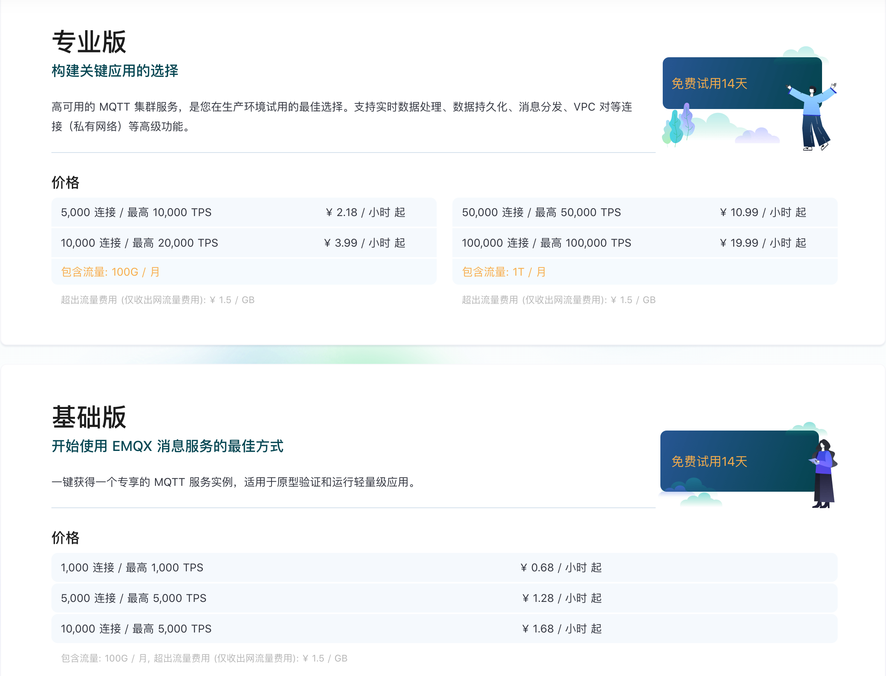
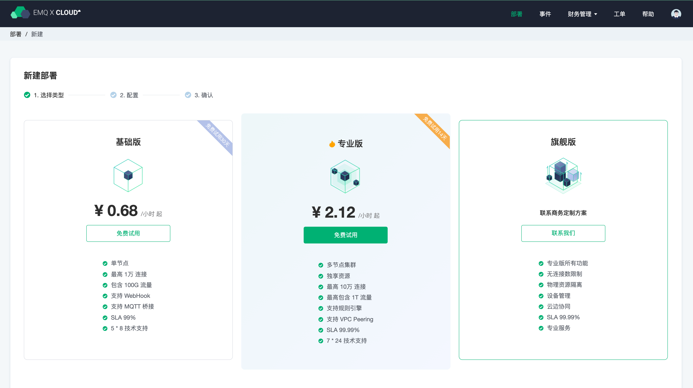
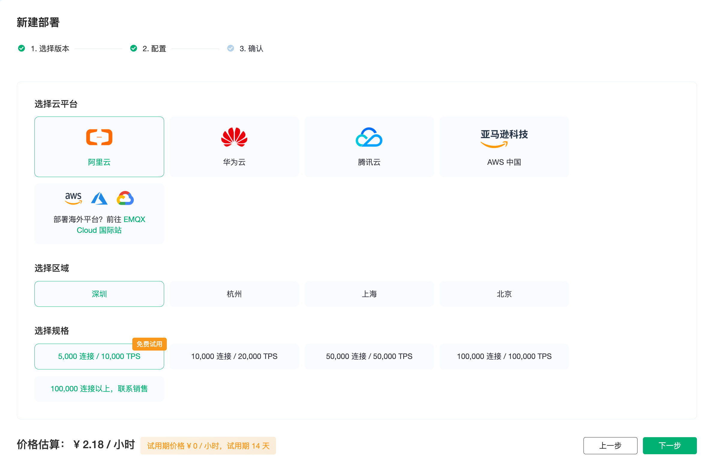
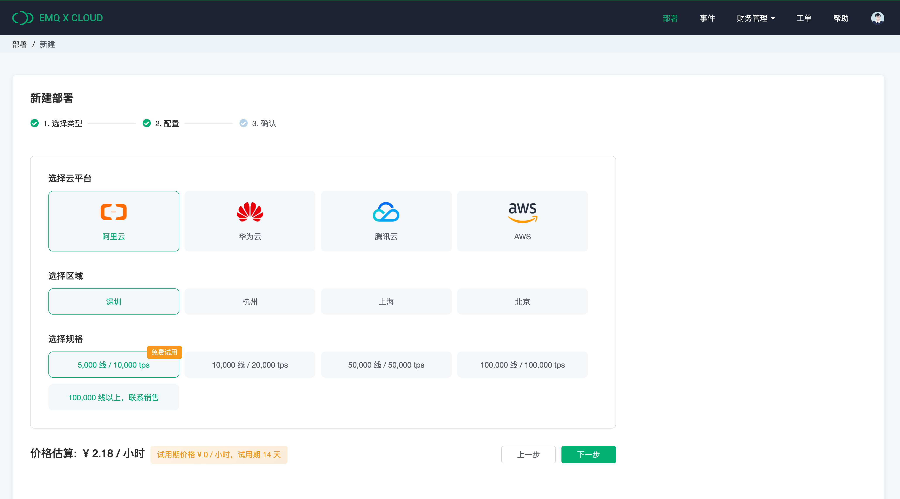

# 价格估算

EMQ X Cloud  价格计算允许您依据实际业务需求预估，预估 EMQX Cloud 上 创建部署所需费用。对于以前从未使用过 EMQ X Cloud 的客户以及要重新组织或扩展 EMQ X Cloud 部署规格的用户，EMQ X Cloud  价格计算是非常有用的。

## 访问 EMQ X Cloud 价格估算

* 对于**未注册** EMQ X Cloud 的用户，您可以前往 [价格](https://cloud.emqx.com/pricing) 页面，使用价格估算。

  

* 对于**登录**到 EMQ X Cloud 的用户，您可以前往 [价格估算](https://cloud.emqx.com/console/deployments/0?oper=new)，选择版本，使用价格估算，并创建部署。
  
  

  

## 获取部署每小时价格

您可以依次选择云平台，区域和规格获取部署每小时价格。

> 专业版：选择阿里云平台，深圳区域，最大连接数 5000，消息上下行 TPS 为 10000，则每小时价格为 2.18，则每月基础费用为： 2.18 * 730 = 1591。

## 支持云服务商和地区

EMQ X Cloud 目前支持云服务商有：阿里云、华为云、腾讯云。如您需要其他云服务商或地区，您可以提 [工单](feature/tickets.md)或邮件(cloud@emqx.io)与我们取得联系。

| 平台   | 区域                   |
| ------ | ---------------------- |
| 阿里云 | 北京，上海，深圳，杭州 |
| 华为云 | 广州，上海，北京       |
| 腾讯云 | 广州，上海，北京 |

