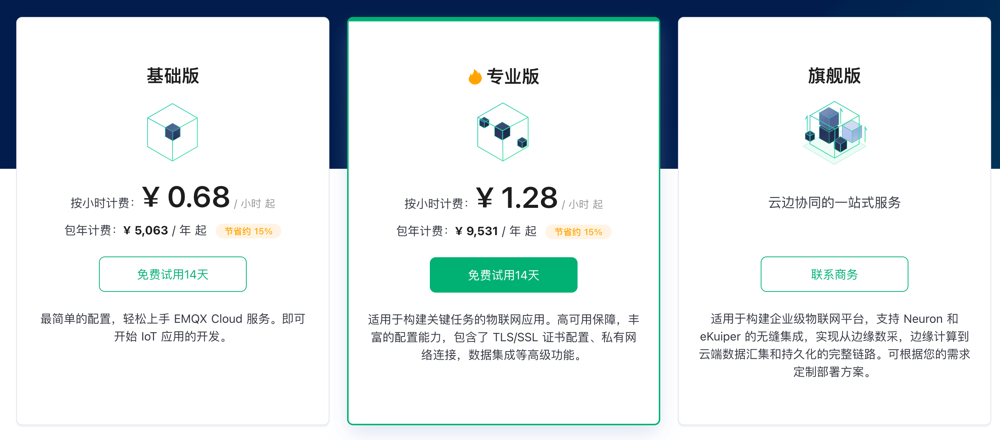

# 产品定价

我们提供了多种灵活的产品规格，支持在全球主流的公有云上部署专属于您的全托管 MQTT 服务。

## 产品版本

EMQX Cloud 分为基础版、专业版和旗舰版三个版本。

- 基础版：最简单的配置，轻松上手 EMQX Cloud 服务。即可开始 IoT 应用的开发。基础版提供 14 天免费试用。
- 专业版：适用于构建关键任务的物联网应用。高可用保障，丰富的配置能力，包含了 TLS/SSL 证书配置、私有网络连接，数据集成等高级功能。专业版提供 14 天免费试用。
- 旗舰版：适用于构建企业级物联网平台，支持 Neuron 和 eKuiper 的无缝集成，实现从边缘数采，边缘计算到云端数据汇集和持久化的完整链路。可根据您的需求定制部署方案。

## 价格详情

<table>
   <tr>
      <th>版本</th>
      <th>规格</th>
      <th>基础费用</th>
      <th>赠送流量</th>
      <th>超出流量单价</th>
   </tr>
   <tr>
      <td rowspan="3">基础版</td>
      <td>1,000 连接 / 最高 1,000 TPS</td>
      <td>¥0.68/小时 起</td>
      <td rowspan="3">100G/月</td>
      <td rowspan="7">￥1.5/GB</td>
   </tr>
   <tr>
      <td>5,000 连接 / 最高 5,000 TPS</td>
      <td>￥1.28/小时 起</td>
   </tr>
   <tr>
      <td>10,000 连接 / 最高 5,000 TPS</td>
      <td>￥1.68/小时 起</td>
   </tr>
   <tr>
      <td rowspan="5">专业版</td>
      <td>1,000 连接 / 最高 1,000 TPS</td>
      <td>￥1.28/小时 起</td>
      <td rowspan="3">100G/月</td>
   </tr>
   <tr>
      <td>5,000 连接 / 最高 10,000 TPS</td>
      <td>￥2.18/小时 起</td>
   </tr>
   <tr>
      <td>10,000 连接 / 最高 20,000 TPS</td>
      <td>￥3.99/小时 起</td>
   </tr>
   <tr>
      <td>50,000 连接 / 最高 50,000 TPS</td>
      <td>￥10.99/小时 起</td>
      <td rowspan="1">1T/月</td>
   </tr>
   <tr>
      <td>≥100,000 连接</td>
      <td colspan="3" align="center">联系商务</td>
   </tr>
   <tr>
      <td>旗舰版</td>
      <td>无限制</td>
      <td colspan="3" align="center">联系商务</td>
   </tr>
</table>

::: warning
根据所选的公有云平台及部署地域的不同，价格可能存在差异。实际价格以部署页面显示价格为准。
:::

## 功能详情

<table>
  <tr>
      <th></th>
      <th>基础版</th>
      <th>专业版</th>
      <th>旗舰版</th>
    </tr>
   <tr>
      <td>协议支持</td>
      <td></td>
      <td></td>
      <td></td>
   </tr>
   <tr>
      <td style="text-indent: 2em;">MQTT v3.1, v3.1.1, v5.0</td>
      <td>&#10003</td>
      <td>&#10003</td>
      <td>&#10003</td>
   </tr>
   <tr>
      <td style="text-indent: 2em;">MQTT over WebSocket</td>
      <td>&#10003</td>
      <td>&#10003</td>
      <td>&#10003</td>
   </tr>
   <tr>
      <td style="text-indent: 2em;">MQTT-SN</td>
      <td>&#10007</td>
      <td>&#10003</td>
      <td>&#10003</td>
   </tr>
   <tr>
      <td style="text-indent: 2em;">CoAP</td>
      <td>&#10007</td>
      <td>&#10003</td>
      <td>&#10003</td>
   </tr>
   <tr>
      <td style="text-indent: 2em;">LwM2M</td>
      <td>&#10007</td>
      <td>&#10003</td>
      <td>&#10003</td>
   </tr>
   <tr>
      <td style="text-indent: 2em;">JT/T808</td>
      <td>&#10007</td>
      <td>&#10003</td>
      <td>&#10003</td>
   </tr>
   <tr>
      <td>功能特性</td>
      <td></td>
      <td></td>
      <td></td>
   </tr>
   <tr>
      <td style="text-indent: 2em;">MQTT QoS 0, QoS 1, QoS 2</td>
      <td>&#10003</td>
      <td>&#10003</td>
      <td>&#10003</td>
   </tr>
   <tr>
      <td style="text-indent: 2em;">消息保留</td>
      <td>&#10003</td>
      <td>&#10003</td>
      <td>&#10003</td>
   </tr>
   <tr>
      <td style="text-indent: 2em;">遗嘱消息</td>
      <td>&#10003</td>
      <td>&#10003</td>
      <td>&#10003</td>
   </tr>
   <tr>
      <td style="text-indent: 2em;">共享订阅</td>
      <td>&#10003</td>
      <td>&#10003</td>
      <td>&#10003</td>
   </tr>
   <tr>
      <td style="text-indent: 2em;">用户名与密码认证</td>
      <td>&#10003</td>
      <td>&#10003</td>
      <td>&#10003</td>
   </tr>
   <tr>
      <td style="text-indent: 2em;">客户端和主题级别的访问控制</td>
      <td>&#10003</td>
      <td>&#10003</td>
      <td>&#10003</td>
   </tr>
   <tr>
      <td style="text-indent: 2em;">监控 API</td>
      <td>&#10003</td>
      <td>&#10003</td>
      <td>&#10003</td>
   </tr>
   <tr>
      <td style="text-indent: 2em;">项目管理</td>
      <td>&#10003</td>
      <td>&#10003</td>
      <td>&#10003</td>
   </tr>
   <tr>
      <td style="text-indent: 2em;">角色权限</td>
      <td>&#10003</td>
      <td>&#10003</td>
      <td>&#10003</td>
   </tr>
   <tr>
      <td style="text-indent: 2em;">自动订阅管理</td>
      <td>&#10003</td>
      <td>&#10003</td>
      <td>&#10003</td>
   </tr>
    <tr>
      <td style="text-indent: 2em;">发票管理</td>
      <td>&#10003</td>
      <td>&#10003</td>
      <td>&#10003</td>
   </tr>
   <tr>
      <td style="text-indent: 2em;">企业 SSL 证书</td>
      <td>&#10007</td>
      <td>&#10003</td>
      <td>&#10003</td>
   </tr>
   <tr>
      <td style="text-indent: 2em;">支持第三方数据源认证与授权</td>
      <td>&#10007</td>
      <td>&#10003</td>
      <td>&#10003</td>
   </tr>
   <tr>
      <td style="text-indent: 2em;">自定义函数</td>
      <td>&#10007</td>
      <td>&#10003</td>
      <td>&#10003</td>
   </tr>
   <tr>
      <td style="text-indent: 2em;">设备管理</td>
      <td>&#10007</td>
      <td>&#10007</td>
      <td>&#10003</td>
   </tr>
   <tr>
      <td style="text-indent: 2em;">设备影子</td>
      <td>&#10007</td>
      <td>&#10007</td>
      <td>&#10003</td>
   </tr>
   <tr>
      <td style="text-indent: 2em;">边缘设备管理</td>
      <td>&#10007</td>
      <td>&#10007</td>
      <td>&#10003</td>
   </tr>
   <tr>
      <td>数据集成</td>
      <td></td>
      <td></td>
      <td></td>
   </tr>
   <tr>
      <td style="text-indent: 2em;">基于 SQL 的数据处理</td>
      <td>&#10003</td>
      <td>&#10003</td>
      <td>&#10003</td>
   </tr>
   <tr>
      <td style="text-indent: 2em;">消息重发布</td>
      <td>&#10003</td>
      <td>&#10003</td>
      <td>&#10003</td>
   </tr>
   <tr>
      <td style="text-indent: 2em;">消息桥接</td>
      <td>&#10003</td>
      <td>&#10003</td>
      <td>&#10003</td>
   </tr>
   <tr>
      <td style="text-indent: 2em;">WebHook</td>
      <td>&#10003</td>
      <td>&#10003</td>
      <td>&#10003</td>
   </tr>
   <tr>
      <td style="text-indent: 2em;">Kafka</td>
      <td>&#10007</td>
      <td>&#10003</td>
      <td>&#10003</td>
   </tr>
   <tr>
      <td style="text-indent: 2em;">RabbitMQ</td>
      <td>&#10007</td>
      <td>&#10003</td>
      <td>&#10003</td>
   </tr>
   <tr>
      <td style="text-indent: 2em;">RocketMQ</td>
      <td>&#10007</td>
      <td>&#10003</td>
      <td>&#10003</td>
   </tr>
   <tr>
      <td style="text-indent: 2em;">Pulsar</td>
      <td>&#10007</td>
      <td>&#10003</td>
      <td>&#10003</td>
   </tr>
   <tr>
      <td style="text-indent: 2em;">MySQL</td>
      <td>&#10007</td>
      <td>&#10003</td>
      <td>&#10003</td>
   </tr>
   <tr>
      <td style="text-indent: 2em;">PostgreSQL</td>
      <td>&#10007</td>
      <td>&#10003</td>
      <td>&#10003</td>
   </tr>
   <tr>
      <td style="text-indent: 2em;">MongoDB</td>
      <td>&#10007</td>
      <td>&#10003</td>
      <td>&#10003</td>
   </tr>
   <tr>
      <td style="text-indent: 2em;">Redis</td>
      <td>&#10007</td>
      <td>&#10003</td>
      <td>&#10003</td>
   </tr>
   <tr>
      <td style="text-indent: 2em;">Cassandra</td>
      <td>&#10007</td>
      <td>&#10003</td>
      <td>&#10003</td>
   </tr>
   <tr>
      <td style="text-indent: 2em;">DynamoDB</td>
      <td>&#10007</td>
      <td>&#10003</td>
      <td>&#10003</td>
   </tr>
   <tr>
      <td style="text-indent: 2em;">ClickHouse</td>
      <td>&#10007</td>
      <td>&#10003</td>
      <td>&#10003</td>
   </tr>
   <tr>
      <td style="text-indent: 2em;">OpenTSDB</td>
      <td>&#10007</td>
      <td>&#10003</td>
      <td>&#10003</td>
   </tr>
   <tr>
      <td style="text-indent: 2em;">InfluxDB</td>
      <td>&#10007</td>
      <td>&#10003</td>
      <td>&#10003</td>
   </tr>
   <tr>
      <td style="text-indent: 2em;">TimescaleDB</td>
      <td>&#10007</td>
      <td>&#10003</td>
      <td>&#10003</td>
   </tr>
   <tr>
      <td style="text-indent: 2em;">Oracle DB</td>
      <td>&#10007</td>
      <td>&#10003</td>
      <td>&#10003</td>
   </tr>
   <tr>
      <td style="text-indent: 2em;">SQL Server</td>
      <td>&#10007</td>
      <td>&#10003</td>
      <td>&#10003</td>
   </tr>
   <tr>
      <td style="text-indent: 2em;">DolphinDB</td>
      <td>&#10007</td>
      <td>&#10003</td>
      <td>&#10003</td>
   </tr>
   <tr>
      <td style="text-indent: 2em;">TDengine</td>
      <td>&#10007</td>
      <td>&#10003</td>
      <td>&#10003</td>
   </tr>
   <tr>
      <td>网络连接</td>
      <td></td>
      <td></td>
      <td></td>
   </tr>
   <tr>
      <td style="text-indent: 2em;">最大连接数</td>
      <td>10,000</td>
      <td>100,000</td>
      <td>无限制</td>
   </tr>
   <tr>
      <td style="text-indent: 2em;">VPC 对等连接（私有网络）</td>
      <td>&#10007</td>
      <td>&#10003</td>
      <td>&#10003</td>
   </tr>
   <tr>
      <td style="text-indent: 2em;">私网连接（阿里云）</td>
      <td>&#10007</td>
      <td>&#10003</td>
      <td>&#10003</td>
   </tr>
   <tr>
      <td style="text-indent: 2em;">NAT 网关</td>
      <td>&#10007</td>
      <td>&#10003</td>
      <td>&#10003</td>
   </tr>
   <tr>
      <td style="text-indent: 2em;">内网 LB</td>
      <td>&#10007</td>
      <td>&#10003</td>
      <td>&#10003</td>
   </tr>
   <tr>
      <td>服务支持</td>
      <td></td>
      <td></td>
      <td></td>
   </tr>
   <tr>
      <td style="text-indent: 2em;">SLA 等级</td>
      <td>99%</td>
      <td>99.99%</td>
      <td>99.99%</td>
   </tr>
    <tr>
      <td style="text-indent: 2em;">客户支持</td>
      <td>8/5</td>
      <td>24/7</td>
      <td>24/7</td>
   </tr>
    <tr>
      <td style="text-indent: 2em;">多可用区部署</td>
      <td>&#10007</td>
      <td>&#10003</td>
      <td>&#10003</td>
   </tr>
   <tr>
      <td style="text-indent: 2em;">支持裸金属服务器部署</td>
      <td>&#10007</td>
      <td>&#10007</td>
      <td>&#10003</td>
   </tr>
   <tr>
      <td style="text-indent: 2em;">架构设计咨询服务</td>
      <td>&#10007</td>
      <td>&#10007</td>
      <td>&#10003</td>
   </tr>
   <tr>
      <td style="text-indent: 2em;">产品集成咨询服务</td>
      <td>&#10007</td>
      <td>&#10007</td>
      <td>&#10003</td>
   </tr>
   <tr>
      <td>公有云平台</td>
      <td></td>
      <td></td>
      <td></td>
   </tr>
   <tr>
      <td style="text-indent: 2em;">阿里云</td>
      <td>&#10003</td>
      <td>&#10003</td>
      <td>&#10003</td>
   </tr>
   <tr>
      <td style="text-indent: 2em;">华为云</td>
      <td>&#10007</td>
      <td>&#10003</td>
      <td>&#10003</td>
   </tr>
   <tr>
      <td style="text-indent: 2em;">腾讯云</td>
      <td>&#10007</td>
      <td>&#10003</td>
      <td>&#10003</td>
   </tr>
   <tr>
      <td style="text-indent: 2em;">亚马逊云科技</td>
      <td>&#10007</td>
      <td>&#10003</td>
      <td>&#10003</td>
   </tr>
   <tr>
      <td style="text-indent: 2em;">AWS</td>
      <td>&#10003</td>
      <td>&#10003</td>
      <td>&#10003</td>
   </tr>
   <tr>
      <td style="text-indent: 2em;">Azure</td>
      <td>&#10007</td>
      <td>&#10003</td>
      <td>&#10003</td>
   </tr>
   <tr>
      <td style="text-indent: 2em;">Google Cloud</td>
      <td>&#10007</td>
      <td>&#10003</td>
      <td>&#10003</td>
   </tr>
</table>
