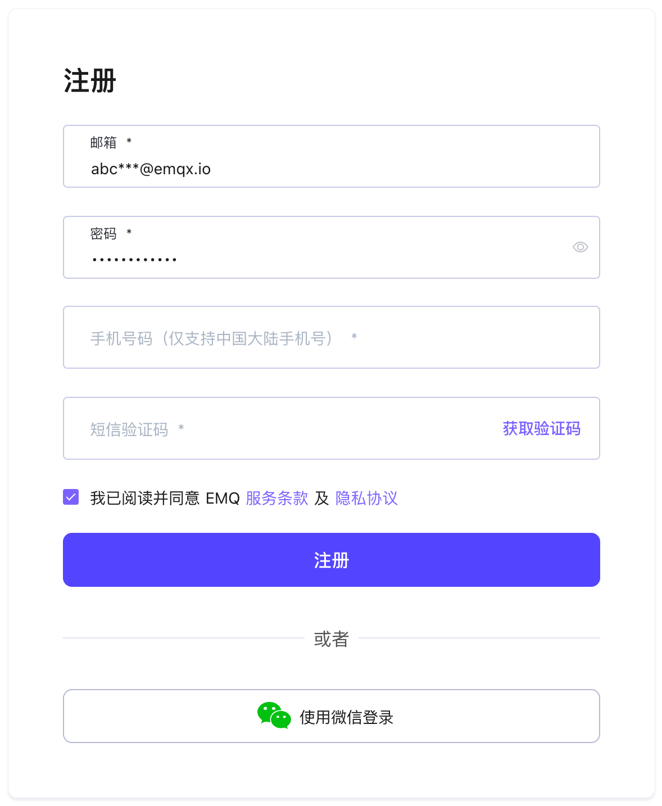
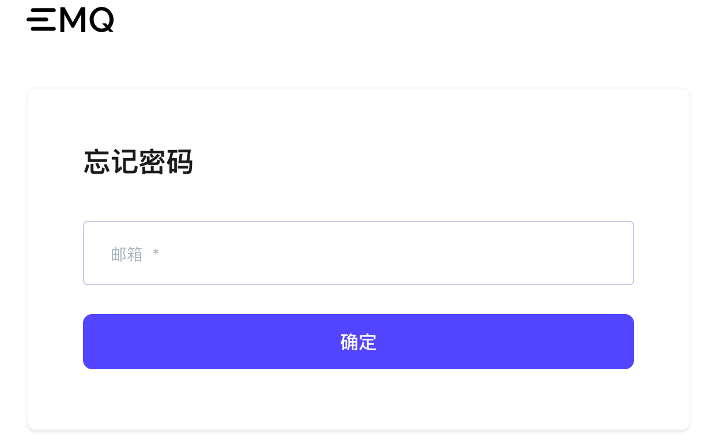

# 创建和登录 EMQ X Cloud 账户

## [注册账户](https://accounts.emqx.cn/signup?continue=https://cloud.emqx.cn)

1. 输入您的个人信息：邮箱，密码，手机号码，公司名称，国家
2. 点击注册，EMQ X Cloud 会自动将确认邮件发送到您提供的邮箱地址
3. 根据监管要求，注册需要验证手机完成实名认证.
4. 要验证您的新账户，请在点击确认邮件中的链接,该链接将会验证您的账户，并返回登录页面
5. 登录 EMQ X Cloud

## [登录账户](https://accounts.emqx.cn/signin?continue=https://cloud.emqx.cn)

输入您的邮箱和密码，然后选择登录将跳转到 EMQ X Cloud 页面

## [找回密码](https://accounts.emqx.cn/forgot_password?continue=https://cloud.emqx.cn)

如果您忘记密码，我们将会向您的邮箱发送验证邮件。您可以在验证邮件中点击找回密码，创建新的密码。您将返回登录页面，输入新的密码，然后选择登录

