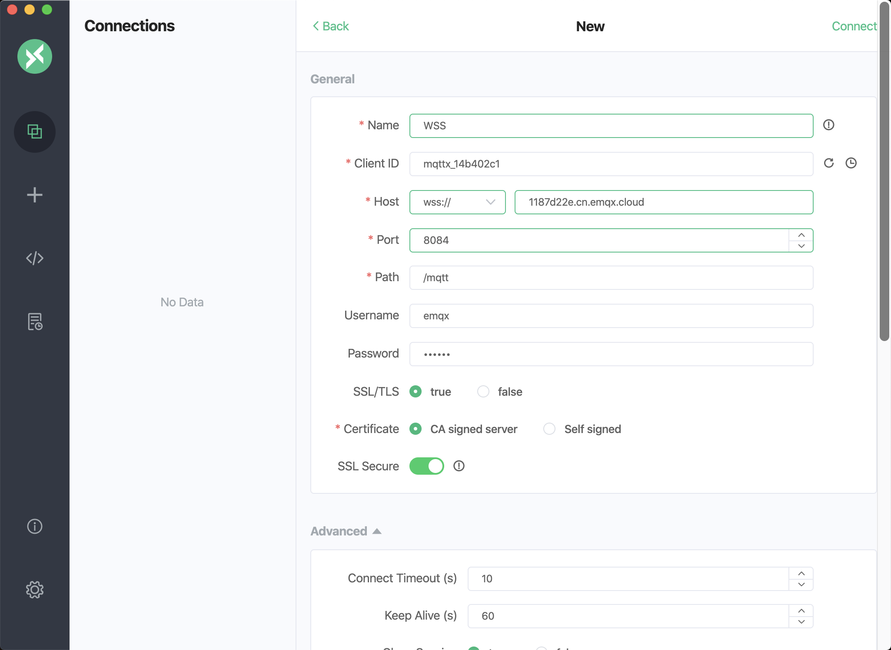

# 在线体验

您可通过我们的 Serverless 的免费额度或专有版提供的 14 天免费试用计划探索和试用 EMQX 产品。

Serverless 免费试用额度：

- 每月 **1百万** 连接分钟数
- 每月 **1GB** 流量

专有版免费试用部署规格如下：

* 1000 线规格

* 14 天免费试用

* 100 GB 免费流量

* 数据集成、监控管理等 EMQX Cloud 自有的功能

* 支持 MQTT，WebSockets 协议连接。

  > 如需其他协议(MQTT-SN、Lwm2m、JT/T808等)支持，您可以提 [工单](../feature/tickets.md) 或发送邮件(cloud-support@emqx.io)与我们取得联系。

免费试用部署注意事项：

* 试用期间若连续 5 天没有客户端连接，试用部署将被停止，但您的部署实例将会被保留，如需继续试用，请在控制台手动启用。
* 试用到期后，如您账户有可用余额，部署将继续运行并自动按小时进行收费。
* 试用到期后，如您账户无可用余额，部署将会被保留 3 天，3 天后，试用部署将被自动删除。

## 开始创建免费试用部署

1. 登录 [EMQX Cloud 控制台](https://cloud.emqx.com/console/)

2. 单击新建部署按钮

   

3. 选择专有版，并且选择 1000 连接规格的部署

   

4. 点击立即部署，并同意 EMQX Cloud 标准服务条款和免费试用申明条款

5. 等待 5 分钟左右，直至部署状态为**运行中**

   

## 连接到您的免费试用部署

在连接到您的免费试用部署之前，您需等待免费试用部署状态由 **创建中** 转为 **运行中**

1. 添加客户端认证信息

   单击所需连接的部署进入部署概览页面，点击左侧【认证鉴权】->【认证】菜单，点击添加按钮，输入客户端或设备用户名和密码并点击确认。

   

2. 获取免费试用连接信息

   点击概览菜单，您将看到部署连接地址以及连接端口。EMQX Cloud 免费试用支持 TCP、WS、TLS、WSS 协议连接

   

3. MQTT X 连接到免费试用部署

   EMQX Cloud 推荐使用 [MQTT X](https://mqttx.app/zh/) 测试连接到部署，您也可以使用熟悉的 [SDK 或其他工具](../connect_to_deployments/overview.md)连接到部署。在使用 MQTT X 连接到部署之前您需要先获取到部署连接地址(Host)和端口(Port)。

* MQTT 连接

    
  
* WebSockets 连接
  
    
  
* MQTT over TLS 连接
  
    
  
* WebSockets over TLS 连接
  
    
