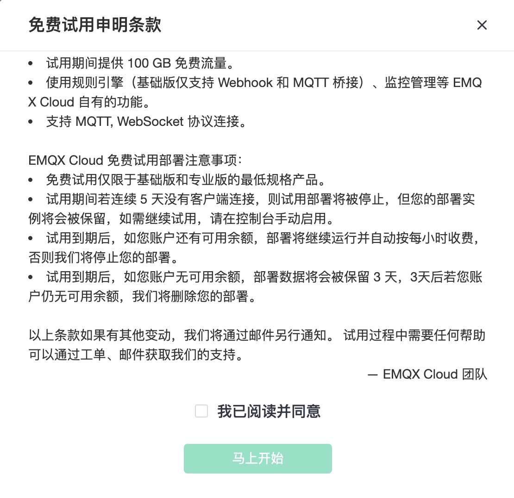

# 创建免费试用部署

对于首次使用 EMQX Cloud 的客户，我们为您准备了 **一次** 创建长达 **14** 天时长免费试用部署的机会。免费试用部署是您学习和探索 EMQX Cloud 功能的理想方式。

EMQX Cloud 免费试用部署规格如下：

* 基础版 1000 线规格提供一次最高 14 天的免费试用。

* 专业版 5000 线规格提供一次最高 14 天的免费试用。

* 试用期间提供 100 GB 免费流量。

* 使用数据集成（基础版仅支持 Webhook 和 MQTT 桥接）、监控管理等 EMQX Cloud 自有的功能。

* 支持 MQTT, WebSockets 协议连接。
  
  > 如需其他协议(MQTT-SN、Lwm2m、JT/T808等)支持，您可以提 [工单](../feature/tickets.md)或发送邮件(cloud@emqx.io)与我们取得联系

EMQX Cloud 免费试用部署注意事项：

* 免费试用仅限于基础版和专业版的**最低规格**产品。

* 试用期间若连续 5 天没有客户端连接，则试用部署将被停止，但您的部署实例将会被保留，如需继续试用，请在控制台手动启用。

* 试用到期后，如您账户还有可用余额，部署将继续运行并自动按每小时收费，否则我们将停止您的部署。

* 试用到期后，如您账户无可用余额，部署数据将会被保留 3 天，3 天后若您账户仍无可用余额，我们将删除您的部署。

## 开始创建免费试用部署

1. 登录 [EMQX Cloud 控制台](https://accounts.emqx.cn/signin?continue=https://cloud.emqx.com/console/)

   

2. 单击创建部署按钮

   

3. 选择 `基础版免费试用`

   

4. 点击立即部署，并同意 EMQX 标准服务条款、免费试用申明

   

5. 等待 5 ~ 10 分钟，直至部署状态为**运行中**
   
   

## 连接到您的免费试用部署

在连接到您的免费试用部署之前，您需等待免费试用部署状态由 **等待中** 转为 **运行中**

1. 添加客户端认证信息

   单击所需连接的部署进入部署概览页面，点击左侧认证鉴权/认证菜单，填写客户端或设备用户名和密码并点击添加。
   
   

2. 获取免费试用连接信息
   
   点击概览菜单，您将看到部署连接信息以及连接端口。EMQX Cloud 免费试用支持 TCP、WS、TLS、WSS 协议连接

   

3. MQTT X 连接到免费试用部署

   EMQX Cloud 推荐使用 [MQTT X](https://mqttx.app/zh/) 测试连接和测试部署，您也可以使用熟悉的[SDK 或其他工具](../connect_to_deployments/overview.md)连接到部署。在使用 MQTT X 连接到部署之前您需要先获取到部署连接地址(Host)和端口(Port)。

  * MQTT 连接

    
  
  * WebSockets 连接
  
    
  
  * MQTT over TLS 连接
  
    
  
  * WebSockets over TLS 连接
  
    

