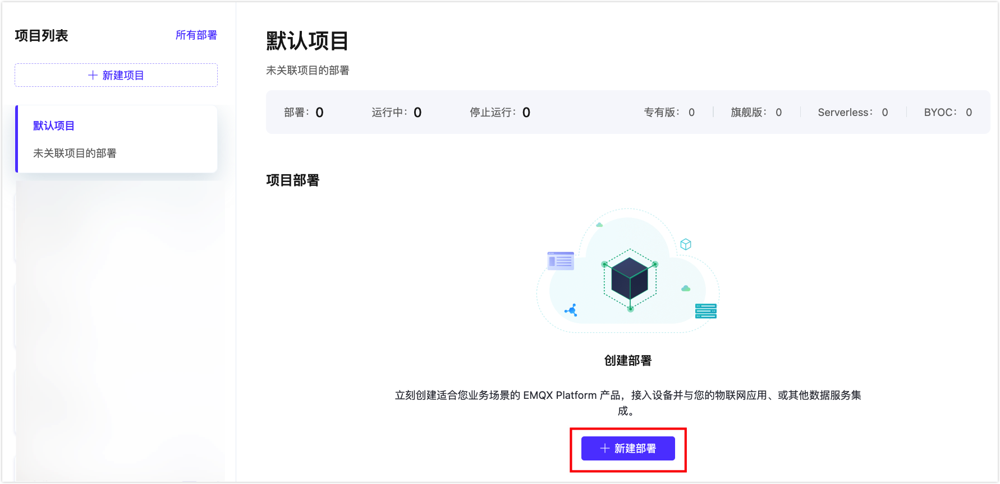
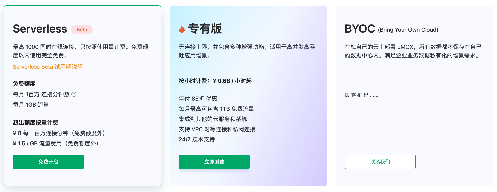

# 创建 Serverless(Beta) 部署

您可以简单几步就创建一个 Serverless(Beta) 部署。

目前一个账号下只能创建一个 Serverless(Beta) 部署。在 2023.4.1 日之前，Serverless 在 Beta测试阶段，部署的最大连接上限为100，并且完全免费使用。

Serverless(Beta) 部署注意事项：

* 若部署持续 30 天没有活跃客户端连接，部署将会被停止。如需继续试用，请在控制台手动启用。

* 如果部署停止 30 天没有开启，我们可能删除部署。

## 创建部署

1. 登录 [EMQX Cloud 控制台](https://cloud.emqx.com/console/)

   

2. 单击新建部署按钮

   

3. 选择 `Serverless(Beta)`

   

4. 点击立即部署，并同意 EMQX Cloud 标准服务条款和 Serverless 服务使用条款

5. 稍事等待至部署状态为**运行中**

   

## 连接到您的免费试用部署

在连接到您的部署之前，确认部署状态由 **创建中** 转为 **运行中**

1. 添加客户端认证信息

   单击所需连接的部署进入部署概览页面，点击左侧【认证鉴权】->【认证】菜单，点击添加按钮，输入客户端或设备用户名和密码并点击确认。

   

2. 获取免费试用连接信息

   点击概览菜单，您将看到部署连接地址以及连接端口。Serverless(Beta) 默认支持 8883(mqtts), 8084(wss) 端口

   

3. MQTT X 连接到免费试用部署

   EMQX Cloud 推荐使用 [MQTT X](https://mqttx.app/zh/) 测试连接到部署，您也可以使用熟悉的 [SDK 或其他工具](../connect_to_deployments/overview.md)连接到部署。在使用 MQTT X 连接到部署之前您需要先获取到部署连接地址(Host)和端口(Port)。

* 设置 MQTT X 的连接信息并连接到部署 

    

* 连接之后即可以发布和订阅消息
   
   
