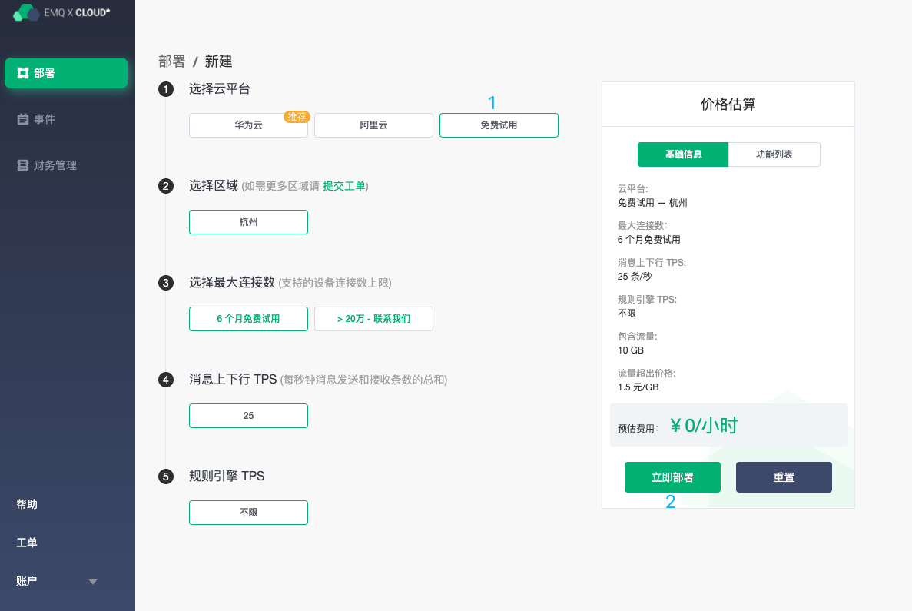
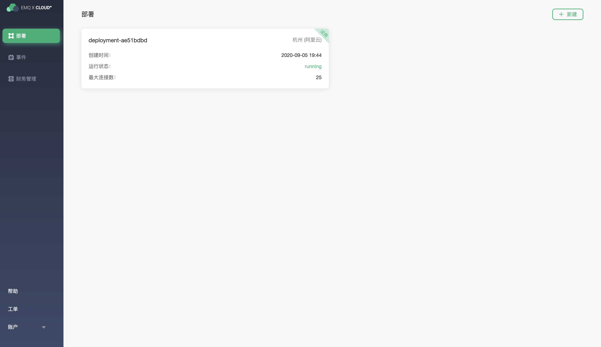

# 免费试用

首次注册或登录 EMQ X Cloud 的客户，我们将提供**一次**长达 **180** 天的免费试用部署，免费试用部署是您探索 EMQ X Cloud 功能的理想方式。其中免费试用有如下限制：

* 最大连接数为:  **25** 个
* 最大并发消息数为：**25 **/ 秒
* 每月 10 GB流量，超过将暂停接入
* 部署 **7** 天内需存在客户端连接，否则我们将暂停您的部署
* 免费试用结束时，将会自动删除部署

## 开始您的免费试用

一旦注册并登陆到 EMQ X Cloud， 就可以开始免费试用

### 创建免费试用部署

创建免费试用部署需要进入 [EMQ X Cloud 控制台](https://cloud.emqx.io/console/)

1. 进入控制台, 点击右上角新建按钮，您将进入部署创建页面。

  

2. 云平台中选择`免费试用`

3. 在右侧基础信息栏核对部署信息。
   

4. 点击`立即部署`按钮，并同意 EMQ X Cloud 服务条款和免费试用申明，您将返回到部署页面。

5. 等待 **5~10** 分钟后，部署状态将由 `pending ` 转为 `running` 。
   
   
6. 前往 [部署连接指南](../deployments/connections.md)，查看 MQTT 客户端连接和测试指南。

