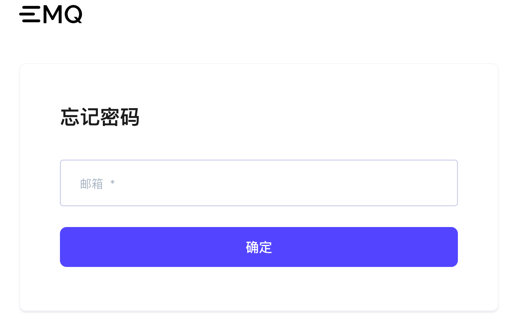

# 简介

欢迎使用 EMQX Cloud，EMQX Cloud 是全球首个全托管的 MQTT 5.0 公有云服务。在 [EMQX Cloud](https://www.emqx.com/zh/cloud)支持下，您可以在云上创建 EMQX 集群并使用 EMQX 企业版全部功能。这使您可以将更多的时间花费在业务对接上，而将较少的时间用于 EMQX 的运维和管理 。本教程将指导您完成创建、连接到 EMQX Cloud 部署，在开始之前，让我们回顾一些核心概念和短语：

* 部署： EMQX Cloud 上托管的 EMQX 企业版集群
* 基础版部署：单节点的 EMQX 企业版
* 专业版部署：拥有独立 网络、实例以及负载均衡的 EMQX 企业版集群

如果您还没有创建EMQX Cloud的账号，以下步骤会引导你完成账号的创建。也可以跳过此步骤查看控制台快速指南。

## 创建和登录 EMQX Cloud 账户

### [注册账户](https://www.emqx.com/zh/signup?continue=https://www.emqx.com/cn/cloud)

1. 请输入：邮箱，密码，手机号码；
2. 点击注册，EMQX Cloud 会自动将确认邮件发送到您提供的邮箱地址；
3. 根据监管要求，注册需要验证手机完成实名认证；
4. 要验证您的新账户，请在点击确认邮件中的链接,该链接将会验证您的账户，并返回登录页面；
5. 登录 EMQX Cloud。

### [登录账户](https://www.emqx.com/zh/signin?continue=https://www.emqx.com/cn/cloud)

输入您的邮箱和密码，然后选择登录将跳转到 EMQX Cloud 控制台。

### [找回密码](https://www.emqx.com/zh/forgot-password?continue=https://www.emqx.com/cn/cloud)

如果您忘记密码，我们将会向您的邮箱发送验证邮件。您可以在验证邮件中点击找回密码，创建新的密码。您将返回登录页面，输入新的密码，然后选择登录

## 控制台快速入门

以下会为您介绍 EMQX Cloud 控制台的基本功能。

1. 访问 EMQX Cloud [控制台](https://cloud.emqx.com/console/)，选择基础版或专业版创建部署
   > EMQX Cloud 为每位用户提供一次 14 天的免费试用和 14 天的专业版免费试用(专业版免费试用需提交申请)。
   
   

2. 前往部署认证和鉴权页面[添加认证信息](../deployments/auth.md)

   

3. 点击左侧概览菜单，获取部署连接信息和端口

   

4. 使用您熟悉的 MQTT 客户端或 SDK [连接到部署](../connect_to_deployments/overview.md)

   

