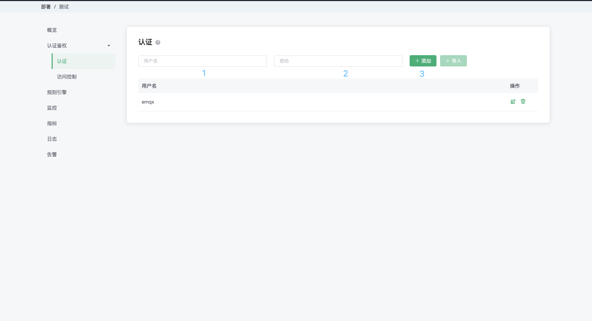

# 简介

欢迎使用 EMQ X Cloud，EMQ X Cloud 是全球首个全托管的 MQTT 5.0 公有云服务。在 [EMQ X Cloud](https://www.emqx.com/zh/cloud)支持下，您可以在云上创建 EMQ X 集群并使用 EMQ X 企业版全部功能。这使您可以将更多的时间花费在业务对接上，而将较少的时间用于 EMQ X 的运维和管理 。本教程将指导您完成创建、连接到 EMQ X Cloud 部署，在开始之前，让我们回顾一些核心概念和短语：

* 部署： EMQ X Cloud 上托管的 EMQ X 企业版集群
* 基础版部署：单节点的 EMQ X 企业版
* 专业版部署：拥有独立 网络、实例以及负载均衡的 EMQ X 企业版集群

您只需跟随以下步骤，即可快速完成 EMQ X Cloud 快速开始指南

1. [登录或注册](./create_account.md) EMQ X Cloud 账户

   

2. 访问 EMQ X Cloud [控制台](https://cloud.emqx.cn/console/)，选择基础版或专业版创建部署
   > EMQ X Cloud 为每位用户提供一次 30 天的免费试用和 14 天的专业版免费试用(专业版免费试用需提交申请)。
   
   

3. 前往部署认证和鉴权页面[添加认证信息](../deployments/auth_and_acl.md)

   

4. 点击左侧概览菜单，获取部署连接信息和端口

   

5. 使用您熟悉的 MQTT 客户端或 SDK [连接到部署](../connect_to_deployments/introduction.md)

   

