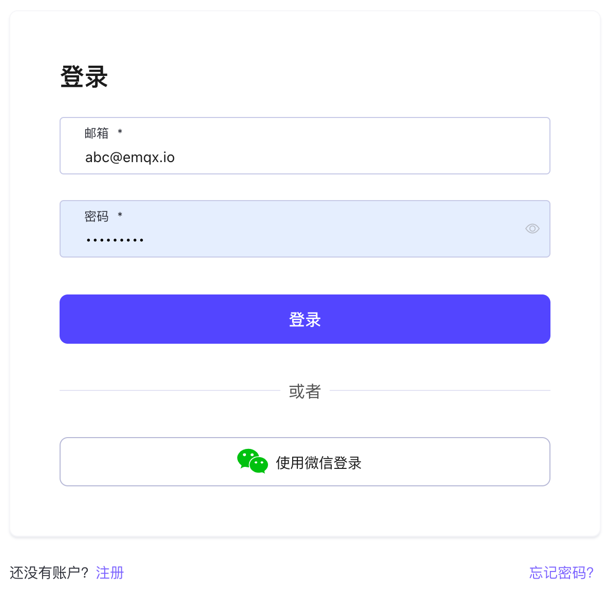

# 简介

欢迎使用 EMQX Cloud，EMQX Cloud 是全球首个全托管的 MQTT 5.0 消息云服务。在 [EMQX Cloud](https://www.emqx.com/zh/cloud)支持下，您可以在云上创建 EMQX 集群并使用 EMQX 企业版的功能。这使得您可以专注于业务对接，减少运维和管理 EMQX 的时间成本。本教程将指导您完成创建和连接到 EMQX Cloud 部署。在开始之前，让我们先回顾一些核心概念：

- 部署：EMQX Cloud 上托管的 EMQX 企业版集群
- 基础版部署：单节点的 EMQX 企业版
- 专业版部署：拥有独立网络、实例以及负载均衡的 EMQX 企业版集群

如果您还没有创建 EMQX Cloud 账号，以下步骤会引导您完成账号的创建。若您已有相关账号，您可跳过本步骤直接查看控制台快速入门。

## 创建和登录 EMQX Cloud 账户

### [注册账户](https://accounts-zh.emqx.com/signup?continue=https://www.emqx.com/cn/cloud)

1. 请输入：姓名、邮箱、密码和手机号码等必填项；
2. 点击注册，EMQX Cloud 会自动将确认邮件发送到您提供的邮箱地址；
3. 根据监管要求，注册需要验证手机完成实名认证；
4. 要验证您的新账户，请点击确认邮件中的链接，该链接将会验证您的账户，并返回登录页面；
5. 登录 EMQX Cloud。

### [登录账户](https://www.emqx.com/zh/signin?continue=https://www.emqx.com/cn/cloud)

输入您的邮箱和密码，然后选择登录将跳转到 EMQX Cloud 控制台。

### [找回密码](https://accounts-zh.emqx.com/forgot-password?continue=https%3A%2F%2Fwww.emqx.com%2Fcn%2Fcloud)

如果您忘记密码，我们将会向您的邮箱发送验证邮件。您可以在验证邮件中点击找回密码，创建新的密码。您将返回登录页面，输入新的密码，然后选择登录。

## 控制台快速入门

以下会为您介绍 EMQX Cloud 控制台的基本功能。

1. 访问 EMQX Cloud [控制台](https://cloud.emqx.com/console/)，选择基础版或专业版创建部署

   > EMQX Cloud 为每位用户提供一次 14 天的基础版免费试用和 14 天的专业版免费试用

   

2. 前往部署【认证鉴权】->【认证】页面 [添加认证信息](../deployments/auth.md)

   

3. 点击左侧概览菜单，获取部署连接地址和连接端口

   

4. 使用您熟悉的 MQTT 客户端或 SDK [连接到部署](../connect_to_deployments/overview.md)

   
