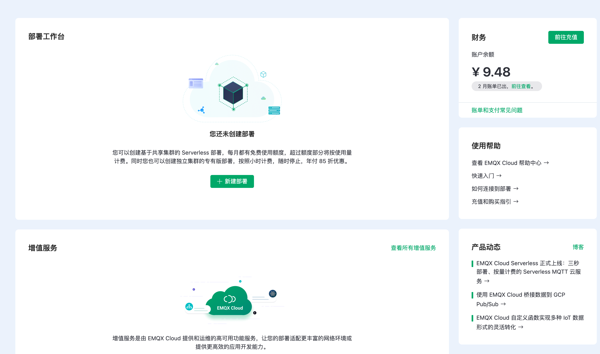

# 快速入门

本节将带您从创建账号开始快速体验 EMQX Platform 的各项功能与特性，若您已有相关账号，您可跳过本步骤直接查看[创建部署](#创建部署)。

## EMQX Platform 试用

您可通过我们的 Serverless 免费额度或专有版提供的 14 天免费试用计划探索和试用 EMQX 产品。

Serverless 免费试用额度：

- 每月 **1百万** 连接分钟数
- 每月 **1GB** 流量
- 每月 **1百万** 规则动作数

专有版免费试用部署规格如下：

* 1000 线规格

* 14 天免费试用

* 100 GB 免费流量

* 数据集成、监控管理等自有的功能

* 支持 MQTT，WebSockets 协议连接。

免费试用部署注意事项：

* 试用期间若连续 5 天没有客户端连接，试用部署将被停止，但您的部署实例将会被保留，如需继续试用，请在控制台手动启用。

* 试用到期后，如您账户有可用余额，部署将继续运行并自动按小时进行收费。

* 试用到期后，如您账户无可用余额，部署将会被保留 3 天。3 天后，试用部署将被自动删除。

## 创建和登录 EMQX Platform 账户

### [注册账户](https://accounts-zh.emqx.com/signup?continue=https://www.emqx.com/cn/cloud)

1. 请输入：姓名、邮箱、密码和手机号码等必填项；根据监管要求，注册需要验证手机完成实名认证。
2. 点击**开始试用**，EMQX Platform 会自动将确认邮件发送到您提供的邮箱地址。
4. 要验证您的新账户，请点击确认邮件中的链接，该链接将会验证您的账户，并返回登录页面。

### [登录账户](https://www.emqx.com/zh/signin?continue=https://www.emqx.com/cn/cloud)

输入您的邮箱和密码，然后点击**登录**将跳转到 EMQX Platform 控制台。

### [找回密码](https://accounts-zh.emqx.com/forgot-password?continue=https%3A%2F%2Fwww.emqx.com%2Fcn%2Fcloud)

如果您忘记密码，可在登录页面点击**忘记密码**，我们将会向您的邮箱发送验证邮件。您可以在验证邮件中点击找回密码，创建新的密码并登录。

## 创建部署

登录 EMQX Platform [控制台](https://cloud.emqx.com/console/)，在此您可查看当前部署的概要信息，进行项目管理和用户管理等。接下来，我们将带您快速完成部署的创建。

1. 在起始页点击**新建部署**，前往部署创建页面。

   
   <!--TODO 更新图片-->
   
2. 从现有的版本中选择一种部署开始创建，可创建[ Serverless 部署](../create/serverless.md)或[专有版部署](../create/dedicated.md)。如选择免费试用 EMQX 专有版，您还需再配置云平台、部署区域、连接规格、计费方式等信息。最后确认您的部署信息，点击**立即部署**。

   
   <!--TODO 更新图片-->

3. 至此，我们已经完成了部署创建流程，只需要等待部署创建完成，即可以进入刚创建的部署查看连接配置。

   
   <!--TODO 更新图片-->

## 认证

为保障您的数据安全，正式接入各类客户端/应用程序之前，您还应该通过**访问控制**模块添加此部署的认证信息。前往部署的**访问控制**->**认证**页面[添加认证信息](../deployments/default_auth.md)。

<!--TODO 更新图片-->
:::tip 提示
请妥善保管此用户信息，后续测试 MQTTX 客户端连接情况时，也需要填写此时创建的**用户名**和**密码**信息。
:::

## 通过 MQTTX 验证连接

推荐使用 [MQTTX](https://mqttx.app/zh/) 测试连接到部署，您也可以使用熟悉的 [SDK 或其他工具](../connect_to_deployments/overview.md)连接到部署。在使用 MQTTX 连接到部署之前您需要先获取到部署的认证信息。

接下来，我们将介绍如何通过 [MQTTX](https://mqttx.app/zh/) 进行测试。详细内容，参阅[通过 MQTTX 测试连接](../connect_to_deployments/mqttx.md)。
