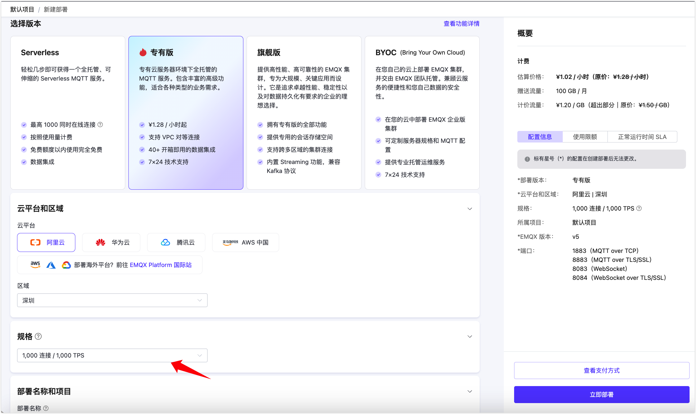
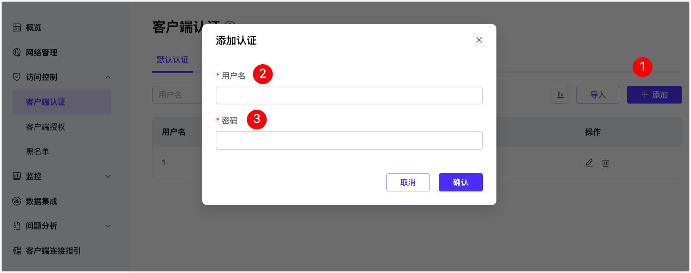
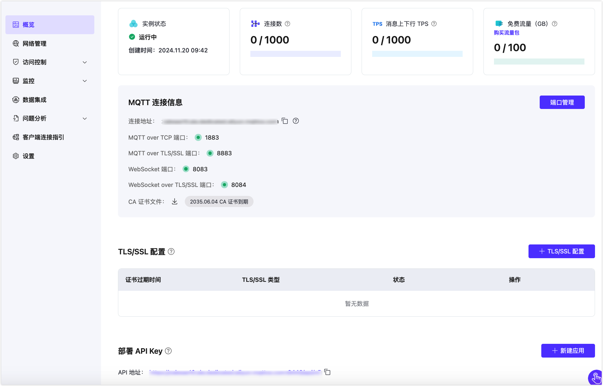

# 快速入门

如果您还没有创建 EMQX Cloud 账号，以下步骤会引导您完成账号的创建。若您已有相关账号，您可跳过本步骤直接查看控制台快速入门。

## 创建和登录 EMQX Cloud 账户

### [注册账户](https://accounts-zh.emqx.com/signup?continue=https://www.emqx.com/cn/cloud)

1. 请输入：姓名、邮箱、密码和手机号码等必填项；
2. 点击注册，EMQX Cloud 会自动将确认邮件发送到您提供的邮箱地址；
3. 根据监管要求，注册需要验证手机完成实名认证；
4. 要验证您的新账户，请点击确认邮件中的链接，该链接将会验证您的账户，并返回登录页面；
5. 登录 EMQX Cloud。

### [登录账户](https://www.emqx.com/zh/signin?continue=https://www.emqx.com/cn/cloud)

输入您的邮箱和密码，然后选择登录将跳转到 EMQX Cloud 控制台。

### [找回密码](https://accounts-zh.emqx.com/forgot-password?continue=https%3A%2F%2Fwww.emqx.com%2Fcn%2Fcloud)

如果您忘记密码，可在登陆页面点击忘记密码，我们将会向您的邮箱发送验证邮件。您可以在验证邮件中点击找回密码，创建新的密码并登陆。

## 控制台快速入门

以下会为您介绍 EMQX Cloud 控制台的基本功能。

1. 访问 EMQX Cloud [控制台](https://cloud.emqx.com/console/)。在起始页面可以浏览到控制台的概况。点击新建，前往项目列表页面。

   

   

2. 点击新建部署，可以从现有的版本中选择一种部署开始创建。

   

3. 您可以[创建 Serverless 部署](../create/serverless.md)，也可以选择[创建专有版部署](../create/dedicated.md)，获取 14 天的免费试用。

4. 完成部署创建流程，只需要等待部署创建完成，即可以进入刚创建的部署查看连接配置。

5. 前往部署【认证鉴权】->【认证】页面 [添加认证信息](../deployments/auth.md)。

   

5. 点击左侧概览菜单，获取部署连接地址和连接端口，这里不同的产品版本端口会略有不同。

   

4. 使用您熟悉的 MQTT 客户端或 SDK [连接到部署](../connect_to_deployments/overview.md)。

   
